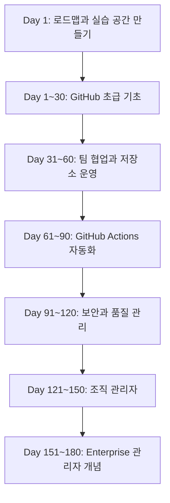
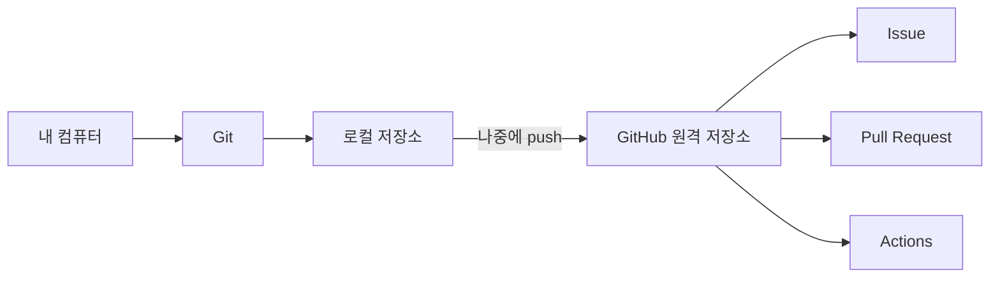
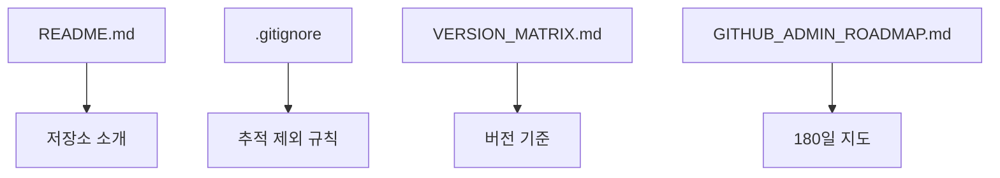
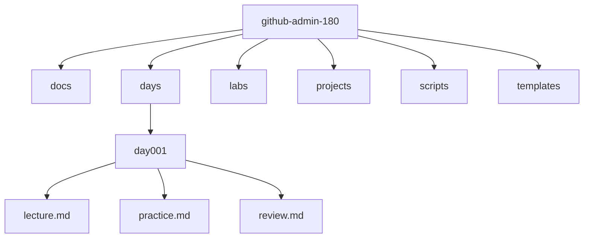
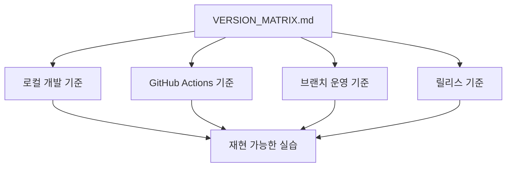
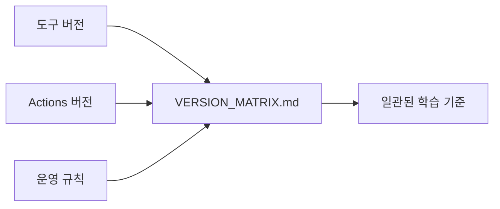
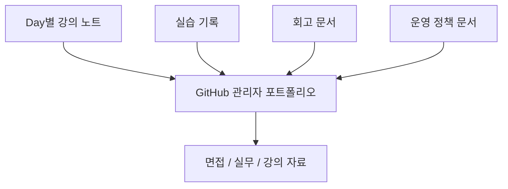
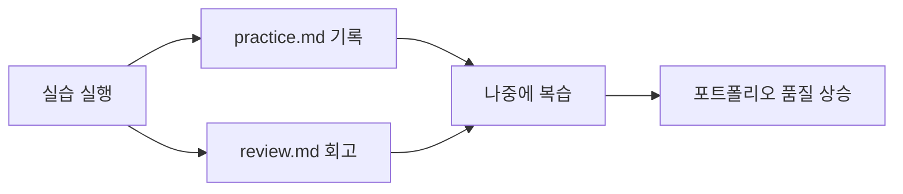

# Day 1. GitHub 학습 로드맵

> 작성 위치: `github-admin-180/days/day001/lecture.md`  
> 실습 기록 위치: `github-admin-180/days/day001/practice.md`  
> 회고 위치: `github-admin-180/days/day001/review.md`

---

## 1. 학습 목표

오늘은 Git과 GitHub를 처음 배우는 사람도 180일 동안 꾸준히 학습할 수 있도록 **학습 지도와 실습 공간**을 만드는 날입니다. 아직 복잡한 명령어를 많이 외우지 않습니다. 대신 앞으로 매일 사용할 저장소 구조를 만들고, 어떤 순서로 GitHub 관리자급 역량까지 성장할지 이해합니다.

| 학습 목표 | 설명 |
|---|---|
| 180일 전체 흐름 이해 | Git 기초부터 Enterprise 관리자 개념까지 이어지는 큰 그림을 이해합니다. |
| 실습 루트 폴더 생성 | 모든 실습을 담을 `github-admin-180` 폴더를 만듭니다. |
| Git 저장소 초기화 | 로컬 폴더를 Git이 추적할 수 있는 저장소로 만듭니다. |
| 표준 폴더 구조 생성 | `docs/`, `days/`, `labs/`, `projects/`, `scripts/`, `templates/` 구조를 만듭니다. |
| 고정 버전표 작성 | `VERSION_MATRIX.md`에 교육 기준 버전을 기록합니다. |
| Day 1 기록 습관 만들기 | `lecture.md`, `practice.md`, `review.md`를 나누어 작성합니다. |

오늘 완료 후 핵심 결과물은 다음과 같습니다.

```text
github-admin-180/
├── README.md
├── .gitignore
├── VERSION_MATRIX.md
├── GITHUB_ADMIN_ROADMAP.md
├── docs/
├── days/
│   └── day001/
│       ├── lecture.md
│       ├── practice.md
│       └── review.md
├── labs/
├── projects/
├── scripts/
└── templates/
```

---

## 2. 오늘 배울 핵심 개념 한눈에 보기

| 개념 | 쉬운 비유 | 오늘의 연결 |
|---|---|---|
| Git | 게임 저장 슬롯 | 내 컴퓨터의 파일 변경 기록을 저장할 준비를 합니다. |
| GitHub | 온라인 협업 작업실 | 나중에 로컬 저장소를 올릴 원격 협업 공간입니다. |
| Repository | 프로젝트 보관함 | `github-admin-180`이 180일 실습 저장소가 됩니다. |
| Commit | 저장 지점 | 오늘은 개념만 이해하고, 본격 커밋은 Day 5에서 다룹니다. |
| Branch | 평행세계 작업 공간 | 기본 브랜치 이름을 `main`으로 맞춥니다. |
| README | 프로젝트 안내판 | 저장소 목적과 규칙을 설명합니다. |
| .gitignore | Git이 보지 말아야 할 목록 | 비밀 파일, 로그, 빌드 결과물을 추적하지 않게 합니다. |
| VERSION_MATRIX | 도구 버전 기준표 | 180일 동안 사용할 기준 버전을 기록합니다. |



---

## 3. 이론 1 — GitHub 학습 로드맵은 왜 필요할까?

### 쉬운 비유

GitHub 학습은 큰 도시를 만드는 일과 비슷합니다. 처음에는 빈 땅에 길 하나를 놓습니다. 그다음 집을 세우고, 전기와 수도를 연결하고, 교통 규칙을 만들고, 마지막에는 도시 전체를 관리합니다.

GitHub도 처음에는 파일 저장과 기록부터 시작합니다. 그다음 팀 협업, 자동화, 보안, 권한, 조직 운영으로 확장됩니다.

### 개념 설명

GitHub는 단순히 소스코드를 올리는 사이트가 아닙니다.

| GitHub의 역할 | 설명 |
|---|---|
| 코드 보관 | 프로젝트 파일과 변경 이력을 보관합니다. |
| 협업 관리 | Issue, Pull Request, Review로 함께 일합니다. |
| 자동화 | GitHub Actions로 테스트, 빌드, 배포를 자동화합니다. |
| 보안 관리 | Secret, Dependabot, CodeQL 등으로 위험을 줄입니다. |
| 권한 관리 | Repository, Team, Organization 권한을 관리합니다. |
| 운영 관리 | Audit Log, 정책, Enterprise 운영 기준을 설계합니다. |

180일 과정의 큰 흐름은 다음과 같습니다.

| 기간 | 단계 | 목표 |
|---|---|---|
| Day 1~30 | GitHub 초급 기초 | Git/GitHub 기본, README, Issue, PR |
| Day 31~60 | 팀 협업과 저장소 운영 | PR Template, CODEOWNERS, Branch Protection, Rulesets |
| Day 61~90 | GitHub Actions와 자동화 | CI/CD, Secrets, Environments, Release 자동화 |
| Day 91~120 | GitHub 보안과 품질 관리 | Dependabot, Secret Scanning, CodeQL, Security Policy |
| Day 121~150 | 조직 관리자와 저장소 관리자 | Organization, Teams, Roles, Audit Log, API 자동화 |
| Day 151~180 | Enterprise 관리자와 최종 프로젝트 | SSO/SCIM, Billing, Compliance, Enterprise 정책, 최종 프로젝트 |

### 실무에서 중요한 이유

실무에서는 코드를 작성하는 능력만으로 부족합니다. 팀원이 늘어나면 “누가 수정했는가?”, “누가 승인했는가?”, “어떤 자동화가 실패했는가?”, “누가 저장소에 접근할 수 있는가?” 같은 운영 질문이 생깁니다. GitHub 관리자는 이런 질문에 답할 수 있어야 합니다.

### 오늘 실습과의 연결

오늘 만드는 `github-admin-180` 저장소는 앞으로 모든 강의 노트, 실습 기록, 회고, 운영 문서, 보안 정책, 최종 포트폴리오가 쌓일 공간입니다.

### 자주 하는 실수

| 실수 | 문제 | 해결 방법 |
|---|---|---|
| 아무 폴더에서 실습함 | 파일이 흩어져 복습이 어렵습니다. | 반드시 `github-admin-180` 안에서 실습합니다. |
| 로드맵 없이 기능만 외움 | 전체 구조를 놓치기 쉽습니다. | Day별 목표를 확인합니다. |
| GitHub를 코드 저장소로만 생각함 | 협업, 보안, 권한 관리 학습을 놓칩니다. | 관리자 관점으로 봅니다. |

### Mermaid 그림


---

## 4. 실습 예제 1 — 루트 폴더 만들고 Git 저장소 초기화하기

### 실습 목표

180일 동안 사용할 루트 폴더를 만들고, Git 저장소로 초기화합니다.

### 사용하는 버전

| 도구 | 버전 |
|---|---:|
| Git | 2.54.0 |

### 생성 또는 수정할 파일 위치

```text
github-admin-180/
```

### 실습 순서

1. 터미널을 엽니다.
2. 실습을 저장할 위치로 이동합니다.
3. `github-admin-180` 폴더를 만듭니다.
4. 해당 폴더로 이동합니다.
5. Git 저장소로 초기화합니다.
6. 기본 브랜치명을 `main`으로 맞춥니다.
7. 상태를 확인합니다.

### 명령어

```bash
mkdir github-admin-180
cd github-admin-180
git init
git branch -M main
git status
```

### 한 줄씩 설명

| 명령어 | 설명 |
|---|---|
| `mkdir github-admin-180` | 새 실습 폴더를 만듭니다. |
| `cd github-admin-180` | 실습 폴더 안으로 이동합니다. |
| `git init` | 현재 폴더를 Git 저장소로 만듭니다. |
| `git branch -M main` | 기본 브랜치명을 `main`으로 맞춥니다. |
| `git status` | 현재 Git 상태를 확인합니다. |

### Mermaid 그림으로 이해하기


### 자주 하는 실수

- `cd github-admin-180`을 하지 않고 다른 위치에서 `git init`을 실행합니다.
- 폴더명을 다르게 만듭니다.
- 브랜치명을 `main`으로 맞추지 않습니다.
- `git status`로 결과를 확인하지 않습니다.

---

## 5. 이론 2 — Git과 GitHub는 어떻게 다를까?

### 쉬운 비유

Git은 내 컴퓨터 안의 게임 저장 슬롯입니다. 중요한 순간마다 저장하면 실수해도 이전 상태를 다시 볼 수 있습니다.

GitHub는 그 저장 내용을 온라인 작업실에 올려 팀원들과 함께 보고, 토론하고, 승인할 수 있게 해주는 공간입니다.

### 개념 설명

| 구분 | Git | GitHub |
|---|---|---|
| 정체 | 버전 관리 도구 | Git 저장소 호스팅 및 협업 플랫폼 |
| 위치 | 내 컴퓨터 중심 | 웹 서비스 중심 |
| 핵심 기능 | add, commit, branch, merge | Repository, Issue, Pull Request, Actions, Security |
| 인터넷 필요 여부 | 기본 기록은 없어도 가능 | 대부분 인터넷 필요 |
| 실무 역할 | 변경 이력 관리 | 협업, 리뷰, 자동화, 보안, 권한 관리 |

### 실무에서 중요한 이유

혼자 개발할 때는 Git만으로도 기록을 남길 수 있습니다. 하지만 팀 개발에서는 GitHub가 필요합니다. Pull Request로 변경사항을 제안하고, 리뷰를 받고, main 브랜치에 안전하게 합치는 흐름이 실무 협업의 기본입니다.

### 오늘 실습과의 연결

오늘은 GitHub 웹 저장소를 만들지 않습니다. 대신 GitHub에 올릴 준비가 된 로컬 Git 저장소를 만듭니다.

### 자주 하는 실수

| 실수 | 설명 |
|---|---|
| Git과 GitHub를 같은 것으로 생각함 | Git은 도구, GitHub는 플랫폼입니다. |
| GitHub 계정만 있으면 Git을 안다고 생각함 | 실제 명령어와 흐름을 익혀야 합니다. |
| 로컬 저장소와 원격 저장소를 구분하지 못함 | 내 컴퓨터와 GitHub 서버의 위치 차이를 이해해야 합니다. |

### Mermaid 그림



---

## 6. 실습 예제 2 — 기본 파일 생성하기

### 실습 목표

저장소의 기본 문서 파일을 생성합니다.

### 사용하는 버전

| 도구 | 버전 |
|---|---:|
| Git | 2.54.0 |
| Visual Studio Code | 1.122.0 |

### 생성 또는 수정할 파일 위치

```text
github-admin-180/README.md
github-admin-180/.gitignore
github-admin-180/VERSION_MATRIX.md
github-admin-180/GITHUB_ADMIN_ROADMAP.md
```

### 실습 순서

1. 현재 위치가 `github-admin-180`인지 확인합니다.
2. 기본 파일 4개를 생성합니다.
3. 파일 목록을 확인합니다.
4. Git 상태를 확인합니다.

### 명령어

```bash
touch README.md .gitignore VERSION_MATRIX.md GITHUB_ADMIN_ROADMAP.md
ls
git status
```

### 한 줄씩 설명

| 명령어 | 설명 |
|---|---|
| `touch README.md .gitignore VERSION_MATRIX.md GITHUB_ADMIN_ROADMAP.md` | 빈 문서 파일 4개를 생성합니다. |
| `ls` | 현재 폴더의 파일 목록을 봅니다. |
| `git status` | Git이 새 파일을 인식했는지 확인합니다. |

### 기본 파일 내용 작성

```bash
cat > README.md <<'README'
# GitHub Admin 180

이 저장소는 Git과 GitHub를 초급부터 관리자급까지 학습하기 위한 180일 실습 저장소입니다.

## 기본 규칙

- 기본 브랜치명은 `main`을 사용합니다.
- 기능 브랜치는 `feature/` 접두사를 사용합니다.
- 버그 수정 브랜치는 `fix/` 접두사를 사용합니다.
- 문서 작업 브랜치는 `docs/` 접두사를 사용합니다.
- 비밀번호, 토큰, SSH private key, PAT, API key는 절대 커밋하지 않습니다.
README

cat > .gitignore <<'GITIGNORE'
# OS files
.DS_Store
Thumbs.db

# Editors
.vscode/
.idea/

# Logs
*.log
logs/

# Environment files
.env
.env.*

# Dependencies
node_modules/

# Build outputs
dist/
build/
coverage/

# Secrets and keys
*.pem
*.key
*.p12
*.crt
GITIGNORE

cat > GITHUB_ADMIN_ROADMAP.md <<'ROADMAP'
# GitHub Admin 180 Roadmap

| 기간 | 단계 | 목표 |
|---|---|---|
| Day 1~30 | GitHub 초급 기초 | Git/GitHub 기본, README, Issue, PR |
| Day 31~60 | 팀 협업과 저장소 운영 | PR Template, CODEOWNERS, Branch Protection, Rulesets |
| Day 61~90 | GitHub Actions와 자동화 | CI/CD, Secrets, Environments, Release 자동화 |
| Day 91~120 | GitHub 보안과 품질 관리 | Dependabot, Secret Scanning, CodeQL, Security Policy |
| Day 121~150 | 조직 관리자와 저장소 관리자 | Organization, Teams, Roles, Audit Log, API 자동화 |
| Day 151~180 | Enterprise 관리자와 최종 프로젝트 | SSO/SCIM, Billing, Compliance, Enterprise 정책, 최종 프로젝트 |
ROADMAP
```

### Mermaid 그림으로 이해하기



### 자주 하는 실수

- `.gitignore` 앞의 점을 빼먹습니다.
- README를 비워둡니다.
- `.env` 같은 민감 파일 제외 규칙을 작성하지 않습니다.
- `git status`로 생성 결과를 확인하지 않습니다.

---

## 7. 이론 3 — 표준 폴더 구조가 왜 필요할까?

### 쉬운 비유

표준 폴더 구조는 책장의 분류표와 같습니다. 책을 아무 곳에나 꽂으면 찾기 어렵지만, 분야별로 나누면 필요한 책을 빨리 찾을 수 있습니다.

### 개념 설명

이번 과정에서는 모든 산출물을 하나의 루트 폴더 안에서 관리합니다.

| 폴더 | 역할 |
|---|---|
| `docs/` | 개념 설명, 운영 문서, 정책 문서 |
| `days/` | Day별 강의, 실습, 회고 |
| `labs/` | 작은 주제별 실습 |
| `projects/` | 포트폴리오 수준의 프로젝트 산출물 |
| `scripts/` | 자동화 스크립트 |
| `templates/` | Issue, PR, 보안 정책 등 템플릿 |

### 실무에서 중요한 이유

프로젝트 구조가 일정하면 새 팀원이 빠르게 적응할 수 있습니다. 보안 정책, 자동화 파일, 운영 문서도 찾기 쉬워집니다. 관리자급 개발자는 사람들이 안전하고 일관되게 일할 수 있는 구조를 설계해야 합니다.

### 오늘 실습과의 연결

오늘 만드는 구조는 앞으로 180일 동안 계속 사용합니다. Day별 자료는 `days/dayNNN/`, Git 기초 문서는 `docs/01-git-basics/`, 최종 포트폴리오는 `projects/admin-portfolio/`에 쌓입니다.

### 자주 하는 실수

| 실수 | 문제 | 해결 방법 |
|---|---|---|
| `day1`처럼 짧게 만듦 | 정렬 시 `day10`과 순서가 꼬일 수 있습니다. | `day001`처럼 3자리 숫자를 씁니다. |
| 문서와 실습을 섞어둠 | 나중에 찾기 어렵습니다. | `docs/`, `days/`, `labs/`를 구분합니다. |
| 템플릿 위치를 제각각 둠 | GitHub가 인식하지 못할 수 있습니다. | `.github/`와 `templates/` 역할을 구분합니다. |

### Mermaid 그림



---

## 8. 실습 예제 3 — 표준 폴더 구조 생성하기

### 실습 목표

180일 학습 과정에서 사용할 표준 폴더 구조를 한 번에 생성합니다.

### 사용하는 버전

| 도구 | 버전 |
|---|---:|
| Git | 2.54.0 |

### 생성 또는 수정할 파일 위치

```text
github-admin-180/docs/
github-admin-180/days/day001/
github-admin-180/labs/
github-admin-180/projects/
github-admin-180/scripts/
github-admin-180/templates/
```

### 실습 순서

1. 현재 위치가 `github-admin-180`인지 확인합니다.
2. 문서 폴더를 생성합니다.
3. Day 1 폴더와 파일을 생성합니다.
4. 실습 폴더와 프로젝트 폴더를 생성합니다.
5. 스크립트와 템플릿 폴더를 생성합니다.
6. 구조를 확인합니다.

### 명령어

```bash
mkdir -p docs/00-roadmap docs/01-git-basics docs/02-collaboration docs/03-repository-admin
mkdir -p docs/04-github-actions docs/05-security docs/06-organization-admin docs/07-enterprise-admin docs/08-final-report
mkdir -p days/day001 labs/git-basics labs/collaboration labs/repository-admin labs/actions labs/security labs/organization-admin labs/enterprise-admin
mkdir -p projects/standard-repo-template/.github/ISSUE_TEMPLATE projects/standard-repo-template/.github/workflows projects/standard-repo-template/docs
mkdir -p projects/actions-lab/src projects/actions-lab/tests projects/actions-lab/.github/workflows
mkdir -p projects/security-lab/.github/workflows projects/admin-portfolio
mkdir -p scripts templates
touch days/day001/lecture.md days/day001/practice.md days/day001/review.md
```

### 한 줄씩 설명

| 명령어 | 설명 |
|---|---|
| `mkdir -p docs/...` | 문서 주제별 폴더를 생성합니다. |
| `mkdir -p days/day001` | Day 1 기록 폴더를 생성합니다. |
| `mkdir -p labs/...` | 주제별 실습 공간을 생성합니다. |
| `mkdir -p projects/...` | 프로젝트형 산출물 공간을 생성합니다. |
| `mkdir -p scripts templates` | 자동화 스크립트와 템플릿 공간을 생성합니다. |
| `touch days/day001/lecture.md ...` | Day 1 강의, 실습, 회고 파일을 생성합니다. |

### 구조 확인 명령어

```bash
find . -maxdepth 2 -type d | sort
find . -maxdepth 3 -type f | sort
```

### Day 1 파일에 기본 내용 넣기

```bash
cat > days/day001/lecture.md <<'LECTURE'
# Day 1. GitHub 학습 로드맵

오늘은 GitHub 관리자급 학습을 위한 180일 로드맵을 이해하고, 표준 실습 폴더 구조를 생성합니다.
LECTURE

cat > days/day001/practice.md <<'PRACTICE'
# Day 1 Practice

## 오늘 만든 것

- `github-admin-180` 루트 폴더
- Git 저장소 초기화
- 기본 문서 파일
- 180일 표준 폴더 구조
PRACTICE

cat > days/day001/review.md <<'REVIEW'
# Day 1 Review

## 오늘 이해한 것

- Git은 변경 이력을 기록하는 도구다.
- GitHub는 협업, 자동화, 보안, 권한 관리를 지원하는 플랫폼이다.
- 180일 학습은 초급 기초에서 Enterprise 관리자 개념까지 이어진다.

## 아직 헷갈리는 것

-

## 내일 확인할 것

- Git과 GitHub의 차이를 더 자세히 정리한다.
REVIEW
```

### Mermaid 그림으로 이해하기


### 자주 하는 실수

- 여러 줄 명령어 중 일부만 실행합니다.
- `.github`처럼 점으로 시작하는 폴더를 빼먹습니다.
- `lecture.md`, `practice.md`, `review.md` 중 하나를 빠뜨립니다.
- Windows 기본 명령 프롬프트에서 Linux 명령어를 실행합니다. Windows 사용자는 WSL 또는 Git Bash를 권장합니다.

---

## 9. 이론 4 — 버전 고정이 왜 중요할까?

### 쉬운 비유

요리 수업에서 선생님은 180도로 20분 굽자고 했는데, 학생마다 온도와 시간을 다르게 하면 결과가 달라집니다. 개발 도구도 같습니다. 버전이 다르면 명령어 출력, 화면, 동작이 달라질 수 있습니다.

### 개념 설명

이번 교육에서는 다음 기준 버전을 사용합니다.

| 구분 | 고정 버전 | 사용 목적 |
|---|---:|---|
| Git | 2.54.0 | Git 기본 명령어, 브랜치, 병합, 충돌 해결 |
| Git LFS | 3.7.1 | 대용량 파일 관리 |
| GitHub CLI | 2.93.0 | 터미널에서 Issue, PR, repo, release 관리 |
| GitHub Desktop | 3.5.8 | CLI 보조 GUI 도구 |
| Visual Studio Code | 1.122.0 | 실습용 에디터 |
| Node.js | 24.16.0 LTS | GitHub Actions JavaScript 실습 |

GitHub Actions 기준은 다음과 같습니다.

| 구분 | 고정 버전 |
|---|---:|
| GitHub-hosted runner | ubuntu-24.04 |
| actions/checkout | v5 |
| actions/setup-node | v6.4.0 |
| actions/cache | v5 |

운영 규칙은 다음과 같습니다.

| 항목 | 기준 |
|---|---|
| 기본 브랜치명 | main |
| 기능 브랜치 접두사 | feature/ |
| 버그 수정 브랜치 접두사 | fix/ |
| 문서 브랜치 접두사 | docs/ |
| 릴리스 브랜치 접두사 | release/ |
| 태그 버전 규칙 | Semantic Versioning, 예: v1.0.0 |
| 기본 PR 병합 방식 | Squash merge |
| GitHub Actions OS | ubuntu-24.04 |
| GitHub Actions Node.js | 24.16.0 |

### 실무에서 중요한 이유

실무에서 팀원마다 개발 도구 버전이 다르면 어떤 사람은 빌드가 성공하고, 어떤 사람은 실패할 수 있습니다. GitHub Actions에서도 `ubuntu-latest`처럼 변할 수 있는 값을 사용하면 시간이 지나면서 결과가 바뀔 수 있습니다. 그래서 기준 버전을 문서화해야 합니다.

### 오늘 실습과의 연결

오늘은 `VERSION_MATRIX.md`에 교육 기준 버전을 작성합니다. 이 파일은 앞으로 “이 교육은 어떤 기준으로 진행되는가?”를 알려주는 기준표가 됩니다.

### 자주 하는 실수

| 실수 | 문제 | 해결 방법 |
|---|---|---|
| 최신 버전이면 무조건 좋다고 생각함 | 교육 화면과 명령어가 달라질 수 있습니다. | 교육 기준 버전을 우선합니다. |
| `ubuntu-latest` 사용 | 시간이 지나면 OS가 바뀔 수 있습니다. | `ubuntu-24.04`로 고정합니다. |
| Actions 버전을 생략함 | 재현성이 떨어집니다. | `actions/checkout@v5`처럼 작성합니다. |

### Mermaid 그림



---

## 10. 실습 예제 4 — VERSION_MATRIX.md 작성하기

### 실습 목표

180일 동안 사용할 고정 버전표를 `VERSION_MATRIX.md`에 작성합니다.

### 사용하는 버전

| 도구 | 버전 |
|---|---:|
| Git | 2.54.0 |
| Git LFS | 3.7.1 |
| GitHub CLI | 2.93.0 |
| GitHub Desktop | 3.5.8 |
| Visual Studio Code | 1.122.0 |
| Node.js | 24.16.0 LTS |

### 생성 또는 수정할 파일 위치

```text
github-admin-180/VERSION_MATRIX.md
```

### 실습 순서

1. `VERSION_MATRIX.md` 파일을 엽니다.
2. 기본 프로그램 버전표를 작성합니다.
3. GitHub Actions 기준표를 작성합니다.
4. 운영 규칙표를 작성합니다.
5. 파일 내용을 확인합니다.

### 명령어

```bash
cat > VERSION_MATRIX.md <<'VERSION'
# Version Matrix

이 문서는 GitHub Admin 180 학습 과정에서 사용할 도구와 운영 기준 버전을 정리합니다.

## 1. 기본 프로그램

| 구분 | 고정 버전 | 사용 목적 |
|---|---:|---|
| Git | 2.54.0 | Git 기본 명령어, 브랜치, 병합, 충돌 해결 |
| Git LFS | 3.7.1 | 대용량 파일 관리 |
| GitHub CLI | 2.93.0 | 터미널에서 Issue, PR, repo, release 관리 |
| GitHub Desktop | 3.5.8 | CLI 보조 GUI 도구 |
| Visual Studio Code | 1.122.0 | 실습용 에디터 |
| Node.js | 24.16.0 LTS | GitHub Actions JavaScript 실습 |

## 2. GitHub Actions 기준

| 구분 | 고정 버전 |
|---|---:|
| GitHub-hosted runner | ubuntu-24.04 |
| actions/checkout | v5 |
| actions/setup-node | v6.4.0 |
| actions/cache | v5 |

## 3. 운영 규칙

| 항목 | 기준 |
|---|---|
| 기본 브랜치명 | main |
| 기능 브랜치 접두사 | feature/ |
| 버그 수정 브랜치 접두사 | fix/ |
| 문서 브랜치 접두사 | docs/ |
| 릴리스 브랜치 접두사 | release/ |
| 태그 버전 규칙 | Semantic Versioning, 예: v1.0.0 |
| 기본 PR 병합 방식 | Squash merge |
| GitHub Actions OS | ubuntu-24.04 |
| GitHub Actions Node.js | 24.16.0 |

## 4. 버전 사용 규칙

1. Git 명령어는 Git 2.54.0 기준으로 학습합니다.
2. GitHub CLI 명령어는 `gh` 2.93.0 기준으로 학습합니다.
3. GitHub Desktop은 3.5.8 기준으로 보조 도구로만 사용합니다.
4. Git LFS는 3.7.1 기준으로 대용량 파일 관리 Day에서 사용합니다.
5. VS Code는 1.122.0 기준으로 설명합니다.
6. GitHub Actions는 `runs-on: ubuntu-24.04`로 고정합니다.
7. Node.js가 필요한 GitHub Actions 예제는 Node.js 24.16.0 LTS를 사용합니다.
8. GitHub Actions 예제는 `actions/checkout@v5`, `actions/setup-node@v6.4.0`, `actions/cache@v5`를 사용합니다.
9. 비밀번호, 토큰, SSH private key, PAT, API key는 절대 저장소에 커밋하지 않습니다.
10. GitHub Enterprise 기능은 실제 Enterprise 계정이 없어도 개념, 운영 설계, 문서 실습 중심으로 진행합니다.
VERSION

cat VERSION_MATRIX.md
git status
```

### 한 줄씩 설명

| 명령어 | 설명 |
|---|---|
| `cat > VERSION_MATRIX.md` | 파일에 여러 줄 내용을 씁니다. |
| `cat VERSION_MATRIX.md` | 작성한 내용을 확인합니다. |
| `git status` | Git이 변경 사항을 감지했는지 확인합니다. |

### Mermaid 그림으로 이해하기



### 자주 하는 실수

- `ubuntu-latest`라고 작성합니다.
- `actions/checkout@v4`처럼 다른 기준을 적습니다.
- Node.js 버전을 생략합니다.
- 실제 비밀번호나 토큰을 문서에 적습니다.

---

## 11. 이론 5 — 오늘 만든 저장소가 포트폴리오가 되는 과정

### 쉬운 비유

오늘 만든 저장소는 빈 성장 앨범입니다. 첫날에는 표지만 있지만, 매일 사진과 기록을 붙이면 180일 뒤에는 성장 과정이 보이는 앨범이 됩니다.

### 개념 설명

좋은 포트폴리오는 결과물만 보여주지 않습니다. 어떤 규칙으로 작업했는지, 어떤 문제를 해결했는지, 어떻게 안전하게 운영했는지 보여줍니다.

| 오늘 만든 것 | 나중에 보여줄 역량 |
|---|---|
| `README.md` | 저장소 설명 능력 |
| `.gitignore` | 보안과 정리 습관 |
| `VERSION_MATRIX.md` | 환경 기준 관리 능력 |
| `GITHUB_ADMIN_ROADMAP.md` | 장기 학습 계획 수립 능력 |
| `days/day001/practice.md` | 실습 기록 능력 |
| `days/day001/review.md` | 회고와 개선 능력 |

### 실무에서 중요한 이유

면접이나 실무에서 “GitHub를 써봤다”보다 중요한 것은 “어떻게 운영했는가”입니다. 브랜치 규칙, 병합 방식, 자동화 기준, 보안 원칙을 문서화할 수 있으면 운영자 관점을 보여줄 수 있습니다.

### 오늘 실습과의 연결

오늘의 작은 문서들이 앞으로 관리자 포트폴리오의 시작점이 됩니다.

### 자주 하는 실수

| 실수 | 문제 |
|---|---|
| 실습만 하고 기록하지 않음 | 나중에 설명하기 어렵습니다. |
| 명령어만 복사하고 의미를 쓰지 않음 | 응용력이 생기지 않습니다. |
| 회고를 비워둠 | 성장 과정이 보이지 않습니다. |

### Mermaid 그림



---

## 12. 실습 예제 5 — Day 1 실습 결과 기록하기

### 실습 목표

오늘 만든 구조와 배운 내용을 `practice.md`와 `review.md`에 기록합니다.

### 사용하는 버전

| 도구 | 버전 |
|---|---:|
| Git | 2.54.0 |
| Visual Studio Code | 1.122.0 |

### 생성 또는 수정할 파일 위치

```text
github-admin-180/days/day001/practice.md
github-admin-180/days/day001/review.md
```

### 실습 순서

1. `practice.md`에 실행한 명령어와 결과를 기록합니다.
2. `review.md`에 오늘 이해한 내용과 헷갈리는 내용을 기록합니다.
3. Git 상태를 확인합니다.

### 명령어

````bash
cat >> days/day001/practice.md <<'PRACTICE_APPEND'

## Day 1 최종 확인

### 생성한 주요 파일

- README.md
- .gitignore
- VERSION_MATRIX.md
- GITHUB_ADMIN_ROADMAP.md
- days/day001/lecture.md
- days/day001/practice.md
- days/day001/review.md

### 확인 명령어

```bash
git status
find . -maxdepth 2 -type d | sort
find . -maxdepth 3 -type f | sort
```

### 오늘의 실습 결론

오늘은 GitHub 관리자급 학습을 위한 표준 저장소의 뼈대를 만들었다.
PRACTICE_APPEND

cat >> days/day001/review.md <<'REVIEW_APPEND'

## Day 1 회고 질문

1. Git과 GitHub는 어떻게 다른가?
2. 왜 모든 실습을 `github-admin-180` 폴더 안에서 진행해야 하는가?
3. `VERSION_MATRIX.md`가 왜 필요한가?
4. `.gitignore`는 어떤 파일을 보호하는 데 도움이 되는가?
5. 180일 뒤 이 저장소는 어떤 포트폴리오가 될 수 있는가?
REVIEW_APPEND

git status
````

### 한 줄씩 설명

| 명령어 | 설명 |
|---|---|
| `cat >> 파일명` | 기존 파일 내용 뒤에 내용을 추가합니다. |
| `practice.md` | 오늘 직접 실행한 명령어와 결과를 기록합니다. |
| `review.md` | 오늘 이해한 내용, 헷갈리는 내용, 내일 확인할 내용을 적습니다. |
| `git status` | Git이 어떤 파일 변경을 감지했는지 확인합니다. |

### Mermaid 그림으로 이해하기



### 자주 하는 실수

- 실습은 했지만 기록을 남기지 않습니다.
- `practice.md`에는 명령어만 쓰고 결과를 쓰지 않습니다.
- `review.md`에 “다 이해함”이라고만 적습니다.
- `git status`를 보지 않고 다음 Day로 넘어갑니다.

---

## 강의 요약

오늘 배운 내용을 정리하면 다음과 같습니다.

| 배운 내용 | 핵심 |
|---|---|
| GitHub 180일 로드맵 | Git 기초에서 Enterprise 관리자 개념까지 단계적으로 성장합니다. |
| Git | 파일의 변경 기록을 저장하는 도구입니다. 게임 저장 슬롯과 비슷합니다. |
| GitHub | Git 저장소를 온라인에서 협업, 자동화, 보안 관리까지 할 수 있게 해주는 플랫폼입니다. |
| Repository | 프로젝트 파일과 변경 이력을 담는 보관함입니다. |
| 표준 폴더 구조 | 180일 동안 실습과 문서를 일관되게 쌓기 위한 기본 뼈대입니다. |
| README.md | 저장소의 첫 안내판입니다. |
| .gitignore | Git이 추적하지 않을 파일을 정하는 규칙 파일입니다. |
| VERSION_MATRIX.md | 교육에서 사용할 도구 버전과 운영 기준을 고정하는 문서입니다. |
| GITHUB_ADMIN_ROADMAP.md | 180일 학습 흐름을 정리하는 로드맵 문서입니다. |
| Day별 기록 | `lecture.md`, `practice.md`, `review.md`에 학습 내용을 누적합니다. |

오늘 꼭 기억해야 할 한 문장:

> GitHub 관리자는 코드를 저장하는 사람을 넘어, 협업 규칙·자동화·보안·권한을 설계하는 사람입니다.

---

## 초급 연습문제 5개

### 문제 1. 루트 폴더 만들기

#### 문제 설명

180일 학습을 위한 루트 폴더 `github-admin-180`을 생성하고 해당 폴더로 이동하세요.

#### 요구사항

- 폴더 이름은 반드시 `github-admin-180`이어야 합니다.
- 폴더 생성 후 해당 폴더 안으로 이동해야 합니다.
- 현재 위치를 확인해야 합니다.

#### 힌트

`mkdir`, `cd`, `pwd` 명령어를 사용합니다.

#### 제출물

- 실행한 명령어
- `pwd` 결과

---

### 문제 2. Git 저장소 초기화하기

#### 문제 설명

`github-admin-180` 폴더를 Git 저장소로 초기화하세요.

#### 요구사항

- `git init`을 실행합니다.
- 기본 브랜치명을 `main`으로 맞춥니다.
- `git status`로 상태를 확인합니다.

#### 힌트

`git branch -M main` 명령어를 사용합니다.

#### 제출물

- 실행한 명령어
- `git status` 결과

---

### 문제 3. 기본 파일 4개 만들기

#### 문제 설명

루트 폴더에 기본 문서 파일 4개를 생성하세요.

#### 요구사항

- `README.md`
- `.gitignore`
- `VERSION_MATRIX.md`
- `GITHUB_ADMIN_ROADMAP.md`

#### 힌트

`touch` 명령어를 사용하면 여러 파일을 한 번에 만들 수 있습니다.

#### 제출물

- 실행한 명령어
- `ls` 결과

---

### 문제 4. Day 1 파일 만들기

#### 문제 설명

Day 1 학습 기록을 위한 폴더와 파일을 만드세요.

#### 요구사항

다음 파일을 생성해야 합니다.

```text
days/day001/lecture.md
days/day001/practice.md
days/day001/review.md
```

#### 힌트

`mkdir -p`와 `touch`를 함께 사용합니다.

#### 제출물

- 실행한 명령어
- 생성된 파일 목록

---

### 문제 5. VERSION_MATRIX.md에 기본 버전 기록하기

#### 문제 설명

`VERSION_MATRIX.md`에 Git과 GitHub Actions 기준 버전을 기록하세요.

#### 요구사항

다음 항목을 반드시 포함해야 합니다.

- Git 2.54.0
- Git LFS 3.7.1
- GitHub CLI 2.93.0
- GitHub Desktop 3.5.8
- Visual Studio Code 1.122.0
- Node.js 24.16.0 LTS
- GitHub Actions runner `ubuntu-24.04`
- `actions/checkout@v5`
- `actions/setup-node@v6.4.0`
- `actions/cache@v5`

#### 힌트

Markdown 표를 사용하면 보기 좋게 정리할 수 있습니다.

#### 제출물

- 작성한 `VERSION_MATRIX.md` 내용

---

## 중급 연습문제 5개

### 문제 1. README.md를 학습 저장소 소개 문서로 만들기

#### 문제 설명

`README.md`에 이 저장소의 목적, 학습 범위, 기본 운영 규칙을 작성하세요.

#### 요구사항

- 저장소 제목을 포함합니다.
- 180일 학습 목표를 5개 이상 작성합니다.
- 기본 브랜치명이 `main`임을 적습니다.
- 민감정보를 커밋하지 않는다는 규칙을 포함합니다.

#### 힌트

오늘 실습에서 작성한 README 예시를 참고하되, 본인의 문장으로 바꿔보세요.

#### 제출물

- `README.md` 전체 내용

---

### 문제 2. .gitignore 보안 규칙 추가하기

#### 문제 설명

`.gitignore`에 운영체제 파일, 에디터 폴더, 로그 파일, 환경 변수 파일, 비밀 키 파일을 제외하는 규칙을 작성하세요.

#### 요구사항

다음 패턴을 포함해야 합니다.

- `.env`
- `.env.*`
- `*.log`
- `node_modules/`
- `.vscode/`
- `.idea/`
- `*.pem`
- `*.key`

#### 힌트

한 줄에 하나의 제외 규칙을 작성합니다.

#### 제출물

- `.gitignore` 전체 내용

---

### 문제 3. 표준 폴더 구조 일부 검증하기

#### 문제 설명

오늘 만든 표준 폴더 구조 중 핵심 폴더가 실제로 존재하는지 확인하세요.

#### 요구사항

다음 폴더가 있어야 합니다.

- `docs/01-git-basics`
- `docs/04-github-actions`
- `docs/05-security`
- `days/day001`
- `labs/git-basics`
- `projects/actions-lab/.github/workflows`
- `projects/admin-portfolio`
- `templates`

#### 힌트

`find` 명령어를 사용해 폴더 목록을 확인합니다.

#### 제출물

- 확인 명령어
- 출력 결과 일부

---

### 문제 4. Day 1 practice.md 정리하기

#### 문제 설명

`days/day001/practice.md`에 오늘 실행한 명령어와 각 명령어의 의미를 정리하세요.

#### 요구사항

- 최소 5개 이상의 명령어를 기록합니다.
- 각 명령어 아래에 한 줄 설명을 작성합니다.
- 실습 결과를 짧게 요약합니다.

#### 힌트

명령어만 복사하지 말고 “왜 실행했는지”를 함께 적어보세요.

#### 제출물

- `days/day001/practice.md` 내용

---

### 문제 5. GITHUB_ADMIN_ROADMAP.md에 6단계 흐름 작성하기

#### 문제 설명

`GITHUB_ADMIN_ROADMAP.md`에 180일 과정을 6단계로 정리하세요.

#### 요구사항

다음 기간과 단계를 포함해야 합니다.

- Day 1~30: GitHub 초급 기초
- Day 31~60: 팀 협업과 저장소 운영
- Day 61~90: GitHub Actions와 자동화
- Day 91~120: GitHub 보안과 품질 관리
- Day 121~150: 조직 관리자와 저장소 관리자
- Day 151~180: Enterprise 관리자와 최종 프로젝트

#### 힌트

Markdown 표로 작성하면 구조가 명확해집니다.

#### 제출물

- `GITHUB_ADMIN_ROADMAP.md` 전체 내용

---

## 고급 연습문제 5개

### 문제 1. 실무형 저장소 운영 기준 초안 만들기

#### 문제 설명

오늘 만든 저장소를 실제 팀에서 사용한다고 가정하고, 기본 운영 기준을 작성하세요.

#### 요구사항

- 기본 브랜치명
- 기능 브랜치 접두사
- 버그 수정 브랜치 접두사
- 문서 작업 브랜치 접두사
- 릴리스 브랜치 접두사
- 기본 PR 병합 방식
- 민감정보 커밋 금지 규칙

#### 힌트

`VERSION_MATRIX.md`의 운영 규칙 표를 확장해서 작성해보세요.

#### 제출물

- 운영 기준 초안 Markdown 문서

---

### 문제 2. 신입 개발자 온보딩 관점으로 README 개선하기

#### 문제 설명

새로운 팀원이 이 저장소를 처음 봤을 때 바로 이해할 수 있도록 `README.md`를 개선하세요.

#### 요구사항

- 저장소 목적
- 폴더 구조 설명
- 실습 진행 방식
- 민감정보 주의사항
- Day별 기록 방법

#### 힌트

신입 개발자가 “어디에 무엇을 적어야 하나요?”라고 묻지 않도록 작성합니다.

#### 제출물

- 개선된 `README.md`

---

### 문제 3. 감사 가능한 학습 기록 구조 설계하기

#### 문제 설명

180일 뒤 누가 봐도 학습 흐름을 추적할 수 있도록 기록 기준을 설계하세요.

#### 요구사항

다음 파일의 작성 규칙을 정해야 합니다.

- `lecture.md`
- `practice.md`
- `review.md`
- `docs/` 문서
- `projects/admin-portfolio/` 결과물

#### 힌트

감사 가능한 기록은 “언제, 무엇을, 왜, 어떻게 했는지”가 보여야 합니다.

#### 제출물

- Day별 기록 운영 규칙 문서

---

### 문제 4. 민감정보 유출 방지 체크리스트 만들기

#### 문제 설명

저장소에 비밀번호, 토큰, SSH private key, PAT, API key가 들어가지 않도록 체크리스트를 만드세요.

#### 요구사항

- 커밋 전 확인 항목 5개 이상
- `.gitignore` 확인 항목 3개 이상
- 실수로 민감정보를 작성했을 때의 대응 절차 3단계 이상

#### 힌트

아직 Secret Scanning을 배우지 않았으므로, 오늘 수준에서는 “커밋 전 사람이 확인할 수 있는 규칙”을 중심으로 작성합니다.

#### 제출물

- 민감정보 유출 방지 체크리스트 Markdown 문서

---

### 문제 5. 180일 최종 포트폴리오 목차 설계하기

#### 문제 설명

180일 뒤 완성할 GitHub 관리자 포트폴리오의 목차를 미리 설계하세요.

#### 요구사항

다음 영역을 포함해야 합니다.

- Git 기본
- GitHub 협업
- 저장소 운영 정책
- GitHub Actions 자동화
- 보안 정책
- 조직 권한 관리
- Enterprise 운영 설계
- 최종 회고

#### 힌트

`projects/admin-portfolio/README.md`에 들어갈 목차라고 생각하고 작성합니다.

#### 제출물

- 최종 포트폴리오 목차 초안

---

## 오늘의 체크리스트

- [ ] `github-admin-180` 폴더를 만들었다.
- [ ] `github-admin-180` 폴더 안에서 `git init`을 실행했다.
- [ ] 기본 브랜치명을 `main`으로 맞췄다.
- [ ] `README.md` 파일을 만들었다.
- [ ] `.gitignore` 파일을 만들었다.
- [ ] `VERSION_MATRIX.md` 파일을 만들었다.
- [ ] `GITHUB_ADMIN_ROADMAP.md` 파일을 만들었다.
- [ ] `docs/` 하위 표준 폴더를 만들었다.
- [ ] `days/day001/lecture.md` 파일을 만들었다.
- [ ] `days/day001/practice.md` 파일을 만들었다.
- [ ] `days/day001/review.md` 파일을 만들었다.
- [ ] `labs/` 하위 실습 폴더를 만들었다.
- [ ] `projects/` 하위 프로젝트 폴더를 만들었다.
- [ ] `scripts/` 폴더를 만들었다.
- [ ] `templates/` 폴더를 만들었다.
- [ ] `VERSION_MATRIX.md`에 고정 버전표를 작성했다.
- [ ] 비밀번호, 토큰, SSH private key, PAT, API key를 저장소에 넣지 않는다는 규칙을 이해했다.
- [ ] `git status`로 현재 변경 상태를 확인했다.
- [ ] 오늘 실습 내용을 `practice.md`에 기록했다.
- [ ] 오늘 회고를 `review.md`에 작성했다.

---

## 다음 Day 예고

다음 Day 2에서는 **Git과 GitHub 차이**를 더 자세히 배웁니다.

Day 2에서 다룰 내용은 다음과 같습니다.

- Git이 필요한 이유
- GitHub가 필요한 이유
- 로컬 저장소와 원격 저장소의 차이
- `Working Directory`, `Staging Area`, `Local Repository`, `Remote Repository` 개념
- Git과 GitHub를 실무에서 함께 사용하는 흐름

다음 Day에서 사용할 주요 파일 위치는 다음과 같습니다.

```text
github-admin-180/docs/01-git-basics/git-vs-github.md
github-admin-180/days/day002/lecture.md
github-admin-180/days/day002/practice.md
github-admin-180/days/day002/review.md
```

오늘은 저장소의 뼈대를 만들었습니다. 내일부터는 Git과 GitHub가 실제로 어떻게 협력하는지 하나씩 쌓아갑니다.
