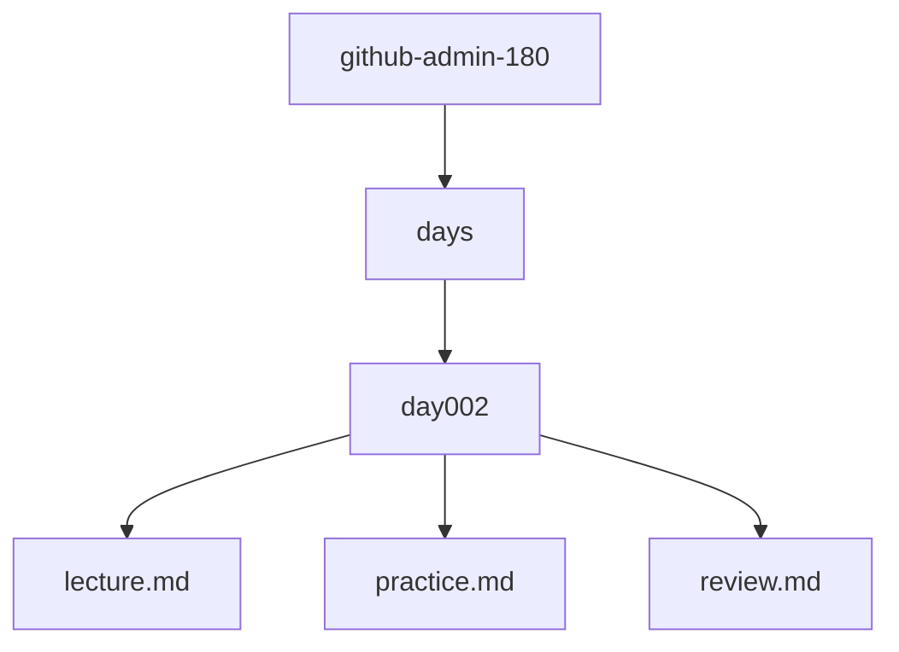
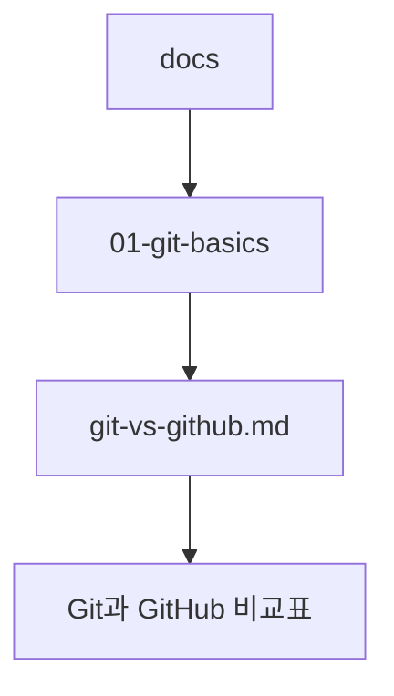
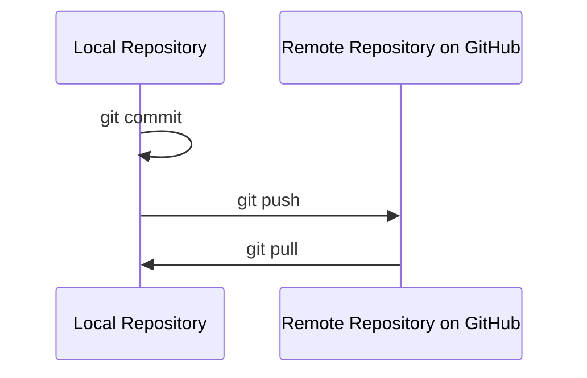
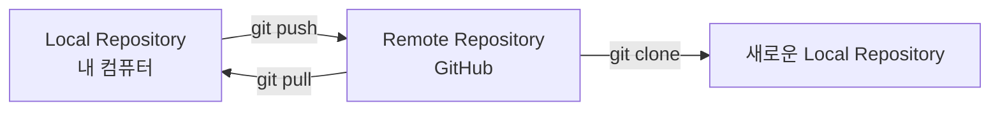
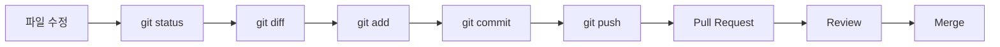
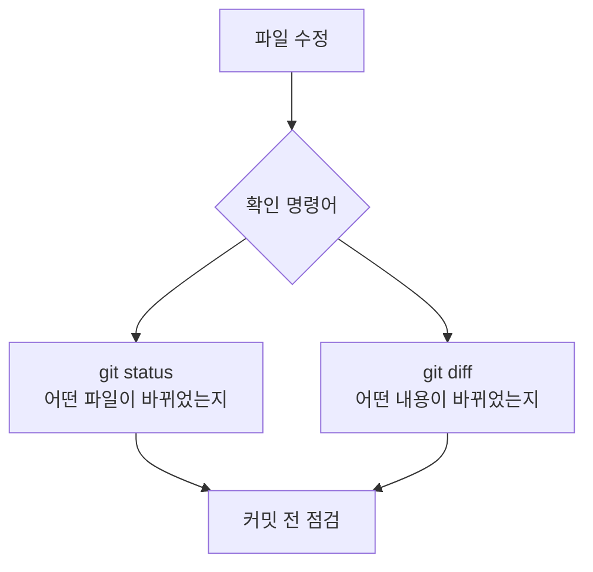
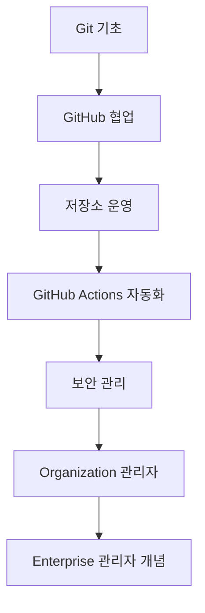
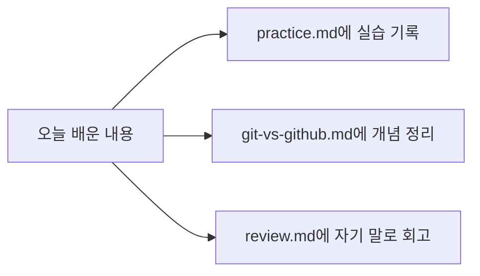

# Day 2. Git과 GitHub 차이

## 1. 학습 목표

오늘의 주제는 **Git과 GitHub의 차이**입니다.

Git과 GitHub는 이름이 비슷해서 처음 배우는 사람이 가장 많이 헷갈리는 개념입니다. 하지만 둘은 같은 것이 아닙니다.

오늘 수업이 끝나면 다음을 설명할 수 있어야 합니다.

| 구분 | 오늘의 목표 |
|---|---|
| 개념 이해 | Git과 GitHub가 각각 무엇인지 설명할 수 있다. |
| 역할 구분 | Git은 내 컴퓨터의 기록 도구, GitHub는 온라인 협업 공간이라는 차이를 이해한다. |
| 실무 흐름 이해 | 개발자가 코드를 수정하고 GitHub에 공유하는 기본 흐름을 이해한다. |
| 문서화 | `docs/01-git-basics/git-vs-github.md` 문서에 Git과 GitHub 차이를 정리한다. |
| Day 2 산출물 | `days/day002/lecture.md`, `practice.md`, `review.md`를 생성하고 실습 기록을 남긴다. |

오늘은 아직 어려운 협업 기능을 깊게 다루지 않습니다. 대신 앞으로 180일 동안 계속 사용할 가장 중요한 기초 개념을 아주 단단하게 잡습니다.

---

## 2. 오늘 배울 핵심 개념 한눈에 보기

| 용어 | 아주 쉬운 비유 | 실제 의미 |
|---|---|---|
| Git | 게임 저장 슬롯 | 내 컴퓨터에서 파일 변경 기록을 저장하는 도구 |
| Commit | 저장 지점 | 특정 시점의 파일 상태를 기록한 것 |
| Repository | 프로젝트 기록 보관함 | Git이 관리하는 프로젝트 폴더 |
| GitHub | 온라인 프로젝트 공유 공간 | Git 저장소를 인터넷에 올려 협업하는 플랫폼 |
| Remote Repository | 온라인 저장소 | GitHub에 있는 저장소 |
| Local Repository | 내 컴퓨터 저장소 | 내 컴퓨터에 있는 Git 저장소 |
| Push | 온라인에 올리기 | 내 컴퓨터의 커밋을 GitHub에 업로드 |
| Pull | 온라인 변경 가져오기 | GitHub의 변경 내용을 내 컴퓨터로 가져오기 |

Git과 GitHub를 한 문장으로 구분하면 다음과 같습니다.

> Git은 내 컴퓨터에서 변경 기록을 저장하는 도구이고, GitHub는 그 기록을 온라인에서 공유하고 협업하는 서비스입니다.

---

## 3. 이론 1 — Git은 무엇일까?

### 1) 쉬운 비유

Git은 **게임 저장 슬롯**과 비슷합니다.

게임을 하다가 중요한 순간마다 저장하면, 나중에 실수했을 때 이전 저장 지점으로 돌아갈 수 있습니다. 문서 작업에서도 비슷한 일이 자주 생깁니다.

예를 들어 다음과 같은 상황을 생각해봅시다.

- README를 잘못 수정했다.
- 어제 작성한 코드가 오늘 갑자기 동작하지 않는다.
- 어떤 파일을 언제, 왜 고쳤는지 기억이 나지 않는다.
- 팀원이 “이 부분 누가 바꿨어요?”라고 물어본다.

Git은 이런 상황에서 파일의 변경 기록을 남겨줍니다.

### 2) 개념 설명

Git은 **분산 버전 관리 시스템**입니다.

처음부터 이 말을 외울 필요는 없습니다. 쉽게 말하면 Git은 다음 일을 합니다.

| Git이 하는 일 | 설명 |
|---|---|
| 파일 변경 추적 | 어떤 파일이 바뀌었는지 확인한다. |
| 저장 지점 생성 | `commit`으로 특정 시점의 상태를 저장한다. |
| 이전 기록 확인 | 과거에 어떤 변경이 있었는지 볼 수 있다. |
| 여러 작업 흐름 관리 | 나중에 branch를 통해 기능별 작업을 나눌 수 있다. |
| 실수 복구 | 잘못된 변경을 되돌릴 수 있다. |

Git은 인터넷이 없어도 내 컴퓨터에서 사용할 수 있습니다. 즉, GitHub에 접속하지 않아도 Git 자체는 사용할 수 있습니다.

### 3) 실무에서 중요한 이유

실무에서는 파일을 한 번 만들고 끝내지 않습니다.

하나의 기능을 만들기 위해 다음과 같은 일이 계속 반복됩니다.

1. 코드를 작성한다.
2. 버그를 고친다.
3. 리뷰를 받는다.
4. 다시 수정한다.
5. 운영 환경에 반영한다.
6. 문제가 생기면 이전 상태를 확인한다.

Git을 사용하지 않으면 이런 변경 흐름을 기억과 파일명으로 관리해야 합니다.

예를 들면 다음과 같은 파일이 생깁니다.

```text
project-final.zip
project-final-real.zip
project-final-real-last.zip
project-final-real-last-v2.zip
project-final-real-last-v2-real.zip
```

이 방식은 혼자 작업할 때도 위험하고, 팀으로 일할 때는 거의 관리가 불가능합니다.

Git은 이런 혼란을 막아주는 기본 도구입니다.

### 4) 오늘 실습과의 연결

오늘은 `github-admin-180` 프로젝트 안에서 Day 2 폴더와 문서를 만들고, Git이 관리할 수 있는 상태로 준비합니다.

오늘 생성 또는 수정할 핵심 파일은 다음과 같습니다.

```text
github-admin-180/
├── days/
│   └── day002/
│       ├── lecture.md
│       ├── practice.md
│       └── review.md
└── docs/
    └── 01-git-basics/
        └── git-vs-github.md
```

### 5) 자주 하는 실수

| 실수 | 설명 |
|---|---|
| Git과 GitHub를 같은 것으로 생각한다 | Git은 도구, GitHub는 서비스다. |
| GitHub에 가입해야만 Git을 쓸 수 있다고 생각한다 | Git은 내 컴퓨터에서 단독으로 사용할 수 있다. |
| Git을 백업 프로그램으로만 생각한다 | Git은 단순 백업이 아니라 변경 이력을 관리한다. |
| 커밋을 너무 큰 단위로 한다 | 나중에 무엇을 바꿨는지 알기 어렵다. |
| 기록을 남기지 않고 파일만 수정한다 | 실무에서 변경 추적이 어려워진다. |

### 6) Mermaid 그림


Git의 기본 흐름은 아주 단순합니다. 파일을 수정하고, 기록할 파일을 고르고, 저장 지점을 만드는 것입니다.

---

## 4. 실습 예제 1 — Day 2 폴더와 파일 만들기

### 실습 목표

Day 2 강의자료, 실습 기록, 회고 파일을 표준 프로젝트 구조 안에 생성합니다.

### 사용하는 버전

| 도구 | 버전 |
|---|---:|
| Git | 2.54.0 |
| Visual Studio Code | 1.122.0 |

### 생성 또는 수정할 파일 위치

```text
github-admin-180/days/day002/lecture.md
github-admin-180/days/day002/practice.md
github-admin-180/days/day002/review.md
```

### 실습 순서

1. `github-admin-180` 폴더로 이동한다.
2. `days/day002` 폴더를 만든다.
3. Day 2 기본 파일 3개를 만든다.
4. Git 상태를 확인한다.
5. 실습 기록을 `practice.md`에 작성한다.

### 명령어

Linux / macOS / WSL / Git Bash 기준입니다.

```bash
cd github-admin-180

mkdir -p days/day002

touch days/day002/lecture.md
touch days/day002/practice.md
touch days/day002/review.md

git status
```

### 한 줄씩 설명

```bash
cd github-admin-180
```

`github-admin-180` 프로젝트 폴더로 이동합니다. 앞으로 180일 동안 모든 실습은 이 루트 폴더 안에서 진행합니다.

```bash
mkdir -p days/day002
```

`days` 폴더 아래에 `day002` 폴더를 만듭니다. `-p` 옵션은 중간 폴더가 없어도 함께 만들어주는 옵션입니다.

```bash
touch days/day002/lecture.md
```

Day 2 강의 노트를 저장할 파일입니다.

```bash
touch days/day002/practice.md
```

Day 2 실습 결과를 기록할 파일입니다.

```bash
touch days/day002/review.md
```

Day 2 회고를 작성할 파일입니다.

```bash
git status
```

현재 Git이 어떤 파일을 새로 발견했는지 확인합니다.

### `practice.md`에 기록할 내용 예시

아래 내용을 `days/day002/practice.md`에 작성합니다.

```md
# Day 2 Practice

## 오늘의 실습 주제

Git과 GitHub의 차이를 이해하고 Day 2 실습 파일을 생성한다.

## 생성한 파일

- days/day002/lecture.md
- days/day002/practice.md
- days/day002/review.md

## Git 상태 확인 결과

git status 명령어로 새 파일이 생성된 것을 확인했다.
```

### Mermaid 그림으로 이해하기



### 자주 하는 실수

- `github-admin-180` 폴더 밖에서 명령어를 실행한다.
- `day002`가 아니라 `day2`처럼 표준 이름과 다르게 만든다.
- 파일 확장자를 `.txt`로 만든다.
- `git status`로 생성 결과를 확인하지 않는다.

---

## 5. 이론 2 — GitHub는 무엇일까?

### 1) 쉬운 비유

GitHub는 **온라인 협업 사무실**과 비슷합니다.

내 컴퓨터에서 혼자 기록을 남기는 도구가 Git이라면, GitHub는 그 기록을 인터넷에 올려서 다른 사람과 함께 볼 수 있게 해주는 공간입니다.

비유하면 다음과 같습니다.

| 현실 비유 | 개발 세계 |
|---|---|
| 내 책상 | 내 컴퓨터 |
| 내 노트 | Git 저장소 |
| 저장한 페이지 | Commit |
| 회사 공유 문서함 | GitHub 저장소 |
| 팀원이 보는 공유 문서 | Remote Repository |

### 2) 개념 설명

GitHub는 Git 저장소를 온라인에서 관리하는 플랫폼입니다.

GitHub에서는 단순히 코드를 올리는 것만 하지 않습니다.

| GitHub 기능 | 쉬운 설명 |
|---|---|
| Repository | 프로젝트를 올려두는 온라인 공간 |
| Issue | 해야 할 일이나 버그를 적는 작업 카드 |
| Pull Request | “제가 이렇게 고쳤는데 확인하고 합쳐도 될까요?”라는 요청서 |
| Review | 다른 사람의 변경 내용을 검토하는 과정 |
| Actions | 테스트, 빌드, 배포를 해주는 로봇 직원 |
| Security | 취약점, 비밀값, 의존성 위험을 확인하는 기능 |
| Organization | 회사나 팀 단위의 GitHub 공간 |
| Enterprise | 여러 조직을 관리하는 본사급 GitHub 환경 |

즉, GitHub는 코드 저장소이면서 협업 도구이고, 자동화 도구이며, 보안과 관리자 운영 도구이기도 합니다.

### 3) 실무에서 중요한 이유

회사에서는 개발자가 혼자만 코드를 가지고 있으면 안 됩니다. 팀원, 리뷰어, 관리자, DevOps 담당자, 보안 담당자가 함께 봐야 합니다.

GitHub가 필요한 이유는 다음과 같습니다.

| 이유 | 설명 |
|---|---|
| 코드 공유 | 팀원이 같은 프로젝트를 함께 볼 수 있다. |
| 변경 검토 | Pull Request로 변경 내용을 검토할 수 있다. |
| 업무 추적 | Issue로 할 일을 관리할 수 있다. |
| 자동화 | GitHub Actions로 테스트와 배포를 자동화할 수 있다. |
| 보안 관리 | Secret Scanning, Dependabot, CodeQL 등을 사용할 수 있다. |
| 권한 관리 | Organization, Team, Role로 접근 권한을 관리할 수 있다. |

초급 개발자는 GitHub를 “코드 올리는 곳”으로만 생각하기 쉽습니다. 하지만 관리자급으로 성장하려면 GitHub를 “협업과 운영을 설계하는 플랫폼”으로 봐야 합니다.

### 4) 오늘 실습과의 연결

오늘은 Git과 GitHub 차이를 문서로 정리합니다.

생성할 문서는 다음 위치입니다.

```text
github-admin-180/docs/01-git-basics/git-vs-github.md
```

이 문서는 앞으로 Git 기초 학습의 첫 번째 개념 문서가 됩니다.

### 5) 자주 하는 실수

| 실수 | 왜 문제인가 |
|---|---|
| GitHub를 Git이라고 부른다 | 도구와 서비스를 구분하지 못하게 된다. |
| GitHub에 올리면 자동으로 커밋된다고 생각한다 | 커밋은 Git에서 먼저 만들어야 한다. |
| GitHub를 백업 저장소로만 사용한다 | 협업, 리뷰, 자동화, 보안 기능을 놓친다. |
| 모든 작업을 `main`에 바로 올린다 | 나중에 협업할 때 충돌과 장애 위험이 커진다. |
| 비밀번호나 토큰을 GitHub에 올린다 | 보안 사고로 이어질 수 있다. |

비밀번호, 토큰, SSH private key, Personal Access Token, API key는 절대 저장소에 커밋하지 않습니다.

### 6) Mermaid 그림


GitHub는 여러 사람의 Git 저장소가 만나는 온라인 중심 공간입니다.

---

## 6. 실습 예제 2 — Git과 GitHub 비교 문서 만들기

### 실습 목표

`docs/01-git-basics/git-vs-github.md` 파일을 만들고 Git과 GitHub의 차이를 표로 정리합니다.

### 사용하는 버전

| 도구 | 버전 |
|---|---:|
| Git | 2.54.0 |
| Visual Studio Code | 1.122.0 |

### 생성 또는 수정할 파일 위치

```text
github-admin-180/docs/01-git-basics/git-vs-github.md
```

### 실습 순서

1. Git 기초 문서 폴더를 확인한다.
2. `git-vs-github.md` 파일을 만든다.
3. Git과 GitHub 비교표를 작성한다.
4. Git 상태를 확인한다.

### 명령어

```bash
cd github-admin-180

mkdir -p docs/01-git-basics

cat > docs/01-git-basics/git-vs-github.md <<'EOT'
# Git과 GitHub 차이

## 한 문장으로 정리

Git은 내 컴퓨터에서 변경 기록을 저장하는 도구이고,
GitHub는 그 기록을 온라인에서 공유하고 협업하는 플랫폼이다.

## 비교표

| 구분 | Git | GitHub |
|---|---|---|
| 종류 | 버전 관리 도구 | 온라인 협업 플랫폼 |
| 위치 | 내 컴퓨터에서 사용 가능 | 인터넷 서비스 |
| 핵심 역할 | 변경 기록 저장 | 저장소 공유, 협업, 리뷰, 자동화 |
| 인터넷 필요 여부 | 기본 사용은 불필요 | 필요 |
| 대표 명령/기능 | add, commit, log, branch | repository, issue, pull request, actions |
| 실무 의미 | 작업 기록 관리 | 팀 협업과 운영 관리 |

## 쉬운 비유

- Git은 게임 저장 슬롯이다.
- Commit은 저장 지점이다.
- GitHub는 팀원이 함께 보는 온라인 작업실이다.

## 주의할 점

비밀번호, 토큰, SSH private key, PAT, API key는 절대 저장소에 커밋하지 않는다.
EOT

git status
```

### 한 줄씩 설명

```bash
mkdir -p docs/01-git-basics
```

Git 기초 문서를 저장할 폴더를 준비합니다.

```bash
cat > docs/01-git-basics/git-vs-github.md <<'EOT'
```

여러 줄의 내용을 한 번에 파일로 저장하기 시작합니다.

```bash
EOT
```

파일 입력을 끝냅니다.

```bash
git status
```

새로 만든 문서가 Git에 감지되는지 확인합니다.

### Mermaid 그림으로 이해하기



### 자주 하는 실수

- `docs/01-git-basics` 폴더를 만들지 않고 파일을 생성하려고 한다.
- 파일명에 공백을 넣어 관리하기 어렵게 만든다.
- Git과 GitHub 차이를 한 문장으로 설명하지 못한다.
- 보안 주의사항을 문서에 적지 않는다.

---

## 7. 이론 3 — Local Repository와 Remote Repository

### 1) 쉬운 비유

Local Repository는 **내 책상 위 노트**입니다. Remote Repository는 **회사 공유 문서함**입니다.

내 책상 위 노트에는 내가 혼자 내용을 적을 수 있습니다. 하지만 팀원이 보려면 회사 공유 문서함에 올려야 합니다.

개발에서도 마찬가지입니다.

- 내 컴퓨터의 Git 저장소: Local Repository
- GitHub의 온라인 저장소: Remote Repository

### 2) 개념 설명

Repository는 프로젝트 기록을 보관하는 공간입니다.

| 구분 | 위치 | 설명 |
|---|---|---|
| Local Repository | 내 컴퓨터 | 내가 직접 수정하고 커밋하는 저장소 |
| Remote Repository | GitHub | 팀원과 공유하는 온라인 저장소 |

Git은 내 컴퓨터의 변경 기록을 관리합니다. GitHub는 그 기록을 온라인 저장소로 공유합니다.

둘은 `push`와 `pull`로 연결됩니다.

| 명령 | 방향 | 의미 |
|---|---|---|
| push | Local → Remote | 내 커밋을 GitHub에 올린다. |
| pull | Remote → Local | GitHub의 변경을 내 컴퓨터로 가져온다. |
| clone | Remote → Local | GitHub 저장소를 처음 내 컴퓨터로 복사한다. |

### 3) 실무에서 중요한 이유

실무에서는 코드가 여러 장소에 존재합니다.

- 내 컴퓨터
- 동료 컴퓨터
- GitHub 저장소
- 배포 서버
- CI/CD 실행 환경

이때 Local과 Remote 개념을 모르면 다음 문제가 생깁니다.

| 상황 | 원인 |
|---|---|
| 내 컴퓨터에서는 되는데 팀원은 못 봄 | push를 하지 않음 |
| GitHub에는 있는데 내 컴퓨터에는 없음 | pull을 하지 않음 |
| 저장소를 처음 가져오지 못함 | clone 개념을 모름 |
| 같은 파일을 서로 다르게 고침 | 협업 흐름을 이해하지 못함 |

Local과 Remote 차이를 이해하는 것은 협업의 출발점입니다.

### 4) 오늘 실습과의 연결

오늘은 아직 GitHub 원격 저장소를 실제로 연결하지 않아도 됩니다. 대신 문서로 Local과 Remote 차이를 정리합니다.

이 내용은 Day 4 저장소 생성, Day 5 clone/add/commit, Day 6 push/pull에서 직접 사용됩니다.

### 5) 자주 하는 실수

| 실수 | 설명 |
|---|---|
| 커밋하면 GitHub에 자동으로 올라간다고 생각한다 | 커밋은 local 기록이다. push를 해야 GitHub로 올라간다. |
| GitHub에서 수정하면 내 컴퓨터에 자동 반영된다고 생각한다 | pull을 해야 가져온다. |
| clone과 pull을 같은 것으로 생각한다 | clone은 처음 복사, pull은 이후 변경 가져오기다. |
| remote가 없어도 push를 하려고 한다 | push하려면 연결된 원격 저장소가 필요하다. |

### 6) Mermaid 그림



핵심은 `commit`은 내 컴퓨터 안의 기록이고, `push`를 해야 GitHub에 올라간다는 점입니다.

---

## 8. 실습 예제 3 — Local과 Remote 개념을 문서에 추가하기

### 실습 목표

`git-vs-github.md` 문서에 Local Repository와 Remote Repository의 차이를 추가합니다.

### 사용하는 버전

| 도구 | 버전 |
|---|---:|
| Git | 2.54.0 |
| Visual Studio Code | 1.122.0 |

### 생성 또는 수정할 파일 위치

```text
github-admin-180/docs/01-git-basics/git-vs-github.md
```

### 실습 순서

1. 기존 문서에 Local/Remote 설명을 추가한다.
2. `git diff`로 변경 내용을 확인한다.
3. `practice.md`에 실습 결과를 기록한다.

### 명령어

```bash
cd github-admin-180

cat >> docs/01-git-basics/git-vs-github.md <<'EOT'

## Local Repository와 Remote Repository

| 구분 | 의미 | 위치 |
|---|---|---|
| Local Repository | 내 컴퓨터에 있는 Git 저장소 | 내 PC |
| Remote Repository | GitHub에 있는 온라인 저장소 | GitHub |

## push와 pull

| 명령어 | 방향 | 의미 |
|---|---|---|
| git push | Local → Remote | 내 커밋을 GitHub에 올린다. |
| git pull | Remote → Local | GitHub의 변경 내용을 내 컴퓨터로 가져온다. |
| git clone | Remote → Local | GitHub 저장소를 처음 복사한다. |
EOT

git diff docs/01-git-basics/git-vs-github.md
```

### 한 줄씩 설명

```bash
cat >> docs/01-git-basics/git-vs-github.md <<'EOT'
```

기존 파일 끝에 내용을 추가합니다. `>`는 파일을 새로 덮어쓰고, `>>`는 기존 내용 뒤에 추가합니다.

```bash
git diff docs/01-git-basics/git-vs-github.md
```

아직 커밋하지 않은 변경 내용을 확인합니다.

### `practice.md`에 추가할 내용 예시

```bash
cat >> days/day002/practice.md <<'EOT'

## Local과 Remote 정리

- Local Repository는 내 컴퓨터에 있는 저장소다.
- Remote Repository는 GitHub에 있는 온라인 저장소다.
- commit은 local 기록이다.
- push를 해야 GitHub에 올라간다.
- pull을 해야 GitHub 변경 내용을 가져온다.
EOT
```

### Mermaid 그림으로 이해하기



### 자주 하는 실수

- `>`와 `>>`를 헷갈려 기존 파일을 덮어쓴다.
- `git diff`를 확인하지 않고 바로 커밋한다.
- Local과 Remote를 위치가 아니라 기능으로만 외운다.
- `commit`과 `push`를 같은 동작으로 생각한다.

---

## 9. 이론 4 — Git과 GitHub를 함께 쓰는 기본 흐름

### 1) 쉬운 비유

Git과 GitHub를 함께 쓰는 과정은 **숙제를 작성하고 선생님께 제출하는 흐름**과 비슷합니다.

1. 내 공책에 숙제를 쓴다.
2. 중요한 지점마다 저장한다.
3. 제출함에 올린다.
4. 선생님이나 친구가 확인한다.
5. 수정이 필요하면 다시 고친다.

개발에서는 이 흐름이 다음과 같이 바뀝니다.

1. 내 컴퓨터에서 파일을 수정한다.
2. Git으로 커밋한다.
3. GitHub로 push한다.
4. Pull Request를 만든다.
5. 리뷰를 받고 main에 합친다.

### 2) 개념 설명

실무에서 가장 기본적인 Git/GitHub 흐름은 다음과 같습니다.

| 단계 | 도구 | 설명 |
|---|---|---|
| 파일 수정 | 에디터 | README, 코드, 문서 등을 수정한다. |
| 변경 확인 | Git | `git status`, `git diff`로 변경을 확인한다. |
| 스테이징 | Git | `git add`로 커밋할 파일을 고른다. |
| 커밋 | Git | `git commit`으로 저장 지점을 만든다. |
| 업로드 | Git + GitHub | `git push`로 GitHub에 올린다. |
| 검토 요청 | GitHub | Pull Request를 생성한다. |
| 리뷰 | GitHub | 팀원이 변경 내용을 확인한다. |
| 병합 | GitHub | 승인된 변경을 main에 합친다. |

오늘은 이 중에서 파일 수정, 문서 작성, 상태 확인 중심으로 다룹니다. 나머지는 앞으로 순서대로 배웁니다.

### 3) 실무에서 중요한 이유

회사에서 중요한 것은 “내가 코드를 작성했다”가 아닙니다. “팀이 안전하게 검토하고 운영에 반영할 수 있게 만들었다”가 중요합니다.

Git과 GitHub 흐름을 이해하면 다음이 가능해집니다.

| 가능해지는 일 | 설명 |
|---|---|
| 변경 이유 설명 | 커밋 메시지와 PR 설명으로 작업 의도를 남긴다. |
| 리뷰 가능 | 팀원이 변경 내용을 보고 의견을 줄 수 있다. |
| 장애 예방 | main에 바로 반영하지 않고 검토 단계를 둘 수 있다. |
| 자동 검사 | GitHub Actions로 테스트를 자동 실행할 수 있다. |
| 감사 가능 | 누가 언제 무엇을 바꿨는지 추적할 수 있다. |

관리자급 GitHub 사용자는 이 흐름을 개인 습관이 아니라 팀 규칙으로 설계할 수 있어야 합니다.

### 4) 오늘 실습과의 연결

오늘은 아직 Pull Request를 만들지는 않습니다. 대신 Day 2 문서를 만들고, Git 상태와 변경 내용을 확인하면서 기본 흐름의 앞부분을 연습합니다.

### 5) 자주 하는 실수

| 실수 | 설명 |
|---|---|
| 변경 내용을 확인하지 않고 커밋한다 | 실수 파일이 함께 들어갈 수 있다. |
| 너무 많은 내용을 한 번에 커밋한다 | 리뷰와 추적이 어려워진다. |
| 커밋 메시지를 대충 쓴다 | 나중에 기록을 이해하기 어렵다. |
| main에 바로 작업한다 | 협업 시 위험이 커진다. |
| GitHub에 올린 뒤 끝이라고 생각한다 | 실무에서는 리뷰, 자동화, 보안 확인이 이어진다. |

### 6) Mermaid 그림



오늘은 `파일 수정 → git status → git diff` 흐름을 특히 중요하게 봅니다.

---

## 10. 실습 예제 4 — Git 상태와 변경 내용 확인하기

### 실습 목표

Day 2에서 만든 문서가 Git에서 어떻게 보이는지 확인하고, 변경 내용을 실습 기록에 남깁니다.

### 사용하는 버전

| 도구 | 버전 |
|---|---:|
| Git | 2.54.0 |

### 생성 또는 수정할 파일 위치

```text
github-admin-180/days/day002/practice.md
github-admin-180/docs/01-git-basics/git-vs-github.md
```

### 실습 순서

1. `git status`로 변경된 파일을 확인한다.
2. `git diff`로 문서 변경 내용을 확인한다.
3. 결과를 `practice.md`에 기록한다.
4. 아직 커밋하지 않은 상태를 이해한다.

### 명령어

```bash
cd github-admin-180

git status

git diff docs/01-git-basics/git-vs-github.md

cat >> days/day002/practice.md <<'EOT'

## git status와 git diff 확인

### git status

현재 새로 생성되거나 수정된 파일을 확인하는 명령어다.

### git diff

아직 커밋하지 않은 변경 내용을 자세히 확인하는 명령어다.

### 오늘 확인한 파일

- docs/01-git-basics/git-vs-github.md
- days/day002/practice.md
EOT
```

### 한 줄씩 설명

```bash
git status
```

현재 프로젝트에서 Git이 보고 있는 변경 상태를 보여줍니다.

```bash
git diff docs/01-git-basics/git-vs-github.md
```

해당 문서에서 어떤 줄이 추가되거나 변경되었는지 보여줍니다.

```bash
cat >> days/day002/practice.md <<'EOT'
```

실습 기록 파일에 내용을 추가합니다.

### Mermaid 그림으로 이해하기



### 자주 하는 실수

- `git status`만 보고 내용 확인을 하지 않는다.
- `git diff` 결과를 읽지 않고 바로 커밋한다.
- 실습 기록을 남기지 않아 나중에 무엇을 했는지 잊는다.
- 새 파일은 `git diff`에서 내용이 바로 안 보일 수 있다는 점을 모른다. 새 파일은 `git add` 후 `git diff --staged`로 확인할 수 있다.

---

## 11. 이론 5 — GitHub 관리자 관점에서 보는 Git과 GitHub

### 1) 쉬운 비유

GitHub 관리자는 단순히 코드를 올리는 사람이 아닙니다. 비유하면 **회사 문서실 관리자**와 비슷합니다.

문서실 관리자는 다음을 신경 씁니다.

- 누가 문서를 볼 수 있는가?
- 누가 문서를 수정할 수 있는가?
- 중요한 문서는 승인 없이 바꾸지 못하게 할 수 있는가?
- 비밀번호 같은 위험한 문서가 올라오지 않게 할 수 있는가?
- 문제가 생겼을 때 누가 언제 무엇을 했는지 확인할 수 있는가?

GitHub 관리자도 같은 일을 합니다.

### 2) 개념 설명

Git과 GitHub를 관리자 관점에서 보면 다음과 같이 구분할 수 있습니다.

| 관점 | Git | GitHub |
|---|---|---|
| 개인 작업 | 변경 기록 관리 | 저장소 업로드 |
| 팀 협업 | branch, merge | Issue, Pull Request, Review |
| 운영 표준 | 커밋 규칙 | PR Template, CODEOWNERS, Branch Protection |
| 자동화 | hook 등 일부 자동화 | GitHub Actions |
| 보안 | 기록 관리 | Secret Scanning, Dependabot, CodeQL |
| 조직 운영 | 개인 저장소 중심 | Organization, Team, Role, Audit Log |
| 엔터프라이즈 | 로컬 도구 | SSO, SCIM, Billing, Compliance |

초급 단계에서는 Git 명령어를 익히는 것이 중요합니다. 하지만 180일 목표는 여기서 끝나지 않습니다.

최종 목표는 다음과 같습니다.

> GitHub 관리자는 코드를 저장하는 사람을 넘어, 협업 규칙·자동화·보안·권한을 설계하는 사람입니다.

### 3) 실무에서 중요한 이유

관리자급으로 성장하려면 “명령어를 칠 줄 안다”에서 멈추면 안 됩니다.

다음 질문에 답할 수 있어야 합니다.

| 질문 | 관리자 관점 |
|---|---|
| main 브랜치에 아무나 push해도 되는가? | Branch Protection 또는 Rulesets가 필요하다. |
| 리뷰 없이 배포해도 되는가? | PR Review 규칙이 필요하다. |
| 비밀번호가 커밋되면 어떻게 막을 것인가? | Secret Scanning과 Push Protection이 필요하다. |
| 팀원이 퇴사하면 권한을 어떻게 회수할 것인가? | Offboarding 절차가 필요하다. |
| 누가 중요한 설정을 바꿨는지 어떻게 확인할 것인가? | Audit Log가 필요하다. |

오늘은 아직 이런 기능을 설정하지 않습니다. 하지만 Git과 GitHub의 차이를 이해해야 나중에 관리자 기능도 정확히 이해할 수 있습니다.

### 4) 오늘 실습과의 연결

오늘 만든 `git-vs-github.md` 문서는 단순 비교 문서가 아닙니다.

앞으로 다음 문서들의 출발점이 됩니다.

```text
docs/01-git-basics/basic-commands.md
docs/01-git-basics/branch-merge.md
docs/02-collaboration/pull-request-workflow.md
docs/03-repository-admin/branch-protection.md
docs/04-github-actions/actions-basics.md
docs/05-security/secret-scanning.md
```

### 5) 자주 하는 실수

| 실수 | 설명 |
|---|---|
| GitHub 관리자를 저장소 생성 담당자로만 생각한다 | 실제로는 협업, 보안, 권한, 자동화 운영까지 포함한다. |
| Git 명령어만 알면 충분하다고 생각한다 | 실무에서는 GitHub 운영 규칙도 매우 중요하다. |
| 보안 기능을 나중 문제로 미룬다 | 초급부터 비밀값 커밋 금지는 습관화해야 한다. |
| 권한 관리를 사람 이름으로만 한다 | 실무에서는 Team과 Role 기반으로 설계해야 한다. |

### 6) Mermaid 그림



Git과 GitHub의 차이를 이해하는 것은 180일 전체 여정의 첫 계단입니다.

---

## 12. 실습 예제 5 — Day 2 회고 작성하기

### 실습 목표

오늘 배운 Git과 GitHub 차이를 자기 말로 정리하고 회고 문서에 남깁니다.

### 사용하는 버전

| 도구 | 버전 |
|---|---:|
| Git | 2.54.0 |
| Visual Studio Code | 1.122.0 |

### 생성 또는 수정할 파일 위치

```text
github-admin-180/days/day002/review.md
```

### 실습 순서

1. `review.md`에 오늘 배운 내용을 정리한다.
2. Git과 GitHub 차이를 한 문장으로 작성한다.
3. 아직 헷갈리는 부분을 적는다.
4. 내일 배울 내용을 확인한다.

### 명령어

```bash
cd github-admin-180

cat > days/day002/review.md <<'EOT'
# Day 2 Review

## 오늘 배운 핵심

Git과 GitHub는 같은 것이 아니다.

## Git과 GitHub 차이 한 문장 정리

Git은 내 컴퓨터에서 변경 기록을 저장하는 도구이고,
GitHub는 그 기록을 온라인에서 공유하고 협업하는 플랫폼이다.

## 내가 이해한 Git

Git은 게임 저장 슬롯처럼 파일의 변경 기록을 저장한다.
commit은 저장 지점이다.

## 내가 이해한 GitHub

GitHub는 온라인 작업실처럼 팀원이 저장소를 함께 보고,
Issue, Pull Request, Review, Actions, Security 기능으로 협업과 운영을 돕는다.

## 아직 헷갈리는 점

- 
- 
- 

## 내일 학습할 내용

Day 3에서는 Git 설치와 계정 설정을 배운다.
EOT

git status
```

### 한 줄씩 설명

```bash
cat > days/day002/review.md <<'EOT'
```

`review.md` 파일에 회고 내용을 새로 작성합니다.

```bash
git status
```

오늘 생성하거나 수정한 파일 목록을 다시 확인합니다.

### 선택 명령어: 오늘 작업을 커밋하기

아직 commit을 배우기 전이라 필수는 아닙니다. 이미 Git commit을 알고 있다면 아래 명령어로 오늘 작업을 저장할 수 있습니다.

```bash
git add days/day002 docs/01-git-basics/git-vs-github.md
git commit -m "docs: add day002 git vs github notes"
```

### Mermaid 그림으로 이해하기



### 자주 하는 실수

- 회고를 단순히 “어려웠다”로만 끝낸다.
- Git과 GitHub 차이를 자기 말로 설명하지 않는다.
- 헷갈리는 부분을 적지 않는다.
- 실습 결과를 확인하지 않고 종료한다.

---

## 강의 요약

오늘 배운 내용을 정리하면 다음과 같습니다.

| 배운 내용 | 핵심 |
|---|---|
| Git | 내 컴퓨터에서 파일 변경 기록을 저장하는 도구 |
| GitHub | Git 저장소를 온라인에서 공유하고 협업하는 플랫폼 |
| Commit | Git에서 만드는 저장 지점 |
| Local Repository | 내 컴퓨터에 있는 Git 저장소 |
| Remote Repository | GitHub에 있는 온라인 저장소 |
| Push | Local의 커밋을 Remote로 올리는 동작 |
| Pull | Remote의 변경 내용을 Local로 가져오는 동작 |
| Clone | Remote 저장소를 처음 내 컴퓨터로 복사하는 동작 |
| 관리자 관점 | GitHub는 협업, 자동화, 보안, 권한 운영을 설계하는 플랫폼 |

Git과 GitHub의 차이를 제대로 이해하면 앞으로 배우는 branch, merge, conflict, Issue, Pull Request, GitHub Actions, Organization, Enterprise 개념이 훨씬 쉬워집니다.

오늘 꼭 기억해야 할 한 문장:

> GitHub 관리자는 코드를 저장하는 사람을 넘어, 협업 규칙·자동화·보안·권한을 설계하는 사람입니다.

---

## 초급 연습문제 5개

### 문제 1. Git 한 문장 설명하기

#### 문제 설명

Git이 무엇인지 한 문장으로 설명해보세요.

#### 요구사항

- “변경 기록”이라는 표현을 포함하세요.
- “내 컴퓨터”라는 표현을 포함하세요.
- 초보자도 이해할 수 있게 작성하세요.

#### 힌트

Git은 게임 저장 슬롯과 비슷합니다.

#### 제출물

- `days/day002/review.md`에 작성한 한 문장

---

### 문제 2. GitHub 한 문장 설명하기

#### 문제 설명

GitHub가 무엇인지 한 문장으로 설명해보세요.

#### 요구사항

- “온라인”이라는 표현을 포함하세요.
- “협업”이라는 표현을 포함하세요.
- Git과 다르다는 점이 드러나야 합니다.

#### 힌트

GitHub는 팀원이 함께 보는 온라인 작업실입니다.

#### 제출물

- `days/day002/review.md`에 작성한 한 문장

---

### 문제 3. 비교표 완성하기

#### 문제 설명

Git과 GitHub의 차이를 표로 정리하세요.

#### 요구사항

- 최소 4개 항목을 비교하세요.
- 위치, 역할, 인터넷 필요 여부를 포함하세요.
- `docs/01-git-basics/git-vs-github.md`에 작성하세요.

#### 힌트

Git은 도구이고 GitHub는 플랫폼입니다.

#### 제출물

- 수정된 `docs/01-git-basics/git-vs-github.md`

---

### 문제 4. Local과 Remote 구분하기

#### 문제 설명

Local Repository와 Remote Repository의 차이를 정리하세요.

#### 요구사항

- Local Repository의 위치를 설명하세요.
- Remote Repository의 위치를 설명하세요.
- push와 pull 중 하나 이상을 함께 설명하세요.

#### 힌트

Local은 내 컴퓨터, Remote는 GitHub입니다.

#### 제출물

- `days/day002/practice.md`에 작성한 정리 문장

---

### 문제 5. 오늘 생성한 파일 확인하기

#### 문제 설명

오늘 만든 파일 목록을 정리하세요.

#### 요구사항

- `days/day002/lecture.md`
- `days/day002/practice.md`
- `days/day002/review.md`
- `docs/01-git-basics/git-vs-github.md`

위 파일이 포함되어야 합니다.

#### 힌트

`git status` 명령어로 확인할 수 있습니다.

#### 제출물

- `days/day002/practice.md`에 작성한 파일 목록

---

## 중급 연습문제 5개

### 문제 1. Git과 GitHub 흐름도 작성하기

#### 문제 설명

파일 수정부터 GitHub 공유까지의 흐름을 Mermaid로 작성하세요.

#### 요구사항

- 파일 수정
- git add
- git commit
- git push
- GitHub 저장소

위 단계를 포함하세요.

#### 힌트

`flowchart LR`를 사용하면 왼쪽에서 오른쪽으로 흐름을 표현할 수 있습니다.

#### 제출물

- `docs/01-git-basics/git-vs-github.md`에 추가한 Mermaid 그림

---

### 문제 2. commit과 push 차이 설명하기

#### 문제 설명

`commit`과 `push`의 차이를 설명하세요.

#### 요구사항

- commit은 어디에 기록되는지 설명하세요.
- push는 어느 방향으로 이동하는지 설명하세요.
- Local과 Remote 용어를 포함하세요.

#### 힌트

commit은 Local, push는 Local에서 Remote로 이동입니다.

#### 제출물

- `days/day002/review.md`에 작성한 설명

---

### 문제 3. 실무 상황으로 설명하기

#### 문제 설명

“내 컴퓨터에서는 수정했는데 팀원이 GitHub에서 볼 수 없다”는 상황의 원인을 설명하세요.

#### 요구사항

- 가능한 원인을 2개 이상 적으세요.
- Git과 GitHub 개념을 사용해 설명하세요.
- 해결 방향도 함께 적으세요.

#### 힌트

커밋만 했는지, push까지 했는지 생각해보세요.

#### 제출물

- `days/day002/practice.md`에 작성한 상황 분석

---

### 문제 4. GitHub 관리자 관점 정리하기

#### 문제 설명

GitHub 관리자가 단순히 코드를 올리는 사람과 다른 이유를 설명하세요.

#### 요구사항

- 협업 규칙
- 보안
- 권한 관리

위 단어를 포함하세요.

#### 힌트

관리자는 저장소를 운영하는 기준을 설계합니다.

#### 제출물

- `days/day002/review.md`에 작성한 관리자 관점 설명

---

### 문제 5. Day 2 문서 품질 개선하기

#### 문제 설명

`git-vs-github.md` 문서를 초보자가 읽기 쉽게 개선하세요.

#### 요구사항

- 제목을 명확히 유지하세요.
- 비교표를 포함하세요.
- 쉬운 비유를 포함하세요.
- 보안 주의사항을 포함하세요.

#### 힌트

“초등학생에게 설명한다면?”이라는 기준으로 문장을 바꿔보세요.

#### 제출물

- 개선된 `docs/01-git-basics/git-vs-github.md`

---

## 고급 연습문제 5개

### 문제 1. 신입 개발자 온보딩 문장 작성하기

#### 문제 설명

회사에 새로 들어온 신입 개발자에게 Git과 GitHub 차이를 설명하는 온보딩 문장을 작성하세요.

#### 요구사항

- 5문장 이상 작성하세요.
- Git, GitHub, Local, Remote, push를 포함하세요.
- 실무에서 왜 중요한지 설명하세요.

#### 힌트

신입 개발자가 “커밋하면 GitHub에 바로 올라가나요?”라고 물었다고 생각해보세요.

#### 제출물

- `docs/01-git-basics/git-vs-github.md`에 추가한 온보딩 설명

---

### 문제 2. 저장소 운영 규칙 초안 만들기

#### 문제 설명

GitHub 저장소를 운영할 때 필요한 기본 규칙 초안을 작성하세요.

#### 요구사항

- main 브랜치에 직접 작업하지 않는다는 규칙을 포함하세요.
- 비밀번호나 토큰을 커밋하지 않는다는 규칙을 포함하세요.
- 커밋 전 `git status`와 `git diff`를 확인한다는 규칙을 포함하세요.
- 아직 배우지 않은 기능은 이름만 언급해도 됩니다.

#### 힌트

관리자 관점에서 “실수를 줄이는 규칙”을 생각하세요.

#### 제출물

- `days/day002/review.md`에 작성한 운영 규칙 초안

---

### 문제 3. 사고 시나리오 분석하기

#### 문제 설명

개발자가 API key를 실수로 GitHub에 올렸다고 가정합니다. 왜 위험한지, 초급 단계에서 어떤 습관으로 예방할 수 있는지 작성하세요.

#### 요구사항

- 위험한 이유를 2개 이상 적으세요.
- 예방 습관을 3개 이상 적으세요.
- “커밋 전 확인”을 포함하세요.

#### 힌트

오늘 배운 보안 주의사항과 `git status`, `git diff`를 연결해보세요.

#### 제출물

- `days/day002/practice.md`에 작성한 사고 분석

---

### 문제 4. GitHub를 협업 플랫폼으로 설명하기

#### 문제 설명

GitHub가 단순한 코드 저장소가 아니라 협업 플랫폼인 이유를 설명하세요.

#### 요구사항

- Issue
- Pull Request
- Review
- Actions
- Security

위 단어를 포함하세요.

#### 힌트

각 기능을 “팀에서 어떤 문제를 해결하는지” 관점으로 설명하세요.

#### 제출물

- `docs/01-git-basics/git-vs-github.md`에 추가한 설명

---

### 문제 5. 180일 학습 연결 지도 만들기

#### 문제 설명

Day 2의 Git/GitHub 차이가 앞으로 배울 주제와 어떻게 연결되는지 정리하세요.

#### 요구사항

- Day 5 clone/add/commit과 연결하세요.
- Day 6 push/pull과 연결하세요.
- Day 19 Pull Request와 연결하세요.
- Day 61 GitHub Actions와 연결하세요.
- Day 121 Organization과 연결하세요.

#### 힌트

Git은 기록, GitHub는 협업과 운영이라는 큰 틀로 연결해보세요.

#### 제출물

- `days/day002/review.md`에 작성한 학습 연결 지도

---

## 오늘의 체크리스트

아래 항목을 스스로 확인하세요.

| 체크 | 항목 |
|---|---|
| [ ] | Git은 내 컴퓨터에서 변경 기록을 저장하는 도구라고 설명할 수 있다. |
| [ ] | GitHub는 온라인 협업 플랫폼이라고 설명할 수 있다. |
| [ ] | Git과 GitHub를 같은 것으로 말하지 않을 수 있다. |
| [ ] | Local Repository와 Remote Repository의 차이를 설명할 수 있다. |
| [ ] | commit과 push가 다르다는 것을 이해했다. |
| [ ] | `days/day002` 폴더를 생성했다. |
| [ ] | `days/day002/lecture.md` 파일을 생성했다. |
| [ ] | `days/day002/practice.md` 파일을 작성했다. |
| [ ] | `days/day002/review.md` 파일을 작성했다. |
| [ ] | `docs/01-git-basics/git-vs-github.md` 파일을 작성했다. |
| [ ] | `git status`로 변경 상태를 확인했다. |
| [ ] | `git diff`로 변경 내용을 확인했다. |
| [ ] | 비밀번호, 토큰, SSH private key, PAT, API key를 절대 커밋하지 않아야 한다는 점을 이해했다. |

---

## 다음 Day 예고

다음은 **Day 3. Git 설치와 계정 설정**입니다.

Day 3에서는 다음을 배웁니다.

| 주제 | 내용 |
|---|---|
| Git 설치 확인 | 내 컴퓨터에 Git이 설치되어 있는지 확인 |
| Git 버전 확인 | Git 2.54.0 기준으로 학습 환경 점검 |
| 사용자 이름 설정 | `git config user.name` 설정 |
| 사용자 이메일 설정 | `git config user.email` 설정 |
| 기본 브랜치명 설정 | `main`을 기본 브랜치명으로 설정 |
| VS Code 연결 | VS Code에서 Git 상태 확인 |
| 설정 문서화 | `docs/01-git-basics/basic-commands.md`에 기본 설정 기록 |

Day 3부터는 Git을 실제로 사용할 준비를 더 구체적으로 갖추게 됩니다.
