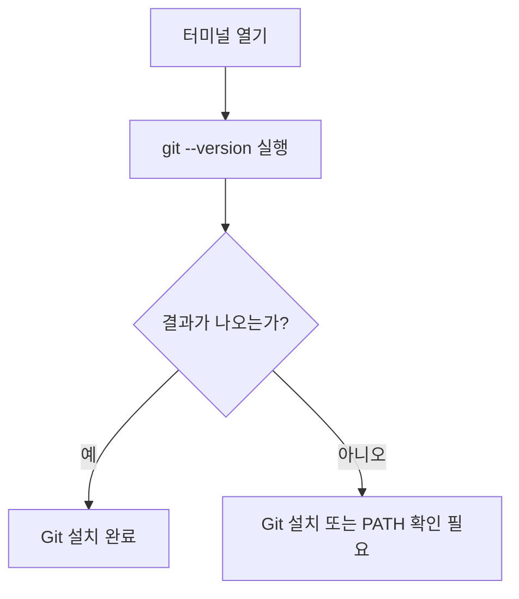
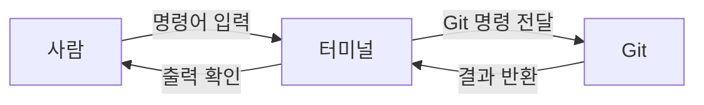
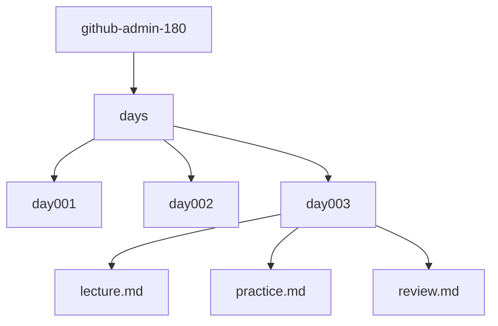
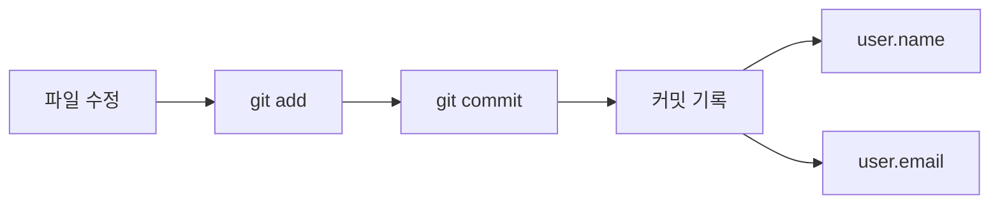
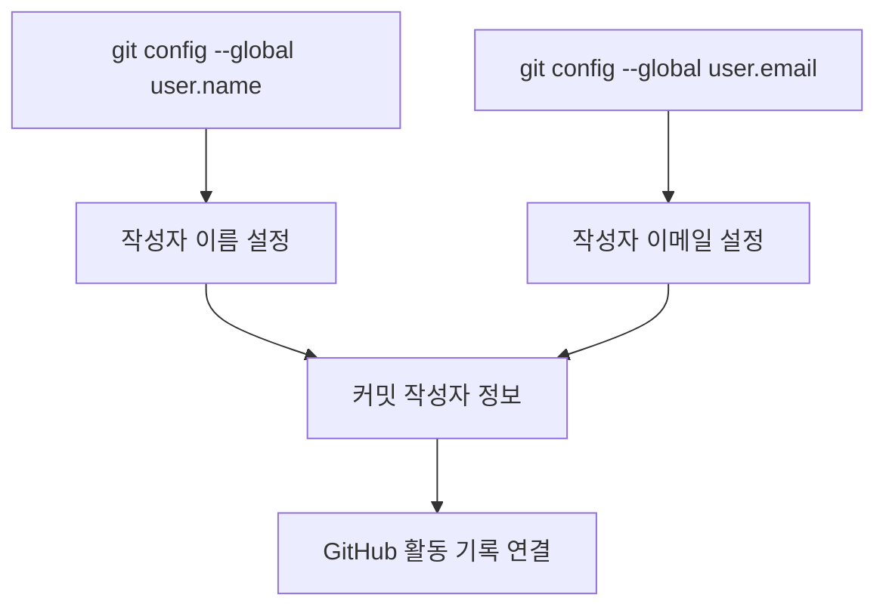
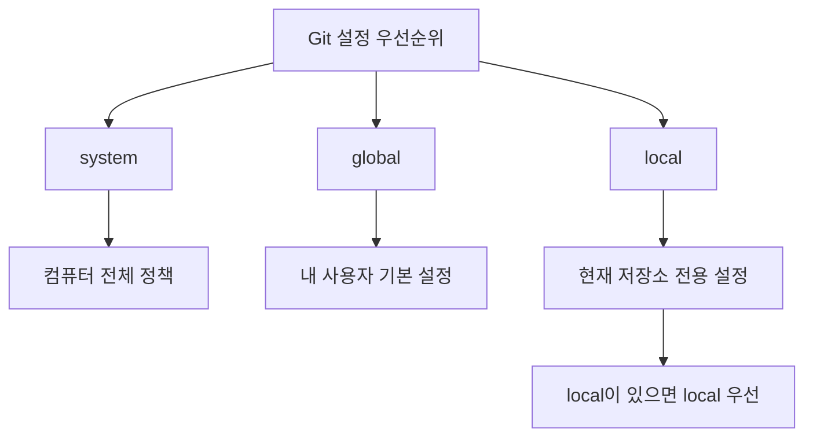
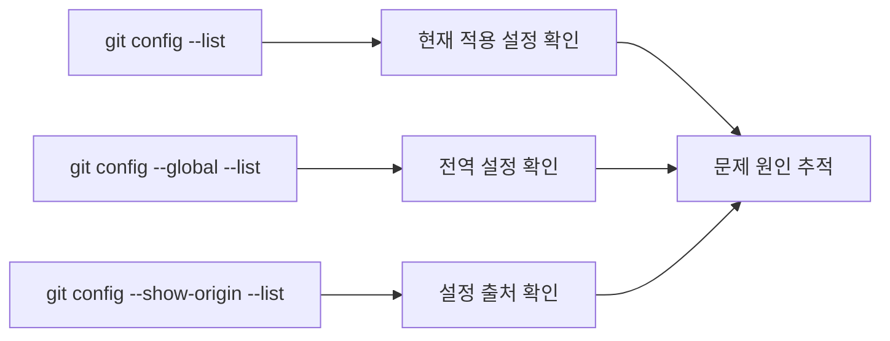
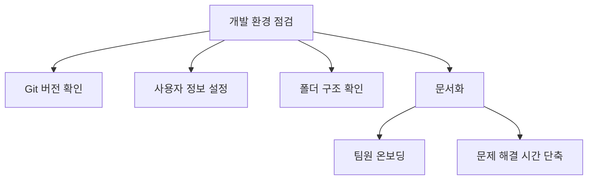
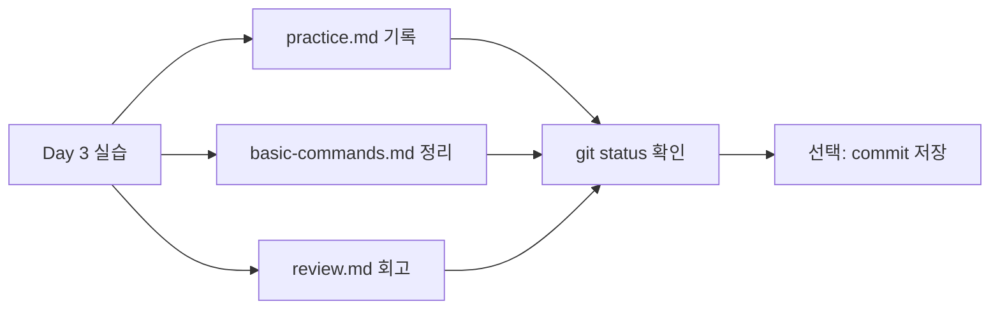

# Day 3. Git 설치와 계정 설정

> 학습 주제: Git 설치와 계정 설정  
> 학습 단계: Day 1~30 — GitHub 초급 기초  
> 오늘의 목표: 내 컴퓨터에서 Git을 사용할 준비를 하고, 커밋 기록에 남을 사용자 정보를 올바르게 설정합니다.

---

## 1. 학습 목표

오늘은 Git과 GitHub를 본격적으로 사용하기 전에 반드시 필요한 **개발 환경 준비**를 합니다.

Git은 파일의 변경 기록을 저장하는 도구입니다. 하지만 Git이 컴퓨터에 설치되어 있지 않거나, 사용자 이름과 이메일이 설정되어 있지 않으면 제대로 기록을 남기기 어렵습니다.

오늘 수업을 끝내면 다음을 할 수 있습니다.

1. Git이 내 컴퓨터에 설치되어 있는지 확인할 수 있습니다.
2. Git 2.54.0 기준으로 기본 명령어를 실행할 준비를 할 수 있습니다.
3. Git 사용자 이름과 이메일을 설정할 수 있습니다.
4. Git 설정값을 확인할 수 있습니다.
5. `github-admin-180` 표준 프로젝트 구조 안에 Day 3 학습 기록을 남길 수 있습니다.
6. 앞으로 GitHub에 올릴 커밋 기록이 누구의 작업인지 구분할 수 있습니다.

---


## 2. 오늘 배울 핵심 개념 한눈에 보기


| 핵심 개념           | 쉬운 설명                      | 실무 의미                |
| --------------- | -------------------------- | -------------------- |
| Git 설치          | 컴퓨터에 저장 기록 도구를 준비하는 것      | 로컬 개발 환경의 기본 준비      |
| 터미널             | 명령어를 입력하는 작업 창             | 개발자가 Git을 제어하는 기본 도구 |
| `git --version` | Git 설치 여부와 버전을 확인하는 명령어    | 팀 기준 버전과 내 환경 비교     |
| Git 사용자 이름      | 커밋 기록에 남는 작성자 이름           | 누가 작업했는지 추적 가능       |
| Git 이메일         | 커밋 작성자와 GitHub 계정을 연결하는 정보 | GitHub 활동 기록 연결      |
| global 설정       | 내 컴퓨터 전체에 적용되는 Git 설정      | 모든 저장소의 기본 작성자 정보 지정 |
| local 설정        | 특정 저장소에만 적용되는 Git 설정       | 회사/개인 프로젝트 계정 분리 가능  |


오늘 사용하는 고정 버전은 다음과 같습니다.


| 도구                 | 고정 버전   | 사용 목적                      |
| ------------------ | ------- | -------------------------- |
| Git                | 2.54.0  | Git 기본 명령어, 브랜치, 병합, 충돌 해결 |
| GitHub CLI         | 2.93.0  | 추후 터미널에서 GitHub 관리         |
| GitHub Desktop     | 3.5.8   | CLI 보조 GUI 도구              |
| Visual Studio Code | 1.122.0 | 실습용 에디터                    |


> 오늘은 Git 설치와 Git 계정 설정이 중심입니다. GitHub CLI, GitHub Desktop, VS Code는 앞으로의 실습에서 점진적으로 사용합니다.

---


## 3. 이론 1 — Git 설치는 왜 필요할까?


### 쉬운 비유

Git은 **게임 저장 슬롯**과 비슷합니다.

게임을 할 때 저장 기능이 없으면 어떻게 될까요?

- 보스를 깨기 전 상태로 돌아갈 수 없습니다.
- 실수했을 때 이전 상태로 되돌리기 어렵습니다.
- 어디까지 진행했는지 기록하기 어렵습니다.

Git도 마찬가지입니다. 개발 중에 파일을 수정하다가 실수해도, Git이 있으면 이전 저장 지점으로 돌아갈 수 있습니다.

### 개념 설명

Git 설치란 내 컴퓨터에서 `git`이라는 명령어를 사용할 수 있도록 준비하는 것입니다.

설치가 되어 있으면 터미널에서 다음 명령어를 실행할 수 있습니다.

```bash
git --version
```

정상적으로 설치되어 있다면 다음과 비슷한 결과가 나옵니다.

```text
git version 2.54.0
```

현재 교육에서는 Git **2.54.0**을 기준으로 설명합니다.

### 실무에서 중요한 이유

실무에서는 개발자마다 사용하는 컴퓨터가 다릅니다. Windows, macOS, Linux, WSL 환경이 섞일 수 있습니다.

Git이 설치되어 있지 않거나 버전이 너무 오래되면 팀에서 정한 명령어가 제대로 동작하지 않을 수 있습니다. 그래서 프로젝트를 시작할 때는 항상 다음을 확인합니다.

```bash
git --version
```


### 오늘 실습과의 연결

오늘은 먼저 `git --version`으로 설치 상태를 확인합니다. 그다음 Git이 내 이름과 이메일을 알 수 있도록 설정합니다.

Git 입장에서는 다음 질문에 답할 수 있어야 합니다.

> “이 변경 기록은 누가 만든 것인가?”

그 답을 알려주는 설정이 바로 `user.name`과 `user.email`입니다.

### 자주 하는 실수

- Git을 설치하지 않고 `git init`부터 실행하려고 합니다.
- Git Bash, PowerShell, 터미널의 차이를 몰라서 명령어 입력 위치를 헷갈립니다.
- 설치는 했지만 터미널을 다시 열지 않아 `git` 명령어가 인식되지 않습니다.
- 교육 기준 버전과 내 버전을 비교하지 않습니다.


### Mermaid 그림


---


## 4. 실습 예제 1 — Git 설치 여부와 버전 확인하기


### 실습 목표

내 컴퓨터에서 Git 명령어를 사용할 수 있는지 확인합니다.

### 사용하는 버전


| 도구  | 버전     |
| --- | ------ |
| Git | 2.54.0 |


### 생성 또는 수정할 파일 위치

```text
github-admin-180/days/day003/practice.md
```


### 실습 순서

1. 터미널을 엽니다.
2. Git 버전 확인 명령어를 실행합니다.
3. 결과를 확인합니다.
4. 결과를 Day 3 실습 파일에 기록합니다.


### 명령어

```bash
git --version
```

정상 예시:

```text
git version 2.54.0
```

다른 버전이 나올 수도 있습니다.

```text
git version 2.43.0
```

다만 이 커리큘럼은 Git 2.54.0 기준으로 진행합니다.

### 한 줄씩 설명

```bash
git --version
```

- `git`은 Git 프로그램을 실행하라는 뜻입니다.
- `--version`은 현재 설치된 Git 버전을 보여달라는 뜻입니다.
- 결과가 나오면 Git이 설치되어 있는 것입니다.
- `command not found`, `git is not recognized` 같은 메시지가 나오면 Git이 설치되어 있지 않거나 PATH 설정이 되지 않은 것입니다.


### 실습 기록 작성

이미 Day 1을 완료했다면 아래 명령어로 프로젝트 폴더로 이동합니다.

```bash
cd github-admin-180
```

Day 3 폴더와 실습 파일을 준비합니다.

```bash
mkdir -p days/day003

touch days/day003/lecture.md days/day003/practice.md days/day003/review.md
```

실습 결과를 기록합니다.

```bash
cat > days/day003/practice.md <<'DAY3PRACTICE'
# Day 3 Practice

## Git 설치 확인

실행한 명령어:

```bash
git --version
```

내 컴퓨터에서 확인된 Git 버전:

```text
여기에 결과를 적으세요.
```

## 확인 결과

- [ ] Git 명령어가 정상 실행되었다.
- [ ] Git 버전을 확인했다.
- [ ] 교육 기준 버전 Git 2.54.0과 비교했다.

DAY3PRACTICE

```


```


### Mermaid 그림으로 이해하기




### 자주 하는 실수

- `git -version`처럼 하이픈을 하나만 입력합니다.
- `git version`이라고 입력하고 결과가 다르다고 당황합니다.
- Git을 설치했는데 터미널을 다시 열지 않습니다.
- 버전 숫자가 다르다고 무조건 실패라고 생각합니다.

---


## 5. 이론 2 — 터미널은 Git과 대화하는 창이다


### 쉬운 비유

터미널은 컴퓨터에게 보내는 **문자 메시지 창**과 비슷합니다.

우리가 친구에게 문자로 “문 열어줘”라고 보내면 친구가 문을 열어줍니다. 터미널에서는 컴퓨터에게 이렇게 말합니다.

```bash
git status
```

그러면 컴퓨터는 Git 상태를 보여줍니다.

### 개념 설명

Git은 주로 터미널에서 명령어로 사용합니다.


| 환경      | 자주 사용하는 터미널                            |
| ------- | -------------------------------------- |
| Windows | Git Bash, PowerShell, Windows Terminal |
| macOS   | Terminal, iTerm2                       |
| Linux   | Terminal                               |
| WSL     | Ubuntu Terminal, Windows Terminal      |


Git 명령어 자체는 대부분 동일합니다.

```bash
git --version
git status
git init
git config --list
```


### 실무에서 중요한 이유

실무에서는 GitHub 화면만 클릭해서 모든 일을 처리하지 않습니다. 많은 작업은 터미널에서 더 빠르고 정확하게 처리합니다.

예를 들어 저장소 초기화, 파일 상태 확인, 커밋 생성, 브랜치 생성, 원격 저장소 연결, GitHub Actions 문제 분석, 관리자 자동화 스크립트 실행은 터미널을 자주 사용합니다.

### 오늘 실습과의 연결

오늘 실습에서는 터미널로 Git 버전 확인, 사용자 이름 설정, 사용자 이메일 설정, Git 설정 목록 확인, Day 3 문서 작성을 합니다.

### 자주 하는 실수

- 터미널을 열었지만 현재 위치가 어디인지 확인하지 않습니다.
- 명령어를 복사할 때 `$` 기호까지 같이 복사합니다.
- 대소문자를 마음대로 바꿉니다.
- 명령어 실행 후 출력 메시지를 읽지 않습니다.


### Mermaid 그림




---


## 6. 실습 예제 2 — 현재 위치 확인하고 Day 3 폴더 준비하기


### 실습 목표

터미널에서 현재 위치를 확인하고, 표준 프로젝트 구조 안에 Day 3 폴더와 파일을 준비합니다.

### 사용하는 버전


| 도구      | 버전      |
| ------- | ------- |
| Git     | 2.54.0  |
| VS Code | 1.122.0 |


### 생성 또는 수정할 파일 위치

```text
github-admin-180/days/day003/lecture.md
github-admin-180/days/day003/practice.md
github-admin-180/days/day003/review.md
```


### 실습 순서

1. `github-admin-180` 폴더로 이동합니다.
2. 현재 위치를 확인합니다.
3. Day 3 폴더를 생성합니다.
4. Day 3 기본 파일을 생성합니다.
5. Git 상태를 확인합니다.


### 명령어

Linux / macOS / WSL / Git Bash 기준:

```bash
cd github-admin-180
pwd
mkdir -p days/day003
touch days/day003/lecture.md days/day003/practice.md days/day003/review.md
git status
```

PowerShell 기준:

```powershell
cd github-admin-180
Get-Location
New-Item -ItemType Directory -Force days/day003
New-Item -ItemType File -Force days/day003/lecture.md, days/day003/practice.md, days/day003/review.md
git status
```


### 한 줄씩 설명

- `cd github-admin-180`: 이 커리큘럼의 루트 폴더로 이동합니다.
- `pwd`: 현재 위치를 확인합니다.
- `mkdir -p days/day003`: Day 3 폴더를 만듭니다.
- `touch ...`: Day 3 강의, 실습, 회고 파일을 만듭니다.
- `git status`: Git이 현재 파일 변경 상태를 어떻게 보고 있는지 확인합니다.


### Mermaid 그림으로 이해하기




### 자주 하는 실수

- `github-admin-180` 폴더 밖에서 파일을 만듭니다.
- `day003` 대신 `day3`처럼 폴더명을 다르게 만듭니다.
- `lecture.md` 파일을 `lecture.txt`로 만듭니다.
- `git status`를 확인하지 않고 다음 단계로 넘어갑니다.

---


## 7. 이론 3 — Git 사용자 이름과 이메일이 필요한 이유


### 쉬운 비유

Git의 커밋은 **저장 지점**입니다.

그런데 저장 지점만 있고 “누가 저장했는지”가 없다면 학교 숙제 파일에 이름을 쓰지 않고 제출한 것과 비슷합니다.

Git은 커밋을 만들 때 다음 정보를 함께 저장합니다.

- 누가 작성했는가?
- 언제 작성했는가?
- 어떤 메시지를 남겼는가?
- 어떤 파일이 바뀌었는가?

여기서 “누가 작성했는가?”를 알려주는 정보가 `user.name`과 `user.email`입니다.

### 개념 설명

Git 사용자 정보는 보통 다음 명령어로 설정합니다.

```bash
git config --global user.name "Your Name"
git config --global user.email "your-email@example.com"
```

예시:

```bash
git config --global user.name "Nara"
git config --global user.email "nara@example.com"
```

`--global`은 내 컴퓨터 전체 Git 저장소에 기본으로 적용하겠다는 뜻입니다.

### 실무에서 중요한 이유

실무에서는 커밋 기록을 보고 다음을 판단합니다.

- 누가 이 기능을 만들었는지
- 누가 이 버그를 수정했는지
- 어떤 변경이 언제 들어왔는지
- 장애가 났을 때 어떤 변경부터 확인해야 하는지

사용자 이름과 이메일이 잘못되어 있으면 협업 기록이 어지러워집니다.

### 오늘 실습과의 연결

오늘은 `github-admin-180` 실습 저장소에서 사용할 기본 사용자 정보를 설정합니다.

아직 GitHub 계정 이메일을 모른다면, 일단 학습용 이메일을 적고 나중에 수정해도 됩니다. 실제 GitHub에 커밋을 올릴 때는 GitHub 계정에 등록된 이메일을 사용하는 것이 좋습니다.

### 자주 하는 실수

- 이름과 이메일을 설정하지 않고 커밋합니다.
- 이메일에 오타를 냅니다.
- 회사 프로젝트와 개인 프로젝트의 이메일을 구분하지 않습니다.
- `--global`과 `--local`의 차이를 모릅니다.
- 따옴표를 빼먹어서 이름에 공백이 있을 때 문제가 생깁니다.


### Mermaid 그림




---


## 8. 실습 예제 3 — Git 사용자 이름과 이메일 설정하기


### 실습 목표

Git 커밋 기록에 남을 사용자 이름과 이메일을 설정합니다.

### 사용하는 버전


| 도구  | 버전     |
| --- | ------ |
| Git | 2.54.0 |


### 생성 또는 수정할 파일 위치

```text
github-admin-180/days/day003/practice.md
```


### 실습 순서

1. 사용자 이름을 설정합니다.
2. 사용자 이메일을 설정합니다.
3. 설정된 값을 확인합니다.
4. 결과를 Day 3 실습 파일에 기록합니다.


### 명령어

아래 예시에서 이름과 이메일은 본인 정보로 바꿔서 입력합니다.

```bash
git config --global user.name "Your Name"
git config --global user.email "your-email@example.com"

git config --global user.name
git config --global user.email
```

예시:

```bash
git config --global user.name "Nara"
git config --global user.email "nara@example.com"

git config --global user.name
git config --global user.email
```


### 한 줄씩 설명

- `git config --global user.name "Your Name"`: Git 사용자 이름을 설정합니다.
- `git config --global user.email "your-email@example.com"`: Git 사용자 이메일을 설정합니다.
- `git config --global user.name`: 현재 설정된 사용자 이름을 확인합니다.
- `git config --global user.email`: 현재 설정된 사용자 이메일을 확인합니다.


### 실습 기록 추가

```bash
cat >> days/day003/practice.md <<'DAY3PRACTICE_APPEND'

## Git 사용자 정보 설정

실행한 명령어:

```bash
git config --global user.name "Your Name"
git config --global user.email "your-email@example.com"
```

확인한 사용자 이름:

```text
여기에 user.name 결과를 적으세요.
```

확인한 사용자 이메일:

```text
여기에 user.email 결과를 적으세요.
```

## 확인 결과

- [ ] `user.name`을 설정했다.
- [ ] `user.email`을 설정했다.
- [ ] 설정된 값을 다시 확인했다.

DAY3PRACTICE_APPEND

```


```


### Mermaid 그림으로 이해하기




### 자주 하는 실수

- `user.name`과 `user.email`의 점을 빼먹습니다.
- 이메일 주소에 오타를 냅니다.
- 확인 명령어를 실행하지 않습니다.
- 회사 이메일과 개인 이메일을 섞어 씁니다.

---


## 9. 이론 4 — global 설정과 local 설정의 차이


### 쉬운 비유

`global` 설정은 **집 전체 기본 규칙**과 비슷합니다. 예를 들어 집에서 “신발은 현관에 벗는다”라는 규칙이 있으면 모든 방에 적용됩니다.

반면 `local` 설정은 **특정 방의 특별 규칙**과 비슷합니다. 예를 들어 공부방에서는 “휴대폰 무음”이라는 규칙이 따로 있을 수 있습니다.

### 개념 설명

전역 설정은 다음처럼 합니다.

```bash
git config --global user.name "Your Name"
git config --global user.email "your-email@example.com"
```

현재 저장소에만 적용하려면 `--global`을 빼고 실행합니다.

```bash
git config user.name "Project Name"
git config user.email "project-email@example.com"
```

설정 우선순위는 보통 다음처럼 이해하면 됩니다.


| 설정 범위  | 적용 대상         | 예시             |
| ------ | ------------- | -------------- |
| system | 컴퓨터 전체 모든 사용자 | 회사 공용 PC 정책    |
| global | 현재 OS 사용자 전체  | 내 개인 기본 Git 설정 |
| local  | 현재 저장소        | 특정 프로젝트 전용 설정  |


일반 학습자는 `global` 설정부터 이해하면 충분합니다.

### 실무에서 중요한 이유

실무에서는 개인 프로젝트와 회사 프로젝트를 동시에 다루는 경우가 많습니다.


| 상황        | 추천 설정                            |
| --------- | -------------------------------- |
| 개인 학습 저장소 | 개인 이름, 개인 GitHub 이메일             |
| 회사 프로젝트   | 회사 이름 형식, 회사 이메일                 |
| 오픈소스 기여   | GitHub noreply 이메일 또는 공개 가능한 이메일 |


이때 `local` 설정을 사용하면 특정 저장소에서만 다른 이메일을 사용할 수 있습니다.

### 오늘 실습과의 연결

오늘은 먼저 `global` 설정을 합니다. 그리고 `github-admin-180` 저장소에서 현재 적용되는 설정을 확인합니다.

나중에 회사 프로젝트와 개인 프로젝트를 나눌 때 `local` 설정을 다시 배웁니다.

### 자주 하는 실수

- 회사 프로젝트에 개인 이메일로 커밋합니다.
- 개인 프로젝트에 회사 이메일로 커밋합니다.
- `--global` 설정을 바꾸면 기존 커밋 작성자까지 자동으로 바뀐다고 오해합니다.
- `local` 설정이 `global`보다 우선 적용된다는 점을 모릅니다.


### Mermaid 그림




---


## 10. 실습 예제 4 — Git 설정 목록 확인하기


### 실습 목표

현재 Git에 어떤 설정이 적용되어 있는지 확인합니다.

### 사용하는 버전


| 도구  | 버전     |
| --- | ------ |
| Git | 2.54.0 |


### 생성 또는 수정할 파일 위치

```text
github-admin-180/days/day003/practice.md
```


### 실습 순서

1. 전체 Git 설정 목록을 확인합니다.
2. 사용자 이름 설정만 확인합니다.
3. 사용자 이메일 설정만 확인합니다.
4. 설정 파일이 어디에 저장되는지 이해합니다.
5. 실습 결과를 기록합니다.


### 명령어

```bash
git config --list

git config --global --list

git config --global user.name
git config --global user.email
```

현재 저장소에서 local 설정까지 포함해 확인하려면 다음 명령어도 사용할 수 있습니다.

```bash
git config --show-origin --list
```


### 한 줄씩 설명

- `git config --list`: 현재 적용되는 Git 설정 전체를 보여줍니다.
- `git config --global --list`: global 설정만 보여줍니다.
- `git config --global user.name`: global 사용자 이름만 확인합니다.
- `git config --global user.email`: global 사용자 이메일만 확인합니다.
- `git config --show-origin --list`: 각 설정이 어떤 파일에서 왔는지 보여줍니다.


### 실습 기록 추가

```bash
cat >> days/day003/practice.md <<'DAY3_CONFIG_RECORD'

## Git 설정 목록 확인

실행한 명령어:

```bash
git config --list
git config --global --list
git config --show-origin --list
```

확인한 주요 설정:


| 설정 항목      | 값      |
| ---------- | ------ |
| user.name  | 여기에 입력 |
| user.email | 여기에 입력 |


## 느낀 점

Git 설정은 커밋 기록의 신뢰성을 위해 중요하다는 것을 알았다.
DAY3_CONFIG_RECORD

```


### Mermaid 그림으로 이해하기




### 자주 하는 실수

- 설정 목록이 길게 나온다고 무시합니다.
- `user.name`, `user.email`만 보지 않고 전체를 이해하려고 하다가 지칩니다.
- 설정 출처를 확인하지 않아 local 설정과 global 설정을 헷갈립니다.
- 이메일이 실제 GitHub 계정과 연결되는지 확인하지 않습니다.

---


## 11. 이론 5 — 개발 환경 점검 문서를 남기는 이유


### 쉬운 비유

개발 환경 점검 문서는 **여행 준비물 체크리스트**와 비슷합니다.

여행 전에 여권, 지갑, 휴대폰, 숙소 주소를 확인하듯이, 개발을 시작하기 전에도 Git 설치, 버전, 사용자 정보, 프로젝트 폴더 구조를 확인해야 합니다.

### 개념 설명

개발 환경 점검 문서는 팀원이 프로젝트에 들어왔을 때 같은 환경을 준비할 수 있도록 돕는 문서입니다.

오늘은 다음 파일에 기록합니다.

```text
github-admin-180/docs/01-git-basics/basic-commands.md
github-admin-180/days/day003/review.md
```

`basic-commands.md`에는 오늘 사용한 Git 기본 명령어를 정리합니다.

`review.md`에는 오늘 내가 배운 점과 헷갈린 점을 적습니다.

### 실무에서 중요한 이유

실무에서는 “제 컴퓨터에서는 되는데요?”라는 문제가 자주 발생합니다.

이 문제를 줄이려면 프로젝트 시작 단계에서 환경 기준을 문서화해야 합니다.


| 항목         | 기준               |
| ---------- | ---------------- |
| Git        | 2.54.0           |
| 기본 브랜치     | main             |
| 기능 브랜치 접두사 | feature/         |
| 커밋 작성자 정보  | GitHub 계정 이메일 사용 |
| 비밀 정보 관리   | 토큰, 비밀번호 커밋 금지   |


### 오늘 실습과의 연결

오늘은 Day 3 회고 파일에 다음을 기록합니다.

- Git 설치 확인 결과
- 사용자 정보 설정 결과
- global/local 설정 차이
- 앞으로 주의할 점

이 기록은 나중에 관리자 포트폴리오의 기본 운영 문서가 됩니다.

### 자주 하는 실수

- 실습만 하고 문서를 남기지 않습니다.
- 에러가 났던 과정을 기록하지 않습니다.
- 본인 컴퓨터의 설정 상태를 기억에만 의존합니다.
- 토큰, 비밀번호, SSH private key 같은 민감 정보를 문서에 적습니다.

> 주의: 비밀번호, 토큰, SSH private key, PAT, API key는 절대 저장소에 커밋하지 않습니다.


### Mermaid 그림




---


## 12. 실습 예제 5 — Day 3 회고와 기본 명령어 문서 작성하기


### 실습 목표

오늘 배운 Git 설치 확인, 계정 설정, 설정 확인 명령어를 문서로 정리합니다.

### 사용하는 버전


| 도구      | 버전      |
| ------- | ------- |
| Git     | 2.54.0  |
| VS Code | 1.122.0 |


### 생성 또는 수정할 파일 위치

```text
github-admin-180/docs/01-git-basics/basic-commands.md
github-admin-180/days/day003/review.md
```


### 실습 순서

1. `docs/01-git-basics` 폴더가 있는지 확인합니다.
2. `basic-commands.md` 파일을 작성합니다.
3. Day 3 회고 파일을 작성합니다.
4. Git 상태를 확인합니다.
5. 변경 파일을 스테이징하고 커밋합니다.


### 명령어

```bash
mkdir -p docs/01-git-basics

cat > docs/01-git-basics/basic-commands.md <<'BASIC_COMMANDS'


# Git Basic Commands


## Day 3에서 배운 명령어


| 명령어                                                       | 의미            | 사용 상황          |
| --------------------------------------------------------- | ------------- | -------------- |
| `git --version`                                           | Git 버전 확인     | Git 설치 여부 확인   |
| `git config --global user.name "Your Name"`               | 전역 사용자 이름 설정  | 커밋 작성자 이름 설정   |
| `git config --global user.email "your-email@example.com"` | 전역 사용자 이메일 설정 | 커밋 작성자 이메일 설정  |
| `git config --list`                                       | 현재 적용 설정 확인   | Git 설정 점검      |
| `git config --global --list`                              | 전역 설정 확인      | 내 기본 Git 설정 확인 |
| `git config --show-origin --list`                         | 설정 출처 확인      | 설정 충돌 원인 파악    |
| `git status`                                              | 현재 파일 상태 확인   | 변경 파일 확인       |


## 주의사항

- GitHub 계정과 연결할 이메일을 정확히 설정한다.
- 회사 프로젝트와 개인 프로젝트의 이메일을 구분한다.
- 비밀번호, 토큰, SSH private key, PAT, API key는 절대 커밋하지 않는다.
BASIC_COMMANDS

cat > days/day003/review.md <<'DAY3_REVIEW'

# Day 3 Review


## 오늘 배운 내용

- Git 설치 여부 확인 방법
- Git 사용자 이름 설정 방법
- Git 사용자 이메일 설정 방법
- global 설정과 local 설정의 차이
- Git 설정 목록 확인 방법


## 가장 중요하다고 느낀 점

커밋은 단순한 저장이 아니라, 누가 어떤 변경을 했는지 남기는 기록이라는 점을 배웠다.

## 아직 헷갈리는 점

- 여기에 헷갈리는 내용을 적으세요.


## 내일 다시 확인할 것

- Git과 GitHub 계정 이메일 연결
- Git 저장소 생성 흐름
- `git init`의 의미
DAY3_REVIEW

git status

```

선택 사항: 오늘 파일을 커밋으로 저장합니다.

```bash
git add days/day003 docs/01-git-basics/basic-commands.md

git commit -m "docs: add day003 git install and config notes"
```

> 아직 커밋이 어렵다면 오늘은 `git status`까지만 확인해도 괜찮습니다. Day 5에서 `add`와 `commit`을 더 자세히 배웁니다.

### 한 줄씩 설명

- `mkdir -p docs/01-git-basics`: Git 기초 문서를 저장할 폴더를 준비합니다.
- `cat > docs/01-git-basics/basic-commands.md`: 기본 명령어 문서를 작성합니다.
- `cat > days/day003/review.md`: Day 3 회고 파일을 작성합니다.
- `git status`: Git이 변경 파일을 어떻게 인식하는지 확인합니다.
- `git add ...`: 변경 파일을 커밋 후보로 올립니다.
- `git commit -m ...`: 현재 변경 내용을 하나의 저장 지점으로 남깁니다.

### Mermaid 그림으로 이해하기




### 자주 하는 실수

- 문서 파일을 프로젝트 밖에 만듭니다.
- 커밋 메시지를 너무 짧게 `test`라고 작성합니다.
- 민감 정보를 문서에 적습니다.
- `git status`에서 보이는 내용을 확인하지 않고 바로 커밋합니다.

---

## 강의 요약

오늘 배운 내용을 정리하면 다음과 같습니다.


| 배운 내용      | 핵심                                                  |
| ---------- | --------------------------------------------------- |
| Git 설치 확인  | `git --version`으로 Git이 설치되어 있는지 확인한다.               |
| Git 고정 버전  | 이 커리큘럼은 Git 2.54.0 기준으로 진행한다.                       |
| 터미널        | Git과 명령어로 대화하는 창이다.                                 |
| 사용자 이름 설정  | `git config --global user.name`으로 커밋 작성자 이름을 설정한다.  |
| 사용자 이메일 설정 | `git config --global user.email`로 커밋 작성자 이메일을 설정한다. |
| global 설정  | 내 컴퓨터 전체 Git 저장소에 적용되는 기본 설정이다.                     |
| local 설정   | 특정 저장소에만 적용되는 설정이다.                                 |
| 설정 확인      | `git config --list`로 현재 설정을 확인한다.                   |
| 문서화        | 개발 환경 기록은 팀 온보딩과 문제 해결에 도움이 된다.                     |


오늘 꼭 기억해야 할 한 문장:

> GitHub 관리자는 코드를 저장하는 사람을 넘어, 협업 규칙·자동화·보안·권한을 설계하는 사람입니다.

---

## 초급 연습문제 5개

### 문제 1. Git 버전 확인하기

#### 문제 설명

내 컴퓨터에 설치된 Git 버전을 확인하세요.

#### 요구사항

- 터미널을 연다.
- Git 버전 확인 명령어를 실행한다.
- 결과를 `days/day003/practice.md`에 기록한다.

#### 힌트

Git 버전은 `--version` 옵션으로 확인할 수 있습니다.

#### 제출물

- `days/day003/practice.md`

---

### 문제 2. Day 3 폴더 만들기

#### 문제 설명

표준 프로젝트 구조 안에 Day 3 폴더를 만드세요.

#### 요구사항

- `github-admin-180` 폴더 안에서 작업한다.
- `days/day003` 폴더를 만든다.
- `lecture.md`, `practice.md`, `review.md` 파일을 만든다.

#### 힌트

폴더 생성은 `mkdir -p`를 사용할 수 있습니다.

#### 제출물

- `days/day003/lecture.md`
- `days/day003/practice.md`
- `days/day003/review.md`

---

### 문제 3. Git 사용자 이름 설정하기

#### 문제 설명

Git 커밋 작성자 이름으로 사용할 사용자 이름을 설정하세요.

#### 요구사항

- `git config --global user.name` 명령어를 사용한다.
- 설정 후 다시 확인한다.
- 결과를 실습 파일에 기록한다.

#### 힌트

이름에 공백이 있으면 따옴표를 사용하세요.

#### 제출물

- `days/day003/practice.md`

---

### 문제 4. Git 사용자 이메일 설정하기

#### 문제 설명

Git 커밋 작성자 이메일로 사용할 이메일을 설정하세요.

#### 요구사항

- `git config --global user.email` 명령어를 사용한다.
- 설정 후 다시 확인한다.
- GitHub 계정 이메일과 연결되는지 생각해본다.

#### 힌트

실제 비밀번호나 토큰을 입력하면 안 됩니다. 이메일만 설정합니다.

#### 제출물

- `days/day003/practice.md`

---

### 문제 5. Git 설정 목록 확인하기

#### 문제 설명

현재 적용된 Git 설정 목록을 확인하세요.

#### 요구사항

- 전체 설정 목록을 확인한다.
- global 설정 목록을 확인한다.
- `user.name`, `user.email` 값을 찾아 기록한다.

#### 힌트

`git config --list`와 `git config --global --list`를 비교해보세요.

#### 제출물

- `days/day003/practice.md`

---

## 중급 연습문제 5개

### 문제 1. 개발 환경 점검표 작성하기

#### 문제 설명

오늘 확인한 Git 환경을 표로 정리하세요.

#### 요구사항

- `days/day003/practice.md`에 표를 작성한다.
- Git 버전, 사용자 이름, 사용자 이메일을 포함한다.
- 교육 기준 버전 Git 2.54.0과 비교한다.

#### 힌트

Markdown 표를 사용하면 보기 좋습니다.

#### 제출물

- `days/day003/practice.md`

---

### 문제 2. basic-commands.md 문서 보강하기

#### 문제 설명

`docs/01-git-basics/basic-commands.md`에 오늘 배운 명령어를 추가로 정리하세요.

#### 요구사항

- 명령어
- 의미
- 사용 상황
- 주의사항

위 항목을 포함합니다.

#### 힌트

명령어만 적지 말고 언제 쓰는지도 함께 적으세요.

#### 제출물

- `docs/01-git-basics/basic-commands.md`

---

### 문제 3. global 설정과 local 설정 비교하기

#### 문제 설명

global 설정과 local 설정의 차이를 직접 설명해보세요.

#### 요구사항

- `days/day003/review.md`에 작성한다.
- 쉬운 비유를 하나 포함한다.
- 실무에서 언제 local 설정이 필요한지 예시를 든다.

#### 힌트

집 전체 규칙과 특정 방 규칙으로 비유할 수 있습니다.

#### 제출물

- `days/day003/review.md`

---

### 문제 4. Git 설정 출처 확인하기

#### 문제 설명

현재 Git 설정이 어떤 설정 파일에서 왔는지 확인하세요.

#### 요구사항

- 설정 출처 확인 명령어를 실행한다.
- `user.name`, `user.email`이 어느 설정에서 왔는지 확인한다.
- 결과를 문서에 기록한다.

#### 힌트

`--show-origin` 옵션을 사용할 수 있습니다.

#### 제출물

- `days/day003/practice.md`

---

### 문제 5. Git 상태 확인 후 변경 파일 정리하기

#### 문제 설명

Day 3 실습 후 Git 상태를 확인하고, 변경된 파일 목록을 정리하세요.

#### 요구사항

- `git status`를 실행한다.
- 변경된 파일 목록을 적는다.
- 각 파일이 왜 변경되었는지 설명한다.

#### 힌트

`days/day003`와 `docs/01-git-basics` 폴더를 중심으로 확인하세요.

#### 제출물

- `days/day003/review.md`

---

## 고급 연습문제 5개

### 문제 1. 팀 온보딩용 Git 환경 체크리스트 설계하기

#### 문제 설명

새 팀원이 프로젝트에 들어왔을 때 확인해야 할 Git 환경 체크리스트를 설계하세요.

#### 요구사항

- Git 설치 확인 항목을 포함한다.
- 사용자 이름과 이메일 확인 항목을 포함한다.
- GitHub 계정 이메일과의 연결 여부를 포함한다.
- 민감 정보 커밋 금지 항목을 포함한다.

#### 힌트

오늘 배운 내용을 팀 운영 문서 관점으로 바꿔보세요.

#### 제출물

- `docs/01-git-basics/basic-commands.md` 또는 `days/day003/review.md`

---

### 문제 2. 개인 프로젝트와 회사 프로젝트의 Git 이메일 전략 작성하기

#### 문제 설명

개인 프로젝트와 회사 프로젝트를 동시에 관리할 때 Git 이메일을 어떻게 나눌지 전략을 작성하세요.

#### 요구사항

- 개인 프로젝트 이메일 전략
- 회사 프로젝트 이메일 전략
- local 설정이 필요한 경우
- 실수했을 때 발생할 수 있는 문제

위 내용을 포함합니다.

#### 힌트

`global`과 `local` 설정 차이를 활용하세요.

#### 제출물

- `days/day003/review.md`

---

### 문제 3. Git 환경 문제 상황 분석하기

#### 문제 설명

다음 상황을 분석하세요.

> 팀원이 커밋을 올렸는데 GitHub 프로필에 커밋 기록이 연결되지 않았습니다.

#### 요구사항

- 가능한 원인을 3가지 이상 작성한다.
- 오늘 배운 명령어 중 어떤 명령어로 확인할지 작성한다.
- 해결 방향을 제안한다.

#### 힌트

이메일 설정과 GitHub 계정 연결을 중심으로 생각하세요.

#### 제출물

- `days/day003/review.md`

---

### 문제 4. 저장소별 사용자 정보 운영 정책 만들기

#### 문제 설명

여러 저장소를 운영하는 관리자의 입장에서 사용자 정보 운영 정책을 작성하세요.

#### 요구사항

- 개인 저장소 기준
- 회사 저장소 기준
- 오픈소스 저장소 기준
- local 설정 사용 기준
- 금지사항

위 내용을 포함합니다.

#### 힌트

관리자는 단순히 명령어를 아는 사람이 아니라 팀 규칙을 만드는 사람입니다.

#### 제출물

- `docs/01-git-basics/basic-commands.md`

---

### 문제 5. Day 3 실습 결과를 관리자 관점으로 설명하기

#### 문제 설명

오늘 실습한 내용을 “왜 관리자가 알아야 하는가?” 관점에서 설명하세요.

#### 요구사항

- Git 설치 확인의 의미
- 사용자 정보 설정의 의미
- 설정 문서화의 의미
- 협업 기록 추적과의 관계

위 내용을 포함합니다.

#### 힌트

커밋 기록은 기술 기록이면서 동시에 협업 기록입니다.

#### 제출물

- `days/day003/review.md`

---

## 오늘의 체크리스트

아래 항목을 확인하세요.

- [ ] `git --version`으로 Git 설치 여부를 확인했다.
- [ ] 교육 기준 Git 버전 2.54.0을 확인했다.
- [ ] `github-admin-180` 폴더에서 작업했다.
- [ ] `days/day003` 폴더를 만들었다.
- [ ] `lecture.md`, `practice.md`, `review.md` 파일을 만들었다.
- [ ] `git config --global user.name`을 설정했다.
- [ ] `git config --global user.email`을 설정했다.
- [ ] `git config --list`로 설정 목록을 확인했다.
- [ ] `global` 설정과 `local` 설정의 차이를 이해했다.
- [ ] `docs/01-git-basics/basic-commands.md`를 작성했다.
- [ ] 비밀번호, 토큰, SSH private key, PAT, API key를 저장소에 적지 않는다는 원칙을 확인했다.
- [ ] Day 3 회고를 작성했다.

---

## 다음 Day 예고

다음 시간에는 **Day 4. 저장소 생성**을 배웁니다.

Day 4에서는 다음 내용을 다룹니다.

- 저장소란 무엇인가?
- 로컬 저장소와 원격 저장소의 차이
- `git init`의 의미
- GitHub에서 새 Repository 만드는 흐름
- `README.md`가 저장소 첫 화면에서 중요한 이유
- `github-admin-180` 프로젝트를 Git 저장소로 관리하는 기본 흐름

다음 시간부터는 Git이 파일 변화를 실제로 어떻게 추적하는지 더 구체적으로 확인합니다.