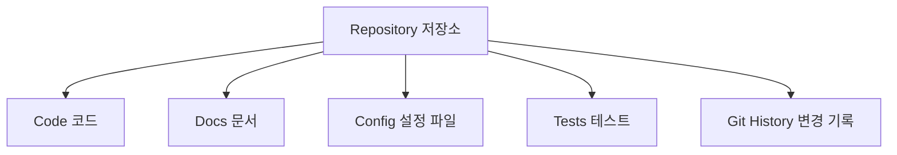
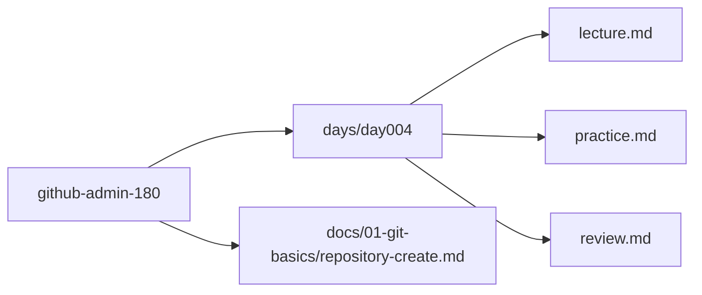
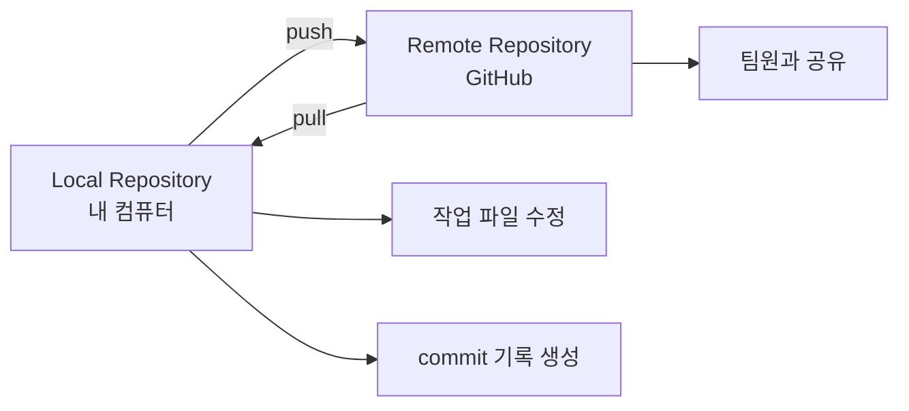
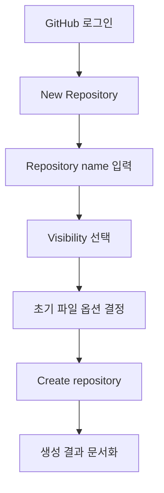
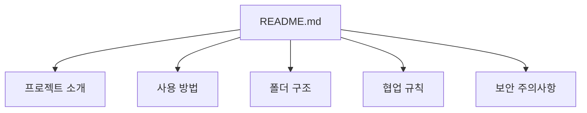
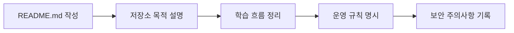
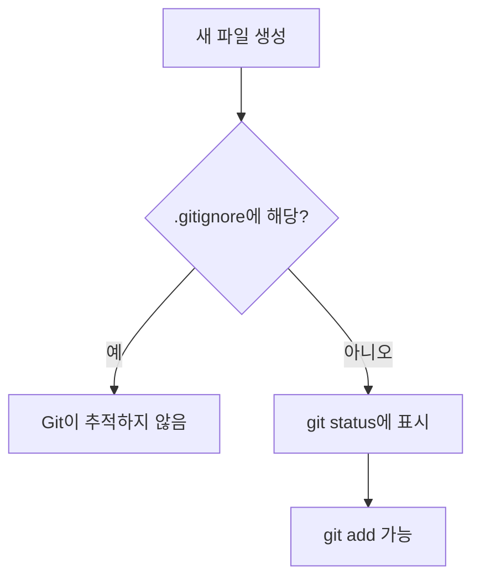
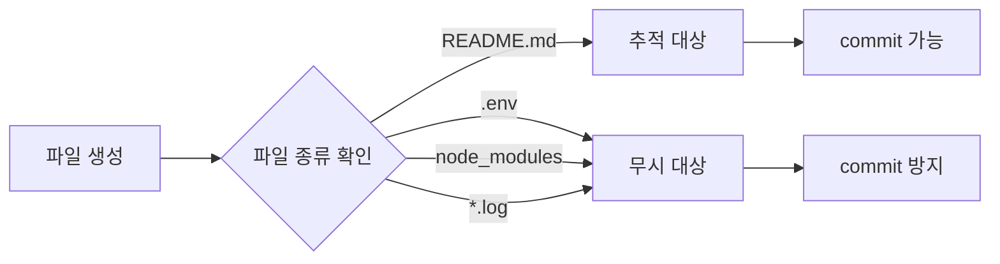
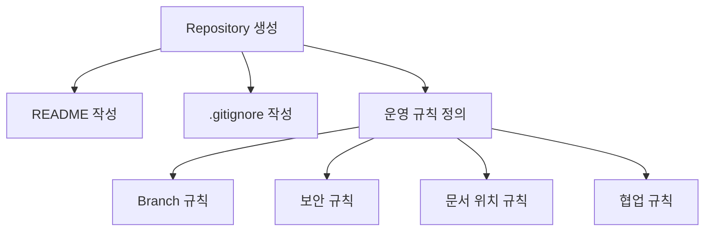
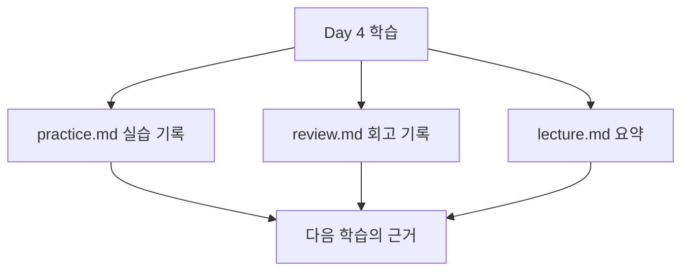

# Day 4. 저장소 생성

## 1. 학습 목표

오늘은 GitHub에서 가장 기본이 되는 **저장소 Repository**를 만드는 날입니다.

Day 1에서는 180일 동안 사용할 큰 학습 폴더인 `github-admin-180`을 만들었습니다.  
Day 2에서는 Git과 GitHub가 어떻게 다른지 배웠습니다.  
Day 3에서는 Git 설치 확인과 사용자 계정 설정을 배웠습니다.

Day 4에서는 다음을 할 수 있어야 합니다.

- 저장소가 무엇인지 쉽게 설명할 수 있다.
- 로컬 저장소와 원격 저장소의 차이를 설명할 수 있다.
- GitHub에서 새 Repository를 만들 수 있다.
- 저장소 이름, 공개 범위, README, `.gitignore`의 의미를 이해할 수 있다.
- `github-admin-180` 표준 구조 안에 Day 4 학습 문서를 만들 수 있다.
- 앞으로 180일 동안 사용할 학습 저장소 운영 기준을 문서로 정리할 수 있다.

---

## 2. 오늘 배울 핵심 개념 한눈에 보기

| 개념 | 쉬운 설명 | 실무에서의 의미 |
|---|---|---|
| Repository | 프로젝트를 담는 상자 | 코드, 문서, 설정 파일을 관리하는 기본 단위 |
| Local Repository | 내 컴퓨터 안의 저장소 | 혼자 작업하고 기록을 만드는 공간 |
| Remote Repository | GitHub에 있는 온라인 저장소 | 팀원과 공유하고 백업하는 공간 |
| README.md | 저장소의 첫 안내문 | 프로젝트 소개, 실행 방법, 규칙을 적는 문서 |
| .gitignore | Git이 무시할 파일 목록 | 비밀 파일, 빌드 결과물, 임시 파일을 커밋하지 않도록 관리 |
| main branch | 기본 작업 흐름 | 가장 안정적인 기준 브랜치 |
| Visibility | 공개 범위 | Public 또는 Private 저장소 선택 기준 |

---

## 오늘 사용하는 고정 버전

| 도구 | 고정 버전 | 오늘 사용 목적 |
|---|---:|---|
| Git | 2.54.0 | 로컬 저장소 상태 확인 |
| GitHub CLI | 2.93.0 | 오늘은 개념만 언급, 본격 사용은 Day 23 |
| GitHub Desktop | 3.5.8 | CLI가 어려운 경우 보조 도구 |
| Visual Studio Code | 1.122.0 | Markdown 파일 작성 |
| Node.js | 24.16.0 LTS | 오늘은 사용하지 않음 |
| GitHub Actions runner | ubuntu-24.04 | 오늘은 사용하지 않음 |

> 오늘은 GitHub Actions, Node.js, CI/CD는 사용하지 않습니다.  
> 저장소라는 “집”을 먼저 만들고, 이후 Day에서 그 안에 기능을 하나씩 채웁니다.

---

## 3. 이론 1 — 저장소 Repository는 무엇일까?

### 1) 쉬운 비유

저장소는 **프로젝트 전용 가방**과 같습니다.

학교에 갈 때 국어책, 수학책, 필통, 노트를 하나의 가방에 넣습니다.  
개발 프로젝트도 비슷합니다.

프로젝트에는 코드, 문서, 이미지, 설정 파일, 테스트 파일이 들어갑니다.  
이 파일들을 아무 데나 흩어놓으면 나중에 찾기 어렵습니다.  
그래서 하나의 저장소 안에 모아 관리합니다.

```text
프로젝트 가방 = Repository
가방 안 물건 = 코드, 문서, 설정 파일
가방 이름표 = README.md
가방에 넣지 말아야 할 물건 목록 = .gitignore
```

### 2) 개념 설명

Repository는 Git이 파일 변경 기록을 관리하는 기본 단위입니다.

저장소 안에서는 다음과 같은 일이 일어납니다.

- 파일을 만든다.
- 파일을 수정한다.
- Git이 변경 내용을 추적한다.
- 필요한 순간에 commit으로 저장 지점을 만든다.
- GitHub에 올려 다른 사람과 공유한다.

저장소는 크게 두 종류로 생각하면 쉽습니다.

| 종류 | 위치 | 설명 |
|---|---|---|
| Local Repository | 내 컴퓨터 | 내가 직접 작업하는 저장소 |
| Remote Repository | GitHub | 온라인에 있는 공유 저장소 |

### 3) 실무에서 중요한 이유

실무에서는 프로젝트 하나가 보통 저장소 하나로 관리됩니다.

예를 들어 다음과 같이 나눌 수 있습니다.

| 프로젝트 | 저장소 예시 |
|---|---|
| 회사 홈페이지 프론트엔드 | `company-homepage-front` |
| 관리자 백엔드 API | `admin-api-server` |
| 공통 디자인 시스템 | `design-system` |
| 배포 자동화 스크립트 | `infra-deploy-scripts` |

저장소를 잘못 만들면 나중에 다음 문제가 생깁니다.

- 프론트엔드와 백엔드 코드가 뒤섞인다.
- 문서 위치가 불분명하다.
- 팀원이 어디서 작업해야 하는지 모른다.
- 권한 관리가 어려워진다.
- GitHub Actions, 보안 설정, 배포 설정을 적용하기 어렵다.

GitHub 관리자는 단순히 저장소를 만드는 사람이 아니라,  
**저장소의 목적, 구조, 권한, 운영 규칙을 설계하는 사람**입니다.

### 4) 오늘 실습과의 연결

오늘은 180일 동안 사용할 학습 저장소를 다음 기준으로 이해합니다.

```text
github-admin-180/
```

이 폴더는 로컬 기준의 학습 프로젝트 루트입니다.  
GitHub에는 이 학습 프로젝트를 올릴 원격 저장소를 만들 수 있습니다.

추천 저장소 이름은 다음과 같습니다.

```text
github-admin-180
```

### 5) 자주 하는 실수

- 저장소 이름을 너무 대충 만든다.
- 저장소마다 목적을 적지 않는다.
- README 없이 저장소를 만든다.
- Private로 해야 할 저장소를 Public으로 만든다.
- 비밀번호, 토큰, API key 같은 민감 정보를 저장소에 넣는다.
- 한 저장소에 관련 없는 프로젝트를 너무 많이 넣는다.

### 6) Mermaid 그림



---

## 4. 실습 예제 1 — Day 4 학습 폴더와 파일 만들기

### 실습 목표

`github-admin-180` 표준 프로젝트 구조 안에 Day 4 학습 파일을 만듭니다.

### 사용하는 버전

| 도구 | 버전 |
|---|---:|
| Git | 2.54.0 |
| Visual Studio Code | 1.122.0 |

### 생성 또는 수정할 파일 위치

```text
github-admin-180/days/day004/lecture.md
github-admin-180/days/day004/practice.md
github-admin-180/days/day004/review.md
github-admin-180/docs/01-git-basics/repository-create.md
```

### 실습 순서

1. `github-admin-180` 폴더로 이동한다.
2. Day 4 폴더를 만든다.
3. Day 4 강의, 실습, 회고 파일을 만든다.
4. 저장소 생성 개념 문서를 만든다.
5. 현재 Git 상태를 확인한다.

### 명령어

Linux / macOS / WSL 기준:

```bash
cd github-admin-180

mkdir -p days/day004
touch days/day004/lecture.md
touch days/day004/practice.md
touch days/day004/review.md

touch docs/01-git-basics/repository-create.md

git status
```

Windows PowerShell 기준:

```powershell
cd github-admin-180

New-Item -ItemType Directory -Force -Path days/day004
New-Item -ItemType File -Force -Path days/day004/lecture.md
New-Item -ItemType File -Force -Path days/day004/practice.md
New-Item -ItemType File -Force -Path days/day004/review.md

New-Item -ItemType File -Force -Path docs/01-git-basics/repository-create.md

git status
```

### 한 줄씩 설명

```bash
cd github-admin-180
```

`github-admin-180` 폴더 안으로 이동합니다.  
Git 명령어는 보통 프로젝트 루트 폴더에서 실행해야 합니다.

```bash
mkdir -p days/day004
```

Day 4 전용 학습 폴더를 만듭니다.  
`-p`는 중간 폴더가 없어도 함께 만들어주는 옵션입니다.

```bash
touch days/day004/lecture.md
```

Day 4 강의 내용을 적을 파일을 만듭니다.

```bash
touch days/day004/practice.md
```

Day 4 실습 결과를 기록할 파일을 만듭니다.

```bash
touch days/day004/review.md
```

Day 4 회고를 적을 파일을 만듭니다.

```bash
touch docs/01-git-basics/repository-create.md
```

저장소 생성 개념을 정리할 문서를 만듭니다.

```bash
git status
```

Git이 현재 어떤 파일을 새로 발견했는지 확인합니다.

### Mermaid 그림으로 이해하기



### 자주 하는 실수

- `github-admin-180` 밖에서 명령어를 실행한다.
- `days/day004`가 아니라 `day004`만 만든다.
- 파일 확장자를 `.md`가 아닌 `.txt`로 만든다.
- `git status` 확인을 생략한다.

---

## 5. 이론 2 — 로컬 저장소와 원격 저장소의 차이

### 1) 쉬운 비유

로컬 저장소는 **내 책상 위 공책**입니다.  
원격 저장소는 **학교 사물함 또는 온라인 공유 폴더**입니다.

내 책상 위 공책에는 내가 마음껏 필기할 수 있습니다.  
하지만 공책이 내 책상에만 있으면 친구가 볼 수 없습니다.  
또 컴퓨터가 고장 나면 기록을 잃을 수도 있습니다.

그래서 GitHub라는 온라인 공간에 원격 저장소를 만들어 둡니다.

### 2) 개념 설명

Local Repository는 내 컴퓨터 안에 있습니다.

```text
내 컴퓨터
└── github-admin-180/
    └── .git/
```

`.git` 폴더가 있으면 Git 저장소입니다.  
이 폴더에는 Git의 변경 기록이 저장됩니다.

Remote Repository는 GitHub에 있습니다.

```text
GitHub
└── 사용자계정/github-admin-180
```

로컬과 원격은 서로 연결할 수 있습니다.

```text
내 컴퓨터의 github-admin-180  <---->  GitHub의 github-admin-180
```

### 3) 실무에서 중요한 이유

팀 프로젝트에서는 내 컴퓨터에서만 작업하지 않습니다.

실무 흐름은 보통 다음과 같습니다.

1. 내 컴퓨터에서 작업한다.
2. 변경 내용을 commit한다.
3. GitHub 원격 저장소에 push한다.
4. 팀원이 GitHub에서 변경 내용을 확인한다.
5. Pull Request로 검토한다.
6. main 브랜치에 병합한다.

오늘은 이 흐름 전체를 외우는 것이 목표가 아닙니다.  
오늘은 먼저 **로컬 저장소와 원격 저장소가 서로 다른 위치에 있다는 것**을 이해하면 됩니다.

### 4) 오늘 실습과의 연결

Day 1에서 로컬 폴더를 만들었습니다.

```bash
github-admin-180
```

오늘은 GitHub에서 같은 이름의 원격 저장소를 만들 수 있습니다.

```text
GitHub Repository Name: github-admin-180
```

다만 push/pull은 Day 6에서 자세히 배울 예정입니다.  
오늘은 저장소 생성과 구조 이해가 핵심입니다.

### 5) 자주 하는 실수

- Git이랑 GitHub를 같은 것으로 생각한다.
- GitHub 저장소를 만들면 자동으로 내 컴퓨터와 연결된다고 생각한다.
- 로컬 저장소 없이 GitHub 저장소만 만들고 작업 위치를 모른다.
- 원격 저장소 주소를 잘못 복사한다.
- `origin`이 무엇인지 모른 채 붙여넣기만 한다.

### 6) Mermaid 그림



---

## 6. 실습 예제 2 — GitHub에서 새 Repository 만들기

### 실습 목표

GitHub 웹 화면에서 새 Repository를 만듭니다.

### 사용하는 버전

| 도구 | 버전 |
|---|---:|
| GitHub Web UI | 2026년 기준 화면 흐름 |
| Git | 2.54.0 |

### 생성 또는 수정할 파일 위치

오늘 GitHub에서 만들 저장소 이름:

```text
github-admin-180
```

로컬에 기록할 문서 위치:

```text
github-admin-180/docs/01-git-basics/repository-create.md
```

### 실습 순서

1. GitHub에 로그인한다.
2. 새 Repository 생성 화면으로 이동한다.
3. Repository name에 `github-admin-180`을 입력한다.
4. Description을 작성한다.
5. Public 또는 Private을 선택한다.
6. README 자동 생성 여부를 결정한다.
7. `.gitignore` 자동 생성 여부를 결정한다.
8. 저장소를 생성한다.
9. 생성 결과를 로컬 문서에 기록한다.

### GitHub 화면에서 입력할 추천값

| 항목 | 추천값 | 설명 |
|---|---|---|
| Repository name | `github-admin-180` | 180일 학습 프로젝트 이름 |
| Description | `GitHub beginner to admin 180-day learning project` | 저장소 목적 설명 |
| Visibility | Private 권장 | 학습 중 실수로 민감 정보가 올라가는 것을 방지 |
| Add a README file | 체크하지 않음 권장 | 이미 로컬에 `README.md`가 있으므로 충돌 방지 |
| Add .gitignore | 체크하지 않음 권장 | 이미 로컬에 `.gitignore`가 있으므로 직접 관리 |
| Choose a license | 지금은 선택하지 않음 | 라이선스는 이후 저장소 운영 단계에서 학습 |

### 로컬 문서에 기록하기

아래 내용을 `docs/01-git-basics/repository-create.md`에 작성합니다.

```md
# Repository Create Guide

## Repository Name

github-admin-180

## Purpose

GitHub beginner to admin 180-day learning project.

## Visibility

Private

## Why Private?

학습 중 실수로 비밀번호, 토큰, 개인 설정 파일이 올라갈 수 있으므로 처음에는 Private 저장소로 시작한다.

## Initial File Policy

- README.md는 로컬에서 직접 관리한다.
- .gitignore는 로컬에서 직접 관리한다.
- License는 이후 학습 단계에서 결정한다.

## Default Branch

main
```

### 명령어로 파일 작성하기

Linux / macOS / WSL 기준:

```bash
cat > docs/01-git-basics/repository-create.md <<'EOF'
# Repository Create Guide

## Repository Name

github-admin-180

## Purpose

GitHub beginner to admin 180-day learning project.

## Visibility

Private

## Why Private?

학습 중 실수로 비밀번호, 토큰, 개인 설정 파일이 올라갈 수 있으므로 처음에는 Private 저장소로 시작한다.

## Initial File Policy

- README.md는 로컬에서 직접 관리한다.
- .gitignore는 로컬에서 직접 관리한다.
- License는 이후 학습 단계에서 결정한다.

## Default Branch

main
EOF
```

Windows PowerShell 기준:

```powershell
@"
# Repository Create Guide

## Repository Name

github-admin-180

## Purpose

GitHub beginner to admin 180-day learning project.

## Visibility

Private

## Why Private?

학습 중 실수로 비밀번호, 토큰, 개인 설정 파일이 올라갈 수 있으므로 처음에는 Private 저장소로 시작한다.

## Initial File Policy

- README.md는 로컬에서 직접 관리한다.
- .gitignore는 로컬에서 직접 관리한다.
- License는 이후 학습 단계에서 결정한다.

## Default Branch

main
"@ | Set-Content -Encoding UTF8 docs/01-git-basics/repository-create.md
```

### 한 줄씩 설명

`Repository Name`은 저장소 이름입니다.  
실무에서는 이름만 보고 저장소 목적을 어느 정도 알 수 있어야 합니다.

`Purpose`는 저장소의 목적입니다.  
관리자는 저장소가 왜 존재하는지 설명할 수 있어야 합니다.

`Visibility`는 공개 범위입니다.  
처음 배우는 단계에서는 실수 방지를 위해 Private이 안전합니다.

`Initial File Policy`는 저장소를 만들 때 자동 생성 파일을 어떻게 다룰지 정한 규칙입니다.  
로컬에 이미 파일이 있다면 GitHub에서 자동 생성하지 않는 것이 충돌을 줄이는 데 도움이 됩니다.

### Mermaid 그림으로 이해하기



### 자주 하는 실수

- 저장소 이름에 공백을 넣는다.
- Public/Private 차이를 모르고 Public으로 만든다.
- 로컬에 README가 있는데 GitHub에서도 README를 자동 생성한다.
- 저장소 설명을 비워둔다.
- 저장소 생성 후 어떤 설정으로 만들었는지 기록하지 않는다.

---

## 7. 이론 3 — README.md는 저장소의 첫 안내문이다

### 1) 쉬운 비유

README.md는 **가게 입구의 안내판**입니다.

손님이 가게에 들어가기 전에 이런 것을 봅니다.

- 어떤 가게인가요?
- 무엇을 파나요?
- 어떻게 이용하나요?
- 주의할 점은 무엇인가요?

저장소도 같습니다.  
팀원이 저장소에 들어왔을 때 가장 먼저 보는 문서가 README.md입니다.

### 2) 개념 설명

README.md에는 보통 다음 내용이 들어갑니다.

| 항목 | 설명 |
|---|---|
| 프로젝트 이름 | 저장소의 이름 |
| 프로젝트 목적 | 왜 만들었는지 |
| 사용 기술 | 어떤 도구를 쓰는지 |
| 설치 방법 | 어떻게 실행하는지 |
| 폴더 구조 | 어디에 무엇이 있는지 |
| 협업 규칙 | 브랜치, 커밋, PR 규칙 |
| 보안 주의사항 | 비밀 정보 커밋 금지 |

Day 4의 README는 아직 복잡할 필요가 없습니다.  
지금은 학습 프로젝트의 목적과 구조를 적는 정도면 충분합니다.

### 3) 실무에서 중요한 이유

README가 없는 저장소는 새 팀원에게 불친절합니다.

실무에서 README가 없으면 다음 문제가 생깁니다.

- 프로젝트 실행 방법을 매번 사람에게 물어봐야 한다.
- 폴더 구조를 이해하는 데 시간이 오래 걸린다.
- 배포, 테스트, 운영 방법이 사람 머릿속에만 남는다.
- 신입 개발자 온보딩이 느려진다.
- 관리자 관점에서 표준화가 어렵다.

GitHub 관리자는 README를 단순 소개문이 아니라  
**저장소 운영의 첫 번째 문서**로 봐야 합니다.

### 4) 오늘 실습과의 연결

오늘은 `README.md`에 학습 저장소의 기본 안내를 작성합니다.

```text
github-admin-180/README.md
```

### 5) 자주 하는 실수

- README를 비워둔다.
- 제목만 적고 목적을 적지 않는다.
- 실행 방법과 폴더 구조를 적지 않는다.
- 오래된 README를 방치한다.
- 실제 저장소 구조와 README 내용이 다르다.

### 6) Mermaid 그림



---

## 8. 실습 예제 3 — README.md에 저장소 소개 작성하기

### 실습 목표

`README.md`에 `github-admin-180` 저장소의 목적과 학습 구조를 작성합니다.

### 사용하는 버전

| 도구 | 버전 |
|---|---:|
| Git | 2.54.0 |
| VS Code | 1.122.0 |

### 생성 또는 수정할 파일 위치

```text
github-admin-180/README.md
```

### 실습 순서

1. README.md를 연다.
2. 프로젝트 제목을 적는다.
3. 저장소 목적을 적는다.
4. 180일 학습 흐름을 표로 적는다.
5. 보안 주의사항을 적는다.
6. Git 상태를 확인한다.

### 명령어

Linux / macOS / WSL 기준:

```bash
cat > README.md <<'EOF'
# GitHub Admin 180

Git과 GitHub를 초급부터 관리자급까지 180일 동안 학습하는 실습 저장소입니다.

## 학습 목표

이 저장소의 목표는 Git 기초부터 GitHub 협업, GitHub Actions, 보안, 조직 관리자, Enterprise 관리자 개념까지 단계적으로 학습하는 것입니다.

## 전체 흐름

| 기간 | 단계 | 목표 |
|---|---|---|
| Day 1~30 | GitHub 초급 기초 | Git/GitHub 기본, README, Issue, PR |
| Day 31~60 | 팀 협업과 저장소 운영 | PR Template, CODEOWNERS, Branch Protection, Rulesets |
| Day 61~90 | GitHub Actions와 자동화 | CI/CD, Secrets, Environments, Release 자동화 |
| Day 91~120 | GitHub 보안과 품질 관리 | Dependabot, Secret Scanning, CodeQL, Security Policy |
| Day 121~150 | 조직 관리자와 저장소 관리자 | Organization, Teams, Roles, Audit Log, API 자동화 |
| Day 151~180 | Enterprise 관리자와 최종 프로젝트 | SSO/SCIM, Billing, Compliance, Enterprise 정책, 최종 프로젝트 |

## 기본 운영 규칙

- 기본 브랜치명은 `main`을 사용합니다.
- 기능 브랜치는 `feature/` 접두사를 사용합니다.
- 버그 수정 브랜치는 `fix/` 접두사를 사용합니다.
- 문서 작업 브랜치는 `docs/` 접두사를 사용합니다.
- 기본 PR 병합 방식은 Squash merge를 기준으로 학습합니다.

## 보안 주의사항

다음 정보는 절대 저장소에 커밋하지 않습니다.

- 비밀번호
- 토큰
- SSH private key
- Personal Access Token
- API key
- 실제 서비스 접속 정보

## Day별 학습 위치

- 강의 노트: `days/dayNNN/lecture.md`
- 실습 기록: `days/dayNNN/practice.md`
- 회고: `days/dayNNN/review.md`
EOF

git status
```

Windows PowerShell 기준:

```powershell
@"
# GitHub Admin 180

Git과 GitHub를 초급부터 관리자급까지 180일 동안 학습하는 실습 저장소입니다.

## 학습 목표

이 저장소의 목표는 Git 기초부터 GitHub 협업, GitHub Actions, 보안, 조직 관리자, Enterprise 관리자 개념까지 단계적으로 학습하는 것입니다.

## 전체 흐름

| 기간 | 단계 | 목표 |
|---|---|---|
| Day 1~30 | GitHub 초급 기초 | Git/GitHub 기본, README, Issue, PR |
| Day 31~60 | 팀 협업과 저장소 운영 | PR Template, CODEOWNERS, Branch Protection, Rulesets |
| Day 61~90 | GitHub Actions와 자동화 | CI/CD, Secrets, Environments, Release 자동화 |
| Day 91~120 | GitHub 보안과 품질 관리 | Dependabot, Secret Scanning, CodeQL, Security Policy |
| Day 121~150 | 조직 관리자와 저장소 관리자 | Organization, Teams, Roles, Audit Log, API 자동화 |
| Day 151~180 | Enterprise 관리자와 최종 프로젝트 | SSO/SCIM, Billing, Compliance, Enterprise 정책, 최종 프로젝트 |

## 기본 운영 규칙

- 기본 브랜치명은 `main`을 사용합니다.
- 기능 브랜치는 `feature/` 접두사를 사용합니다.
- 버그 수정 브랜치는 `fix/` 접두사를 사용합니다.
- 문서 작업 브랜치는 `docs/` 접두사를 사용합니다.
- 기본 PR 병합 방식은 Squash merge를 기준으로 학습합니다.

## 보안 주의사항

다음 정보는 절대 저장소에 커밋하지 않습니다.

- 비밀번호
- 토큰
- SSH private key
- Personal Access Token
- API key
- 실제 서비스 접속 정보

## Day별 학습 위치

- 강의 노트: `days/dayNNN/lecture.md`
- 실습 기록: `days/dayNNN/practice.md`
- 회고: `days/dayNNN/review.md`
"@ | Set-Content -Encoding UTF8 README.md

git status
```

### 한 줄씩 설명

```bash
cat > README.md <<'EOF'
```

`README.md` 파일에 여러 줄의 내용을 한 번에 작성하겠다는 뜻입니다.

```md
# GitHub Admin 180
```

Markdown에서 `#`은 가장 큰 제목입니다.

```md
## 전체 흐름
```

`##`는 두 번째 수준 제목입니다.

```md
| 기간 | 단계 | 목표 |
```

Markdown 표를 만듭니다.

```bash
git status
```

README.md가 수정되었는지 확인합니다.

### Mermaid 그림으로 이해하기



### 자주 하는 실수

- README에 너무 많은 내용을 한 번에 넣으려 한다.
- 실제로 지키지 않을 규칙을 적는다.
- 보안 주의사항을 빼먹는다.
- Day별 학습 위치를 적지 않는다.

---

## 9. 이론 4 — .gitignore는 저장소의 출입 금지 목록이다

### 1) 쉬운 비유

`.gitignore`는 **가방에 넣지 말아야 할 물건 목록**입니다.

학교 가방에 교과서와 필통은 넣어도 됩니다.  
하지만 쓰레기, 젖은 우산, 남의 물건은 넣으면 안 됩니다.

개발 저장소도 마찬가지입니다.

저장소에는 코드와 문서는 넣어도 되지만,  
임시 파일, 빌드 결과물, 비밀번호 파일은 넣으면 안 됩니다.

### 2) 개념 설명

`.gitignore`는 Git이 추적하지 않을 파일과 폴더를 적는 파일입니다.

예를 들어 다음과 같은 파일은 보통 Git에 올리지 않습니다.

| 파일 또는 폴더 | 이유 |
|---|---|
| `.env` | 환경 변수와 비밀번호가 들어갈 수 있음 |
| `node_modules/` | 너무 크고 다시 설치 가능 |
| `dist/` | 빌드 결과물 |
| `.DS_Store` | macOS 시스템 파일 |
| `*.log` | 실행 로그 파일 |
| `.vscode/` 일부 설정 | 개인별 에디터 설정일 수 있음 |

### 3) 실무에서 중요한 이유

`.gitignore`를 제대로 관리하지 않으면 큰 문제가 생길 수 있습니다.

- API key가 GitHub에 올라갈 수 있다.
- 불필요하게 큰 파일이 저장소에 들어간다.
- 팀원마다 다른 개인 설정이 충돌한다.
- 빌드 결과물이 코드 변경처럼 보인다.
- 저장소가 지저분해지고 느려진다.

특히 보안 사고는 작은 실수에서 시작됩니다.  
관리자 관점에서는 `.gitignore`도 중요한 운영 정책입니다.

### 4) 오늘 실습과의 연결

오늘은 학습 저장소에 기본 `.gitignore`를 작성합니다.

```text
github-admin-180/.gitignore
```

### 5) 자주 하는 실수

- `.env`를 빼먹는다.
- 이미 커밋된 파일을 `.gitignore`에 추가하면 자동으로 사라진다고 생각한다.
- 모든 설정 폴더를 무조건 무시해서 팀 공통 설정까지 빠뜨린다.
- 대용량 파일을 `.gitignore` 없이 커밋한다.
- 비밀 정보 파일을 테스트용이라고 생각하고 커밋한다.

### 6) Mermaid 그림



---

## 10. 실습 예제 4 — .gitignore 기본 규칙 작성하기

### 실습 목표

학습 저장소에서 커밋하면 안 되는 파일들을 `.gitignore`에 등록합니다.

### 사용하는 버전

| 도구 | 버전 |
|---|---:|
| Git | 2.54.0 |
| VS Code | 1.122.0 |

### 생성 또는 수정할 파일 위치

```text
github-admin-180/.gitignore
```

### 실습 순서

1. `.gitignore` 파일을 연다.
2. 운영체제 임시 파일을 무시한다.
3. 로그 파일을 무시한다.
4. 환경 변수 파일을 무시한다.
5. Node.js 관련 폴더를 무시한다.
6. Git 상태를 확인한다.

### 명령어

Linux / macOS / WSL 기준:

```bash
cat > .gitignore <<'EOF'
# OS files
.DS_Store
Thumbs.db

# Logs
*.log
logs/

# Environment files
.env
.env.*
!.env.example

# Node.js
node_modules/
dist/
build/
coverage/

# Editor
.vscode/*
!.vscode/extensions.json
!.vscode/settings.json.example

# Temporary files
tmp/
temp/
EOF

git status
```

Windows PowerShell 기준:

```powershell
@"
# OS files
.DS_Store
Thumbs.db

# Logs
*.log
logs/

# Environment files
.env
.env.*
!.env.example

# Node.js
node_modules/
dist/
build/
coverage/

# Editor
.vscode/*
!.vscode/extensions.json
!.vscode/settings.json.example

# Temporary files
tmp/
temp/
"@ | Set-Content -Encoding UTF8 .gitignore

git status
```

### 한 줄씩 설명

```gitignore
.DS_Store
```

macOS에서 자동으로 생기는 시스템 파일을 무시합니다.

```gitignore
Thumbs.db
```

Windows에서 이미지 미리보기 때문에 생길 수 있는 파일을 무시합니다.

```gitignore
*.log
```

모든 `.log` 파일을 무시합니다.

```gitignore
.env
.env.*
```

환경 변수 파일을 무시합니다.  
이 파일에는 비밀번호나 API key가 들어갈 수 있습니다.

```gitignore
!.env.example
```

`.env.example`은 예시 파일이므로 추적할 수 있게 예외 처리합니다.

```gitignore
node_modules/
```

Node.js 의존성 폴더를 무시합니다.  
나중에 `npm install`로 다시 만들 수 있기 때문입니다.

```bash
git status
```

`.gitignore` 수정 상태를 확인합니다.

### Mermaid 그림으로 이해하기



### 자주 하는 실수

- `.env.example`까지 무시해서 팀원이 예시를 볼 수 없게 만든다.
- `node_modules/`를 커밋한다.
- 로그 파일을 커밋한다.
- `.gitignore` 파일명을 `gitignore`로 잘못 만든다.
- 점으로 시작하는 파일이 숨김 파일이라는 것을 몰라 찾지 못한다.

---

## 11. 이론 5 — 저장소 생성은 운영 규칙의 시작이다

### 1) 쉬운 비유

저장소를 만드는 것은 **새 교실을 여는 것**과 같습니다.

교실을 열면 책상만 놓는다고 끝이 아닙니다.

- 출입 규칙이 필요합니다.
- 청소 당번이 필요합니다.
- 과제 제출 방식이 필요합니다.
- 선생님 확인 절차가 필요합니다.
- 위험한 물건을 가져오면 안 된다는 규칙도 필요합니다.

GitHub 저장소도 같습니다.  
저장소를 만들면 운영 규칙을 함께 정해야 합니다.

### 2) 개념 설명

GitHub 저장소 운영 규칙에는 다음이 포함됩니다.

| 운영 규칙 | 오늘 기준 |
|---|---|
| 기본 브랜치 | `main` |
| 기능 브랜치 | `feature/기능명` |
| 버그 수정 브랜치 | `fix/버그명` |
| 문서 브랜치 | `docs/문서명` |
| 릴리스 브랜치 | `release/버전명` |
| 태그 규칙 | Semantic Versioning, 예: `v1.0.0` |
| 기본 병합 방식 | Squash merge |
| 민감 정보 | 절대 커밋 금지 |

아직 브랜치, PR, 릴리스는 자세히 배우지 않았습니다.  
오늘은 “이런 규칙이 앞으로 필요하구나” 정도만 이해하면 됩니다.

### 3) 실무에서 중요한 이유

저장소를 만들 때 운영 기준을 정하지 않으면  
팀원이 각자 다른 방식으로 작업합니다.

그러면 다음 문제가 생깁니다.

- 브랜치 이름이 제각각이다.
- 커밋 메시지 스타일이 다르다.
- main 브랜치에 바로 위험한 코드가 들어간다.
- 리뷰 없이 코드가 병합된다.
- 배포 버전을 추적하기 어렵다.
- 보안 정보가 실수로 올라간다.

관리자급 GitHub 운영자는 저장소를 만들 때부터  
**일관된 규칙을 문서화**해야 합니다.

### 4) 오늘 실습과의 연결

오늘은 `docs/01-git-basics/repository-create.md`에 저장소 생성 기준을 적고,  
`README.md`와 `.gitignore`에 기본 운영 규칙을 반영했습니다.

추가로 Day 4 실습 기록에는 다음을 남깁니다.

```text
days/day004/practice.md
```

### 5) 자주 하는 실수

- 저장소 생성만 하고 운영 기준을 문서화하지 않는다.
- 기본 브랜치명을 팀마다 다르게 둔다.
- 비밀 정보 금지 규칙을 말로만 전달한다.
- README와 실제 운영 방식이 다르다.
- 저장소 목적이 바뀌었는데 설명을 수정하지 않는다.

### 6) Mermaid 그림



---

## 12. 실습 예제 5 — Day 4 실습 기록과 회고 작성하기

### 실습 목표

오늘 만든 저장소 생성 기준을 Day 4 실습 파일과 회고 파일에 정리합니다.

### 사용하는 버전

| 도구 | 버전 |
|---|---:|
| Git | 2.54.0 |
| VS Code | 1.122.0 |

### 생성 또는 수정할 파일 위치

```text
github-admin-180/days/day004/practice.md
github-admin-180/days/day004/review.md
github-admin-180/days/day004/lecture.md
```

### 실습 순서

1. `practice.md`에 오늘 실습한 내용을 기록한다.
2. `review.md`에 오늘 이해한 점과 헷갈린 점을 적는다.
3. `lecture.md`에는 오늘 핵심 요약을 적는다.
4. Git 상태를 확인한다.
5. 아직 commit은 선택 사항으로 둔다. commit은 Day 5에서 자세히 학습한다.

### 명령어

Linux / macOS / WSL 기준:

```bash
cat > days/day004/practice.md <<'EOF'
# Day 4 Practice

## 오늘 실습한 내용

- GitHub에서 Repository 생성 기준을 학습했다.
- 로컬 저장소와 원격 저장소의 차이를 정리했다.
- README.md에 저장소 소개를 작성했다.
- .gitignore에 기본 무시 규칙을 작성했다.
- docs/01-git-basics/repository-create.md에 저장소 생성 기준을 정리했다.

## 내가 만든 또는 수정한 파일

- README.md
- .gitignore
- docs/01-git-basics/repository-create.md
- days/day004/lecture.md
- days/day004/practice.md
- days/day004/review.md

## 저장소 생성 기준

- Repository name: github-admin-180
- Visibility: Private
- Default branch: main
- README: 로컬에서 직접 관리
- .gitignore: 로컬에서 직접 관리
EOF

cat > days/day004/review.md <<'EOF'
# Day 4 Review

## 오늘 이해한 것

- Repository는 프로젝트를 담는 상자이다.
- Local Repository는 내 컴퓨터에 있고, Remote Repository는 GitHub에 있다.
- README.md는 저장소의 첫 안내문이다.
- .gitignore는 Git이 추적하지 않을 파일 목록이다.
- 저장소 생성은 운영 규칙을 정하는 시작점이다.

## 아직 헷갈리는 것

- origin이 정확히 무엇인지
- push와 pull이 언제 필요한지
- Public 저장소와 Private 저장소를 실무에서 어떻게 선택하는지

## 내일 다시 확인할 것

- 파일을 Git에 추가하는 방법
- commit이 왜 필요한지
- commit 메시지를 어떻게 작성해야 하는지
EOF

cat > days/day004/lecture.md <<'EOF'
# Day 4 Lecture Summary

## 주제

저장소 생성

## 핵심 요약

저장소는 프로젝트의 코드, 문서, 설정, 변경 기록을 관리하는 기본 단위이다.

## 오늘의 핵심 문장

저장소를 만든다는 것은 단순히 공간을 만드는 것이 아니라, 프로젝트의 운영 기준을 정하는 일이다.
EOF

git status
```

Windows PowerShell 기준:

```powershell
@"
# Day 4 Practice

## 오늘 실습한 내용

- GitHub에서 Repository 생성 기준을 학습했다.
- 로컬 저장소와 원격 저장소의 차이를 정리했다.
- README.md에 저장소 소개를 작성했다.
- .gitignore에 기본 무시 규칙을 작성했다.
- docs/01-git-basics/repository-create.md에 저장소 생성 기준을 정리했다.

## 내가 만든 또는 수정한 파일

- README.md
- .gitignore
- docs/01-git-basics/repository-create.md
- days/day004/lecture.md
- days/day004/practice.md
- days/day004/review.md

## 저장소 생성 기준

- Repository name: github-admin-180
- Visibility: Private
- Default branch: main
- README: 로컬에서 직접 관리
- .gitignore: 로컬에서 직접 관리
"@ | Set-Content -Encoding UTF8 days/day004/practice.md

@"
# Day 4 Review

## 오늘 이해한 것

- Repository는 프로젝트를 담는 상자이다.
- Local Repository는 내 컴퓨터에 있고, Remote Repository는 GitHub에 있다.
- README.md는 저장소의 첫 안내문이다.
- .gitignore는 Git이 추적하지 않을 파일 목록이다.
- 저장소 생성은 운영 규칙을 정하는 시작점이다.

## 아직 헷갈리는 것

- origin이 정확히 무엇인지
- push와 pull이 언제 필요한지
- Public 저장소와 Private 저장소를 실무에서 어떻게 선택하는지

## 내일 다시 확인할 것

- 파일을 Git에 추가하는 방법
- commit이 왜 필요한지
- commit 메시지를 어떻게 작성해야 하는지
"@ | Set-Content -Encoding UTF8 days/day004/review.md

@"
# Day 4 Lecture Summary

## 주제

저장소 생성

## 핵심 요약

저장소는 프로젝트의 코드, 문서, 설정, 변경 기록을 관리하는 기본 단위이다.

## 오늘의 핵심 문장

저장소를 만든다는 것은 단순히 공간을 만드는 것이 아니라, 프로젝트의 운영 기준을 정하는 일이다.
"@ | Set-Content -Encoding UTF8 days/day004/lecture.md

git status
```

### 한 줄씩 설명

```bash
cat > days/day004/practice.md <<'EOF'
```

Day 4 실습 기록 파일에 내용을 작성합니다.

```md
## 오늘 실습한 내용
```

오늘 실제로 한 작업을 나열합니다.

```md
## 아직 헷갈리는 것
```

모르는 것을 적는 공간입니다.  
회고에서 가장 중요한 부분입니다.

```bash
git status
```

오늘 만든 파일들이 Git에 어떻게 보이는지 확인합니다.

### Mermaid 그림으로 이해하기



### 자주 하는 실수

- 실습만 하고 기록을 남기지 않는다.
- 헷갈리는 내용을 숨기고 적지 않는다.
- Day별 폴더 위치를 틀린다.
- `git status`로 변경 파일을 확인하지 않는다.

---

## 보너스 개념 — remote origin은 무엇일까?

Day 6에서 자세히 배우지만, 오늘 저장소를 만들면 GitHub가 보통 이런 명령어를 안내합니다.

```bash
git remote add origin https://github.com/YOUR-USERNAME/github-admin-180.git
git branch -M main
git push -u origin main
```

오늘은 이 명령어를 완벽히 이해하지 않아도 됩니다.  
다만 의미만 가볍게 보면 다음과 같습니다.

| 명령어 | 쉬운 의미 |
|---|---|
| `git remote add origin ...` | 내 로컬 저장소와 GitHub 저장소를 연결한다 |
| `git branch -M main` | 기본 브랜치 이름을 main으로 맞춘다 |
| `git push -u origin main` | 내 기록을 GitHub의 main 브랜치로 올린다 |

주의할 점:

- push/pull은 Day 6에서 자세히 배웁니다.
- 오늘은 저장소 생성 기준과 문서화를 우선합니다.
- 실제 원격 연결은 GitHub 저장소 생성 후 주소가 정확할 때 진행해야 합니다.

---

## 강의 요약

오늘 배운 내용을 정리하면 다음과 같습니다.

| 배운 내용 | 핵심 |
|---|---|
| Repository | 프로젝트를 담는 저장소 |
| Local Repository | 내 컴퓨터에 있는 Git 저장소 |
| Remote Repository | GitHub에 있는 온라인 저장소 |
| README.md | 저장소의 첫 안내문 |
| .gitignore | Git이 추적하지 않을 파일 목록 |
| main branch | 기본 기준 브랜치 |
| Visibility | 저장소 공개 범위 |
| 저장소 운영 규칙 | 저장소를 만들 때 함께 정해야 하는 기준 |

오늘 꼭 기억해야 할 한 문장:

> GitHub 관리자는 코드를 저장하는 사람을 넘어, 협업 규칙·자동화·보안·권한을 설계하는 사람입니다.

---

## 초급 연습문제 5개

### 문제 1. Repository 뜻 설명하기

#### 문제 설명

Repository가 무엇인지 초등학생도 이해할 수 있게 설명해보세요.

#### 요구사항

- “프로젝트를 담는 상자”라는 비유를 사용하세요.
- 코드, 문서, 설정 파일이 들어간다는 내용을 포함하세요.

#### 힌트

학교 가방이나 장난감 상자를 떠올려보세요.

#### 제출물

- `days/day004/review.md`에 3문장 이상 작성

---

### 문제 2. Day 4 폴더 만들기

#### 문제 설명

Day 4 학습 파일을 저장할 폴더와 파일을 직접 만들어보세요.

#### 요구사항

- `days/day004/lecture.md`
- `days/day004/practice.md`
- `days/day004/review.md`

#### 힌트

`mkdir -p`와 `touch`를 사용합니다.

#### 제출물

- `git status` 결과에서 위 파일들이 보이는지 확인

---

### 문제 3. README.md 제목 작성하기

#### 문제 설명

README.md에 저장소 제목과 한 줄 소개를 작성하세요.

#### 요구사항

- 제목은 `# GitHub Admin 180`으로 작성
- 저장소 목적을 한 문장으로 작성

#### 힌트

Markdown에서 가장 큰 제목은 `#`입니다.

#### 제출물

- 수정된 `README.md`

---

### 문제 4. .gitignore에 .env 추가하기

#### 문제 설명

비밀 정보가 들어갈 수 있는 `.env` 파일을 Git이 추적하지 않도록 설정하세요.

#### 요구사항

- `.gitignore`에 `.env` 추가
- `.env.*`도 추가

#### 힌트

환경 변수 파일은 보통 커밋하지 않습니다.

#### 제출물

- 수정된 `.gitignore`

---

### 문제 5. 저장소 공개 범위 설명하기

#### 문제 설명

Public 저장소와 Private 저장소의 차이를 정리하세요.

#### 요구사항

- Public의 의미 작성
- Private의 의미 작성
- 학습 초기에는 Private을 권장하는 이유 작성

#### 힌트

누가 볼 수 있는지를 기준으로 생각하세요.

#### 제출물

- `days/day004/review.md`에 작성

---

## 중급 연습문제 5개

### 문제 1. 저장소 생성 기준 문서 작성하기

#### 문제 설명

`docs/01-git-basics/repository-create.md`에 저장소 생성 기준을 작성하세요.

#### 요구사항

- Repository name
- Purpose
- Visibility
- Default branch
- Initial file policy

#### 힌트

오늘 실습 예제 2의 구조를 참고하세요.

#### 제출물

- `docs/01-git-basics/repository-create.md`

---

### 문제 2. README에 운영 규칙 추가하기

#### 문제 설명

README.md에 기본 운영 규칙을 추가하세요.

#### 요구사항

다음 내용을 포함하세요.

- 기본 브랜치명: `main`
- 기능 브랜치 접두사: `feature/`
- 버그 수정 브랜치 접두사: `fix/`
- 문서 브랜치 접두사: `docs/`
- 기본 PR 병합 방식: Squash merge

#### 힌트

표 또는 목록으로 작성하면 읽기 쉽습니다.

#### 제출물

- 수정된 `README.md`

---

### 문제 3. .gitignore 분류 정리하기

#### 문제 설명

`.gitignore` 내용을 종류별로 분류해서 작성하세요.

#### 요구사항

아래 분류를 포함하세요.

- OS files
- Logs
- Environment files
- Node.js
- Temporary files

#### 힌트

주석은 `#`으로 작성합니다.

#### 제출물

- 수정된 `.gitignore`

---

### 문제 4. 로컬 저장소와 원격 저장소 비교표 만들기

#### 문제 설명

로컬 저장소와 원격 저장소의 차이를 표로 정리하세요.

#### 요구사항

- 위치
- 목적
- 사용 도구
- 실무 역할

#### 힌트

Local은 내 컴퓨터, Remote는 GitHub입니다.

#### 제출물

- `days/day004/practice.md`에 비교표 작성

---

### 문제 5. GitHub 저장소 생성 체크리스트 만들기

#### 문제 설명

GitHub에서 새 저장소를 만들 때 확인할 체크리스트를 작성하세요.

#### 요구사항

- 저장소 이름
- 설명
- 공개 범위
- README 자동 생성 여부
- .gitignore 자동 생성 여부
- 라이선스 선택 여부

#### 힌트

저장소 생성 화면의 입력 항목을 떠올리세요.

#### 제출물

- `docs/01-git-basics/repository-create.md` 하단에 체크리스트 추가

---

## 고급 연습문제 5개

### 문제 1. 회사 프로젝트 저장소 이름 설계하기

#### 문제 설명

회사에서 프론트엔드, 백엔드, 관리자 문서를 각각 다른 저장소로 관리하려고 합니다. 저장소 이름을 설계해보세요.

#### 요구사항

- 프론트엔드 저장소 이름 1개
- 백엔드 저장소 이름 1개
- 관리자 문서 저장소 이름 1개
- 각 이름의 이유 작성

#### 힌트

이름만 보고 목적을 알 수 있게 작성하세요.

#### 제출물

- `days/day004/review.md`에 작성

---

### 문제 2. Public으로 만들면 위험한 저장소 판단하기

#### 문제 설명

다음 저장소 중 Public으로 만들면 위험할 수 있는 저장소를 고르고 이유를 작성하세요.

- 개인 학습 블로그
- 회사 내부 API 서버
- 공개 오픈소스 라이브러리
- 배포 스크립트 저장소
- 테스트용 비밀 키가 포함된 저장소

#### 요구사항

- 위험한 저장소를 2개 이상 고르세요.
- 이유를 보안 관점에서 설명하세요.

#### 힌트

민감 정보와 내부 로직 노출을 기준으로 판단하세요.

#### 제출물

- `days/day004/review.md`에 작성

---

### 문제 3. 저장소 초기화 전략 선택하기

#### 문제 설명

이미 로컬에 `README.md`와 `.gitignore`가 있는 상태에서 GitHub 저장소를 만들려고 합니다. GitHub 생성 화면에서 README와 `.gitignore` 자동 생성을 체크해야 할지 판단하세요.

#### 요구사항

- 체크 여부 작성
- 이유 작성
- 잘못 선택했을 때 생길 수 있는 문제 작성

#### 힌트

로컬과 원격에 서로 다른 초기 commit이 생길 수 있습니다.

#### 제출물

- `docs/01-git-basics/repository-create.md`에 작성

---

### 문제 4. 저장소 운영 규칙 초안 만들기

#### 문제 설명

팀 프로젝트를 시작하기 전에 저장소 운영 규칙 초안을 작성하세요.

#### 요구사항

아래 항목을 포함하세요.

- 기본 브랜치
- 브랜치 이름 규칙
- README 관리 방식
- 비밀 정보 커밋 금지 규칙
- 문서 저장 위치

#### 힌트

아직 Branch Protection이나 PR은 자세히 배우지 않았으므로 기본 방향만 작성하세요.

#### 제출물

- `docs/01-git-basics/repository-create.md` 하단에 작성

---

### 문제 5. 관리자 관점 저장소 생성 보고서 작성하기

#### 문제 설명

당신이 GitHub 관리자라고 가정하고, 새 저장소를 만들 때 어떤 기준으로 만들었는지 보고서를 작성하세요.

#### 요구사항

- 저장소 목적
- 공개 범위 선택 이유
- 초기 파일 정책
- 보안 주의사항
- 앞으로 추가할 운영 기능

#### 힌트

관리자는 “왜 그렇게 정했는가”를 설명할 수 있어야 합니다.

#### 제출물

- `days/day004/review.md`에 10문장 이상 작성

---

## 오늘의 체크리스트

아래 항목을 스스로 확인하세요.

- [ ] Repository가 무엇인지 설명할 수 있다.
- [ ] Local Repository와 Remote Repository의 차이를 설명할 수 있다.
- [ ] GitHub에서 새 저장소를 만들 때 입력하는 항목을 이해했다.
- [ ] `github-admin-180` 저장소 이름의 목적을 설명할 수 있다.
- [ ] Public과 Private의 차이를 설명할 수 있다.
- [ ] README.md가 저장소의 첫 안내문이라는 것을 이해했다.
- [ ] `.gitignore`가 왜 필요한지 설명할 수 있다.
- [ ] `.env` 파일을 커밋하면 안 되는 이유를 이해했다.
- [ ] `docs/01-git-basics/repository-create.md`를 만들었다.
- [ ] `days/day004/lecture.md`, `practice.md`, `review.md`를 만들었다.
- [ ] 저장소 생성은 운영 규칙의 시작이라는 점을 이해했다.

---

## 다음 Day 예고

다음 Day 5에서는 **clone/add/commit**을 배웁니다.

Day 5에서 배울 내용은 다음과 같습니다.

- Git의 작업 공간 이해
- `git add`의 의미
- `git commit`의 의미
- Commit은 “저장 지점”이라는 비유
- 첫 commit 만들기
- commit 메시지 작성 기준
- `git log --oneline`으로 기록 확인하기

다음 시간에 꼭 기억해야 할 예고 문장:

> Commit은 게임 저장 슬롯처럼, 프로젝트의 특정 순간을 안전하게 기록하는 저장 지점입니다.
