# Day 5. clone / add / commit

## 1. 학습 목표

오늘은 Git의 가장 기본적인 기록 흐름인 `clone`, `add`, `commit`을 배웁니다.

Day 4에서 저장소를 만들었다면, 이제 저장소를 내 컴퓨터로 가져오고 변경 내용을 안전한 기록으로 남길 차례입니다.

오늘 학습을 마치면 다음을 할 수 있어야 합니다.

- `git clone`이 무엇인지 설명할 수 있다.
- Working Directory, Staging Area, Local Repository의 차이를 설명할 수 있다.
- `git status`로 현재 변경 상태를 확인할 수 있다.
- `git add`로 다음 커밋에 포함할 파일을 선택할 수 있다.
- `git commit`으로 저장 지점을 만들 수 있다.
- `git restore --staged`로 잘못 스테이징한 파일을 되돌릴 수 있다.
- `git log --oneline`과 `git show --stat HEAD`로 기록을 확인할 수 있다.
- 하나의 목적을 가진 좋은 커밋 메시지를 작성할 수 있다.

## 2. 오늘 배울 핵심 개념 한눈에 보기

| 개념 | 쉬운 비유 | 핵심 의미 |
|---|---|---|
| clone | 온라인 가방을 내 책상으로 복사하기 | 원격 저장소를 로컬로 복제 |
| Working Directory | 현재 작업 중인 책상 | 실제 파일을 만들고 수정하는 공간 |
| Staging Area | 제출할 종이를 모아두는 바구니 | 다음 커밋에 포함할 변경 선택 |
| Local Repository | 저장 기록 보관함 | 커밋이 보관되는 로컬 Git 공간 |
| add | 제출 바구니에 넣기 | 변경 파일을 스테이징 |
| commit | 게임 저장 지점 만들기 | 선택한 변경 사항을 기록 |
| status | 현재 상태 점검표 | 변경 및 스테이징 상태 확인 |
| log | 저장 기록 목록 | 커밋 이력 확인 |

### 오늘 사용하는 고정 버전

| 도구 | 고정 버전 | 오늘 사용 목적 |
|---|---:|---|
| Git | 2.54.0 | clone, status, add, commit, log |
| GitHub CLI | 2.93.0 | 오늘은 사용하지 않음 |
| GitHub Desktop | 3.5.8 | CLI 보조 도구 |
| Visual Studio Code | 1.122.0 | Markdown 파일 작성 |
| Node.js | 24.16.0 LTS | 오늘은 사용하지 않음 |

## 3. 이론 1 — git clone은 무엇일까?

### 1) 쉬운 비유

`git clone`은 GitHub에 있는 프로젝트 가방을 내 컴퓨터 책상 위로 통째로 복사하는 행동과 같습니다. 파일뿐 아니라 이전 커밋 기록과 원격 저장소 연결 정보도 함께 가져옵니다.

### 2) 개념 설명

`git clone`은 원격 저장소를 로컬 저장소로 복제하는 명령어입니다.

기본 형식:

```bash
git clone 원격저장소주소
```

예시:

```bash
git clone https://github.com/YOUR-USERNAME/github-admin-180.git
```

복제가 완료되면 현재 폴더 아래에 `github-admin-180` 폴더가 만들어지고, 내부에는 숨김 폴더인 `.git`도 포함됩니다.

| 함께 가져오는 것 | 설명 |
|---|---|
| 현재 파일 | README, 문서, 코드 |
| 폴더 구조 | days, docs, labs 등 |
| 커밋 기록 | 누가 언제 무엇을 저장했는지 |
| 원격 정보 | 보통 `origin`이라는 이름으로 연결 |

### 3) 실무에서 중요한 이유

팀 프로젝트에 처음 참여하거나 새 컴퓨터에서 작업을 시작할 때 기존 저장소를 가져오는 표준 방법입니다. ZIP 다운로드와 달리 Git 기록과 원격 연결을 유지하므로 이후 `pull`, `push`, 브랜치 작업을 이어갈 수 있습니다.

### 4) 오늘 실습과의 연결

이미 Day 1부터 로컬의 `github-admin-180`을 사용하고 있다면 같은 폴더를 다시 clone하지 않습니다. 새 컴퓨터나 비어 있는 별도 작업 폴더에서 시작할 때만 clone합니다.

### 5) 자주 하는 실수

- 이미 같은 이름의 폴더가 있는데 다시 clone한다.
- 저장소 내부에서 같은 저장소를 clone해 중첩 폴더를 만든다.
- `YOUR-USERNAME`을 자신의 사용자명으로 바꾸지 않는다.
- clone 후 새로 생성된 폴더로 이동하지 않는다.
- Private 저장소 접근 권한이 없는 계정으로 clone한다.

### 6) Mermaid 그림

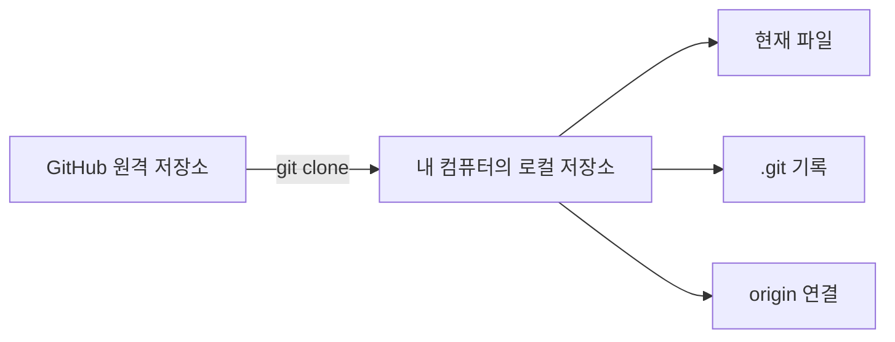

## 4. 실습 예제 1 — 저장소 clone 또는 기존 폴더 확인하기

### 실습 목표

현재 자신의 상황에 맞게 학습 저장소를 준비하고 로컬 저장소와 원격 연결 상태를 확인합니다.

### 사용하는 버전

| 도구 | 버전 |
|---|---:|
| Git | 2.54.0 |
| Visual Studio Code | 1.122.0 |

### 생성 또는 수정할 파일 위치

```text
github-admin-180/
```

### 명령어

```bash
# 상황 A: 기존 로컬 폴더를 계속 사용하는 경우
cd github-admin-180
git status
git remote -v

# 상황 B: 새 컴퓨터 또는 새 작업 폴더에서 시작하는 경우
git clone https://github.com/YOUR-USERNAME/github-admin-180.git
cd github-admin-180
git status
git remote -v
```

### 한 줄씩 설명

```bash
cd github-admin-180
```

학습 저장소의 루트 폴더로 이동합니다.

```bash
git status
```

현재 브랜치와 변경 파일 상태를 확인합니다. 저장소 밖에서 실행하면 Git 저장소가 아니라는 오류가 나옵니다.

```bash
git remote -v
```

연결된 원격 저장소의 fetch와 push 주소를 확인합니다.

```bash
git clone https://github.com/YOUR-USERNAME/github-admin-180.git
```

GitHub 저장소를 현재 컴퓨터로 복제합니다. `YOUR-USERNAME`은 자신의 GitHub 사용자명으로 바꿉니다.

### Mermaid 그림으로 이해하기

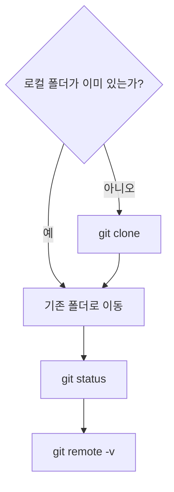

### 자주 하는 실수

- 저장소 주소가 아닌 일반 GitHub 화면 주소를 복사한다.
- 복제 후 `cd github-admin-180`을 하지 않는다.
- 현재 폴더 위치를 확인하지 않고 clone한다.
- 동일한 저장소를 여러 번 복제한다.

## 5. 이론 3 — Git의 세 공간 이해하기

### 1) 쉬운 비유

Git 작업은 숙제 제출 과정과 비슷합니다. 책상에서 숙제를 작성하고, 제출할 종이만 바구니에 넣은 다음, 선생님이 제출본을 날짜와 함께 보관합니다.

### 2) 개념 설명

Git은 변경 내용을 곧바로 커밋하지 않습니다.

```text
Working Directory
        ↓ git add
Staging Area
        ↓ git commit
Local Repository
```

| 공간 | 역할 | 대표 확인 명령 |
|---|---|---|
| Working Directory | 실제 파일 생성과 수정 | `git status` |
| Staging Area | 다음 커밋 대상 선택 | `git status` |
| Local Repository | 커밋 기록 저장 | `git log` |

파일을 수정한 상태와 커밋할 준비가 된 상태는 서로 다릅니다. `git add`가 그 사이를 연결합니다.

### 3) 실무에서 중요한 이유

실무에서는 여러 파일을 동시에 수정하더라도 관련된 변경만 골라 하나의 커밋으로 만들어야 합니다. 이 구조를 이해하면 로그인 버그 수정과 README 수정처럼 목적이 다른 변경을 서로 다른 커밋으로 나눌 수 있습니다.

### 4) 오늘 실습과의 연결

오늘은 Day 5 파일을 만든 뒤 `git status → git add → git status → git commit → git log` 순서를 직접 반복합니다.

### 5) 자주 하는 실수

- 파일 저장과 Git commit을 같은 것으로 생각한다.
- `git add` 없이 commit을 시도한다.
- 모든 변경을 습관적으로 `git add .`에 넣는다.
- 서로 관련 없는 파일을 한 커밋에 섞는다.
- 각 단계에서 `git status`를 확인하지 않는다.

### 6) Mermaid 그림

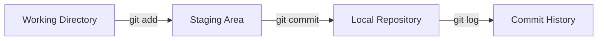

## 6. 실습 예제 2 — Day 5 파일 만들고 변경 상태 확인하기

### 실습 목표

Day 5 표준 파일과 Git 기초 명령 문서를 만들고, Git이 새 파일을 어떻게 표시하는지 확인합니다.

### 사용하는 버전

| 도구 | 버전 |
|---|---:|
| Git | 2.54.0 |
| Visual Studio Code | 1.122.0 |

### 생성 또는 수정할 파일 위치

```text
github-admin-180/days/day005/lecture.md
github-admin-180/days/day005/practice.md
github-admin-180/days/day005/review.md
github-admin-180/docs/01-git-basics/basic-commands.md
```

### 명령어

```bash
cd github-admin-180

mkdir -p days/day005
touch days/day005/lecture.md
touch days/day005/practice.md
touch days/day005/review.md
touch docs/01-git-basics/basic-commands.md

cat > days/day005/practice.md <<'EOF'
# Day 5 Practice

## 오늘의 Git 흐름

1. 파일 생성 또는 수정
2. git status
3. git add
4. git status
5. git commit
6. git log

## 핵심 문장

Commit은 프로젝트의 특정 순간을 기록하는 저장 지점이다.
EOF

git status
```

### 한 줄씩 설명

```bash
mkdir -p days/day005
```

Day 5 전용 표준 폴더를 생성합니다.

```bash
touch days/day005/lecture.md
```

Day 5 강의 요약 파일을 만듭니다.

```bash
touch docs/01-git-basics/basic-commands.md
```

Git 기본 명령을 누적 정리할 문서를 만듭니다.

```bash
git status
```

새 파일이 `Untracked files` 또는 변경 파일로 표시되는지 확인합니다.

### Mermaid 그림으로 이해하기

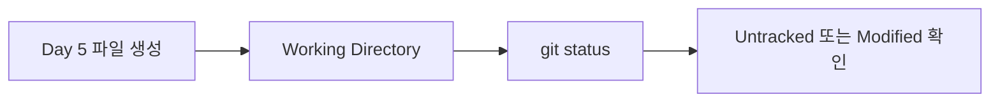

### 자주 하는 실수

- `day005`를 `day05` 또는 `day5`로 만든다.
- 파일을 저장하지 않은 상태로 status를 확인한다.
- `Untracked`를 오류로 오해한다.
- 프로젝트 루트가 아닌 다른 폴더에서 파일을 만든다.

## 7. 이론 5 — git add는 무엇일까?

### 1) 쉬운 비유

`git add`는 책상 위 여러 장의 숙제 중 이번에 제출할 종이만 골라 바구니에 넣는 행동입니다.

### 2) 개념 설명

`git add`는 Working Directory의 변경 사항을 Staging Area로 올립니다.

```bash
# 특정 파일
git add days/day005/practice.md

# 여러 파일
git add days/day005/lecture.md days/day005/review.md

# 특정 폴더
git add days/day005/

# 현재 폴더 아래 모든 변경
git add .
```

`git add .`는 편리하지만, 의도하지 않은 로그나 비밀 파일까지 포함할 수 있으므로 반드시 먼저 `git status`를 확인해야 합니다.

### 3) 실무에서 중요한 이유

`git add`는 단순 준비 명령이 아니라 커밋 범위를 설계하는 단계입니다. 좋은 커밋은 하나의 목적만 가지므로 어떤 파일을 스테이징할지 판단하는 능력이 중요합니다.

### 4) 오늘 실습과의 연결

Day 5 관련 문서만 명시적으로 스테이징하고, `git status`에서 `Changes to be committed` 구역으로 이동했는지 확인합니다.

### 5) 자주 하는 실수

- 무조건 `git add .`만 사용한다.
- 민감 정보나 임시 파일까지 스테이징한다.
- 스테이징한 뒤 파일을 다시 수정하고 상태를 확인하지 않는다.
- 잘못 올린 파일을 취소하는 방법을 모른다.
- 하나의 커밋과 관련 없는 파일까지 추가한다.

### 6) Mermaid 그림

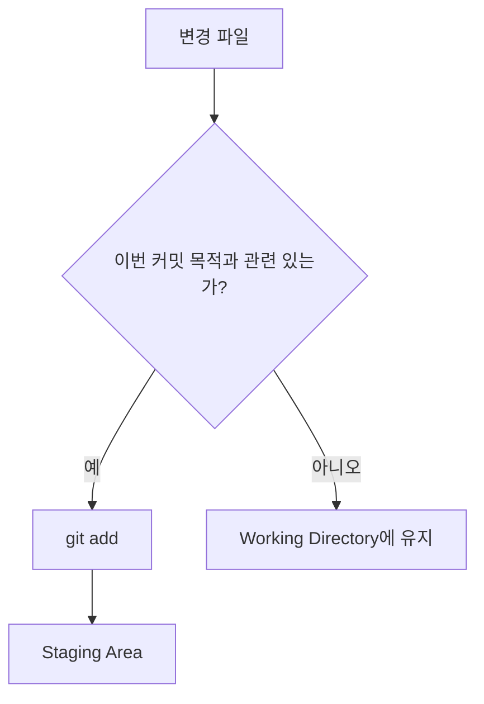

## 8. 실습 예제 3 — 파일을 스테이징하고 취소해보기

### 실습 목표

`git add` 전후의 상태 차이와 `git restore --staged`를 이용한 스테이징 취소를 확인합니다.

### 사용하는 버전

| 도구 | 버전 |
|---|---:|
| Git | 2.54.0 |
| Visual Studio Code | 1.122.0 |

### 생성 또는 수정할 파일 위치

```text
github-admin-180/days/day005/
github-admin-180/docs/01-git-basics/basic-commands.md
```

### 명령어

```bash
git status

git add days/day005/
git add docs/01-git-basics/basic-commands.md

git status

# 연습: review.md만 스테이징 취소
git restore --staged days/day005/review.md
git status

# 다시 스테이징
git add days/day005/review.md
git status
```

### 한 줄씩 설명

```bash
git add days/day005/
```

Day 5 폴더 아래의 변경 파일을 Staging Area에 올립니다.

```bash
git add docs/01-git-basics/basic-commands.md
```

기초 명령 문서를 다음 커밋 대상으로 선택합니다.

```bash
git restore --staged days/day005/review.md
```

파일 내용은 그대로 두고 Staging Area에서만 제거합니다.

```bash
git status
```

스테이징 여부가 원하는 상태인지 확인합니다.

### Mermaid 그림으로 이해하기

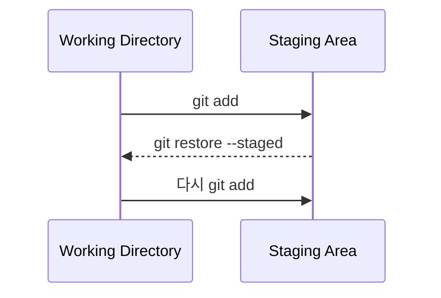

### 자주 하는 실수

- `git restore --staged`가 파일을 삭제한다고 오해한다.
- 취소 후 다시 add하는 것을 잊는다.
- add한 뒤 파일을 수정하고 재스테이징하지 않는다.
- `Changes to be committed` 목록을 읽지 않는다.

## 9. 이론 7 — git commit은 저장 지점이다

### 1) 쉬운 비유

Commit은 게임의 저장 슬롯과 같습니다. 중요한 순간을 저장해두면 나중에 어떤 상태였는지 확인할 수 있습니다.

### 2) 개념 설명

기본 형식은 다음과 같습니다.

```bash
git commit -m "커밋 메시지"
```

예시:

```bash
git commit -m "docs: add day005 clone add commit lesson"
```

하나의 커밋에는 다음 정보가 들어갑니다.

- 고유한 커밋 ID
- 작성자
- 작성 시각
- 커밋 메시지
- 포함된 파일 변경 내용
- 바로 이전 커밋과의 연결

Commit은 로컬 저장소에 생성됩니다. GitHub에 공유하는 `push`와는 다른 작업입니다.

### 3) 실무에서 중요한 이유

커밋은 문제 원인을 추적하고, 코드 리뷰를 진행하고, 변경 이력을 설명하는 기본 단위입니다. 작고 명확한 커밋은 되돌리기와 검토도 쉽습니다.

### 4) 오늘 실습과의 연결

스테이징 목록을 확인한 뒤 Day 5 문서를 하나의 `docs` 커밋으로 저장하고 `git log --oneline`으로 결과를 확인합니다.

### 5) 자주 하는 실수

- 메시지를 `수정`, `작업`, `완료`처럼 모호하게 작성한다.
- commit 전에 스테이징 목록을 확인하지 않는다.
- commit과 push를 같은 것으로 생각한다.
- 관련 없는 여러 작업을 한 커밋에 넣는다.
- 토큰이나 API key가 포함된 파일을 커밋한다.

### 6) Mermaid 그림

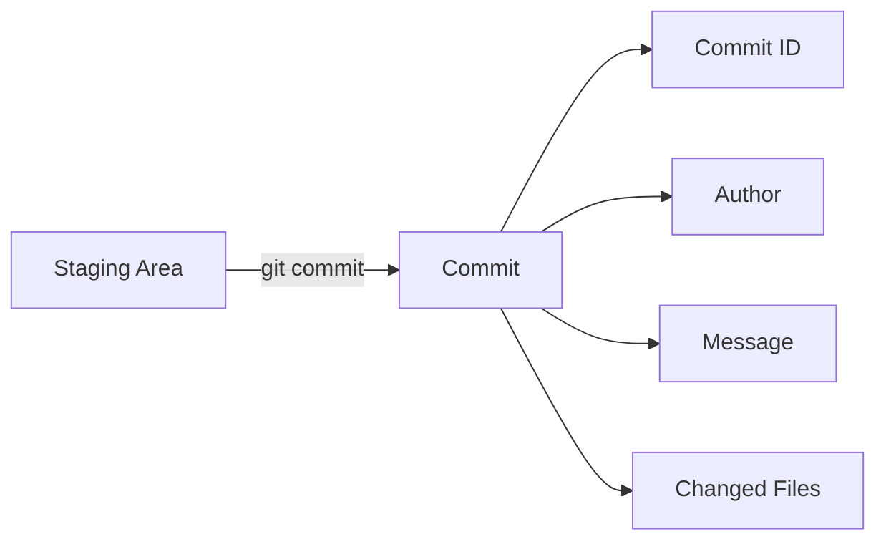

## 10. 실습 예제 4 — 첫 커밋 만들고 기록 확인하기

### 실습 목표

스테이징된 Day 5 파일을 하나의 커밋으로 저장하고 커밋 기록을 확인합니다.

### 사용하는 버전

| 도구 | 버전 |
|---|---:|
| Git | 2.54.0 |
| Visual Studio Code | 1.122.0 |

### 생성 또는 수정할 파일 위치

```text
github-admin-180/days/day005/
github-admin-180/docs/01-git-basics/basic-commands.md
```

### 명령어

```bash
git status

git commit -m "docs: add day005 clone add commit lesson"

git status
git log --oneline -5
git show --stat HEAD
```

### 한 줄씩 설명

```bash
git status
```

커밋 직전에 원하는 파일만 `Changes to be committed`에 있는지 확인합니다.

```bash
git commit -m "docs: add day005 clone add commit lesson"
```

스테이징된 변경 사항으로 로컬 커밋을 만듭니다.

```bash
git log --oneline -5
```

최근 커밋 5개를 짧은 형식으로 봅니다.

```bash
git show --stat HEAD
```

가장 최근 커밋의 메시지와 포함 파일 통계를 확인합니다.

### Mermaid 그림으로 이해하기

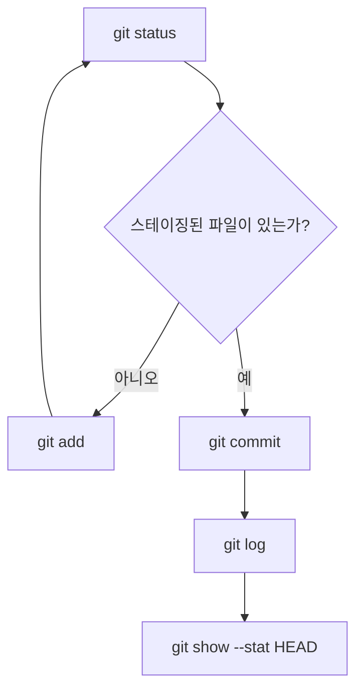

### 자주 하는 실수

- `Author identity unknown` 오류를 무시한다.
- `nothing to commit`의 원인을 확인하지 않는다.
- 따옴표를 빠뜨려 메시지가 나뉜다.
- commit 성공 후 log를 확인하지 않는다.

## 11. 이론 9 — 좋은 커밋 메시지는 기록의 제목이다

### 1) 쉬운 비유

커밋 메시지는 사진첩의 사진 제목과 같습니다. 모든 제목이 `사진`, `수정`, `완료`라면 나중에 원하는 기록을 찾기 어렵습니다.

### 2) 개념 설명

오늘부터 다음과 같은 기본 형식을 사용합니다.

```text
종류: 구체적인 변경 내용
```

| 종류 | 의미 | 예시 |
|---|---|---|
| `docs` | 문서 변경 | `docs: add day005 lesson` |
| `feat` | 새 기능 | `feat: add login form` |
| `fix` | 버그 수정 | `fix: handle empty username` |
| `test` | 테스트 변경 | `test: add login service tests` |
| `chore` | 설정·정리 | `chore: update gitignore` |

좋은 메시지는 실제 변경과 일치하고, 짧지만 무엇을 바꿨는지 알 수 있어야 합니다.

### 3) 실무에서 중요한 이유

명확한 메시지는 코드 리뷰, 장애 원인 추적, 릴리스 노트 작성, 업무 인수인계에 도움이 됩니다.

### 4) 오늘 실습과의 연결

Day 5 강의자료는 문서 변경이므로 `docs:`를 사용합니다. 이후 실습 회고만 따로 보완했다면 `docs: complete day005 review`처럼 별도 커밋을 만들 수 있습니다.

### 5) 자주 하는 실수

- `update`, `change`, `work`처럼 대상이 없는 메시지를 사용한다.
- 실제 변경 내용과 다른 메시지를 작성한다.
- 한 커밋 제목에 여러 목적을 나열한다.
- 팀의 언어와 형식 규칙을 무시한다.
- 너무 긴 설명을 제목 한 줄에 모두 적는다.

### 6) Mermaid 그림

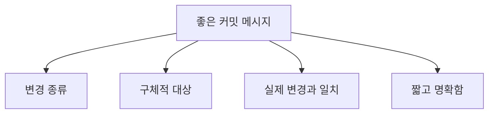

## 12. 실습 예제 5 — Day 5 회고 작성하고 두 번째 커밋 만들기

### 실습 목표

오늘 배운 내용을 회고 문서에 정리하고, 첫 커밋 이후 생긴 변경을 별도 커밋으로 기록합니다.

### 사용하는 버전

| 도구 | 버전 |
|---|---:|
| Git | 2.54.0 |
| Visual Studio Code | 1.122.0 |

### 생성 또는 수정할 파일 위치

```text
github-admin-180/days/day005/review.md
github-admin-180/days/day005/lecture.md
```

### 명령어

```bash
cat > days/day005/review.md <<'EOF'
# Day 5 Review

## 오늘 이해한 것

- clone은 원격 저장소를 로컬 저장소로 복제한다.
- add는 다음 commit에 포함할 변경을 선택한다.
- commit은 프로젝트의 저장 지점이다.
- status는 현재 변경과 스테이징 상태를 보여준다.
- log는 commit 기록을 보여준다.

## 아직 헷갈리는 것

- commit과 push의 차이
- origin의 정확한 역할
- 여러 변경을 커밋 단위로 나누는 기준

## 오늘의 핵심 문장

좋은 commit은 하나의 목적을 가진 작은 저장 지점이다.
EOF

git status
git add days/day005/review.md
git commit -m "docs: complete day005 review"
git log --oneline -5
```

### 한 줄씩 설명

```bash
cat > days/day005/review.md <<'EOF'
```

Day 5 회고 파일에 여러 줄을 작성합니다.

```bash
git add days/day005/review.md
```

회고 파일만 다음 커밋 대상으로 선택합니다.

```bash
git commit -m "docs: complete day005 review"
```

회고 보완 작업을 별도의 목적을 가진 커밋으로 저장합니다.

```bash
git log --oneline -5
```

Day 5 관련 커밋이 두 개로 나뉘었는지 확인합니다.

### Mermaid 그림으로 이해하기

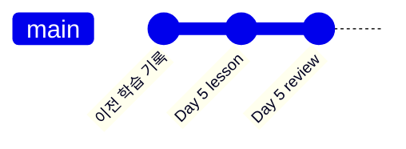

### 자주 하는 실수

- 첫 커밋 이후 수정한 내용도 자동으로 저장됐다고 생각한다.
- 회고와 관계없는 파일까지 함께 add한다.
- 새 커밋을 만든 뒤 log를 확인하지 않는다.
- 헷갈리는 내용을 회고에 적지 않는다.

## 13. 실습 전체 흐름 복습

```bash
cd github-admin-180

mkdir -p days/day005
touch days/day005/lecture.md
touch days/day005/practice.md
touch days/day005/review.md
touch docs/01-git-basics/basic-commands.md

git status

git add days/day005/
git add docs/01-git-basics/basic-commands.md

git status

git commit -m "docs: add day005 clone add commit lesson"

git status
git log --oneline -5
git show --stat HEAD
```

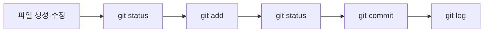

## 강의 요약

| 배운 내용 | 핵심 |
|---|---|
| `git clone` | 원격 저장소를 로컬로 복제 |
| Working Directory | 실제 파일을 수정하는 공간 |
| Staging Area | 다음 커밋 대상을 선택하는 공간 |
| Local Repository | 커밋 기록이 저장되는 공간 |
| `git status` | 변경과 스테이징 상태 확인 |
| `git add` | 변경 사항 스테이징 |
| `git restore --staged` | 파일을 삭제하지 않고 스테이징 취소 |
| `git commit` | 로컬 저장 지점 생성 |
| `git log --oneline` | 커밋 이력을 간단히 확인 |
| 커밋 메시지 | 변경 목적을 설명하는 기록 제목 |

오늘 꼭 기억해야 할 한 문장:

> 좋은 커밋은 하나의 목적을 가진 작고 명확한 저장 지점입니다.

## 초급 연습문제 5개

### 문제 1. clone 뜻 설명하기

#### 문제 설명

`git clone`의 역할을 초등학생도 이해할 수 있게 설명하세요.

#### 요구사항

- 원격 저장소와 로컬 저장소 표현 포함
- 파일과 커밋 기록을 함께 가져온다고 설명

#### 힌트

온라인 가방을 내 책상으로 복사하는 비유를 사용하세요.

#### 제출물

- `days/day005/review.md`

### 문제 2. 새 파일 상태 확인하기

#### 문제 설명

`days/day005/command-test.md`를 만든 뒤 Git 상태를 확인하세요.

#### 요구사항

- 파일 생성
- `git status` 실행
- Untracked 상태 확인

#### 힌트

새 파일은 아직 Git 관리 대상으로 등록되지 않았습니다.

#### 제출물

- `days/day005/practice.md`에 결과 기록

### 문제 3. 특정 파일만 add하기

#### 문제 설명

`command-test.md`만 스테이징하세요.

#### 요구사항

- `git add .` 사용 금지
- 정확한 파일 경로 사용
- add 후 status 확인

#### 힌트

`git add 파일경로` 형식을 사용하세요.

#### 제출물

- 사용한 명령어와 status 결과

### 문제 4. 스테이징 취소하기

#### 문제 설명

스테이징한 파일을 내용 삭제 없이 Staging Area에서 제거하세요.

#### 요구사항

- `git restore --staged` 사용
- 파일이 남아 있는지 확인
- status 재확인

#### 힌트

스테이징 취소와 파일 삭제는 다릅니다.

#### 제출물

- 전후 상태 비교

### 문제 5. 연습 커밋 만들기

#### 문제 설명

연습 파일을 다시 add하고 커밋하세요.

#### 요구사항

- 커밋 메시지에 `docs:` 사용
- 커밋 후 log 확인

#### 힌트

`git commit -m "docs: ..."` 형식을 사용하세요.

#### 제출물

- `git log --oneline` 결과

## 중급 연습문제 5개

### 문제 1. 커밋 두 개로 나누기

#### 문제 설명

강의 문서와 회고 문서를 서로 다른 커밋으로 나누세요.

#### 요구사항

- 강의 파일을 첫 번째 커밋에 포함
- 회고 파일을 두 번째 커밋에 포함
- 각기 다른 메시지 작성

#### 힌트

커밋 전에 add 대상을 다르게 선택하세요.

#### 제출물

- `git log --oneline -5` 결과

### 문제 2. add 전후 상태 비교표

#### 문제 설명

`git add` 전과 후의 status 출력을 비교하세요.

#### 요구사항

- 파일 상태
- status 구역
- 다음 커밋 포함 여부
- 취소 명령어

#### 힌트

Untracked files와 Changes to be committed를 비교하세요.

#### 제출물

- `days/day005/practice.md`의 비교표

### 문제 3. 나쁜 메시지 개선하기

#### 문제 설명

`수정`, `작업`, `업데이트`, `완료`, `파일 추가`를 좋은 메시지로 바꾸세요.

#### 요구사항

- 각 메시지에 변경 종류 포함
- 대상과 목적을 구체적으로 작성

#### 힌트

`docs`, `feat`, `fix`, `test`, `chore`를 활용하세요.

#### 제출물

- `days/day005/review.md`

### 문제 4. add 후 다시 수정하기

#### 문제 설명

파일을 add한 뒤 같은 파일을 다시 수정하고 status 변화를 관찰하세요.

#### 요구사항

- 수정 후 add
- 같은 파일 다시 수정
- status 확인
- 다시 add

#### 힌트

한 파일에 스테이징된 변경과 스테이징되지 않은 변경이 동시에 있을 수 있습니다.

#### 제출물

- 단계별 status 해석

### 문제 5. HEAD 커밋 분석하기

#### 문제 설명

가장 최근 커밋을 분석하세요.

#### 요구사항

- `git show --stat HEAD` 실행
- 커밋 메시지 확인
- 포함 파일 확인

#### 힌트

HEAD는 현재 위치의 최신 커밋을 가리킵니다.

#### 제출물

- 분석 결과 5문장

## 고급 연습문제 5개

### 문제 1. 커밋 단위 설계하기

#### 문제 설명

README 설치 방법 추가, 로그인 오류 수정, 로그인 테스트 추가, `.gitignore` 수정, Day 5 회고를 커밋 단위로 나누세요.

#### 요구사항

- 커밋 개수 결정
- 각 커밋 포함 변경 작성
- 메시지 작성
- 나눈 이유 설명

#### 힌트

하나의 커밋은 하나의 목적에 집중해야 합니다.

#### 제출물

- `days/day005/review.md`

### 문제 2. 민감 정보 스테이징 대응

#### 문제 설명

실수로 `.env`를 스테이징했지만 아직 commit하지 않은 상황에 대응하세요.

#### 요구사항

- 스테이징 취소
- `.gitignore` 수정
- 다시 status 확인
- 비밀값 노출 여부 점검

#### 힌트

파일을 삭제하지 않고 스테이징만 취소하세요.

#### 제출물

- 대응 절차 문서

### 문제 3. 중첩 clone 문제 분석

#### 문제 설명

저장소 내부에 같은 저장소를 clone해 `github-admin-180/github-admin-180` 구조가 된 상황을 분석하세요.

#### 요구사항

- 문제점 설명
- 올바른 clone 위치 설명
- 정리 전 백업·상태 확인 항목 작성

#### 힌트

저장소 안에 또 다른 동일 저장소가 중첩된 상태입니다.

#### 제출물

- 문제 분석 문서

### 문제 4. nothing to commit 원인 찾기

#### 문제 설명

`git commit` 결과가 `nothing to commit`인 가능한 원인을 찾으세요.

#### 요구사항

- 원인 3개 이상
- 점검 명령어 포함
- 확인 순서 작성

#### 힌트

변경 파일, add 여부, 현재 저장소 위치를 확인하세요.

#### 제출물

- 번호가 있는 점검 절차

### 문제 5. 관리자용 커밋 정책 초안

#### 문제 설명

팀이 사용할 기초 커밋 정책을 작성하세요.

#### 요구사항

- 커밋 목적 원칙
- 메시지 형식
- 금지 메시지 예시
- 민감 정보 금지
- commit 전후 확인 명령

#### 힌트

Day 5에서 배운 범위만 사용해 작성하세요.

#### 제출물

- `docs/01-git-basics/basic-commands.md`

## 오늘의 체크리스트

- [ ] `git clone`의 역할을 설명할 수 있다.
- [ ] 기존 로컬 폴더가 있을 때 clone을 생략해야 하는 이유를 이해했다.
- [ ] Working Directory를 설명할 수 있다.
- [ ] Staging Area를 설명할 수 있다.
- [ ] Local Repository를 설명할 수 있다.
- [ ] `git status` 결과를 읽을 수 있다.
- [ ] 특정 파일과 특정 폴더를 `git add`할 수 있다.
- [ ] `git restore --staged`로 스테이징을 취소할 수 있다.
- [ ] `git commit -m`으로 커밋을 만들 수 있다.
- [ ] `git log --oneline`으로 기록을 확인할 수 있다.
- [ ] `git show --stat HEAD`로 최근 커밋을 분석할 수 있다.
- [ ] commit과 push가 다른 작업이라는 것을 이해했다.
- [ ] 하나의 커밋은 하나의 목적을 가져야 한다는 것을 이해했다.
- [ ] 비밀번호, 토큰, SSH private key, PAT, API key를 커밋하지 않는다.
- [ ] `days/day005/lecture.md`를 만들었다.
- [ ] `days/day005/practice.md`를 만들었다.
- [ ] `days/day005/review.md`를 만들었다.
- [ ] `docs/01-git-basics/basic-commands.md`를 만들었다.

## 다음 Day 예고

다음 Day 6에서는 **push와 pull**을 배웁니다.

- commit과 push의 차이
- `origin`의 의미
- `git push`로 로컬 커밋을 GitHub에 올리기
- `git pull`로 원격 변경을 가져오기
- 로컬과 원격 저장소 동기화
- push가 거절되는 대표 상황
- 안전하게 pull하는 기본 순서

다음 시간에 꼭 기억해야 할 예고 문장:

> Commit은 내 컴퓨터에 기록을 남기고, push는 그 기록을 GitHub에 공유합니다.
